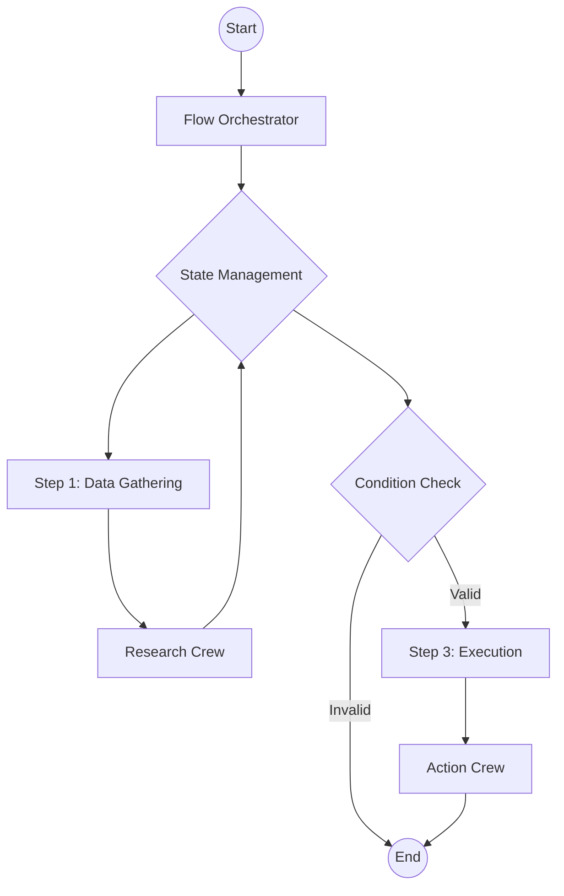

> ## Documentation Index
> Fetch the complete documentation index at: https://docs.crewai.com/llms.txt
> Use this file to discover all available pages before exploring further.

# Crafting Effective Agents

> Learn best practices for designing powerful, specialized AI agents that collaborate effectively to solve complex problems.

## The Art and Science of Agent Design

At the heart of CrewAI lies the agent - a specialized AI entity designed to perform specific roles within a collaborative framework. While creating basic agents is simple, crafting truly effective agents that produce exceptional results requires understanding key design principles and best practices.

This guide will help you master the art of agent design, enabling you to create specialized AI personas that collaborate effectively, think critically, and produce high-quality outputs tailored to your specific needs.

### Why Agent Design Matters

The way you define your agents significantly impacts:

1. **Output quality**: Well-designed agents produce more relevant, high-quality results
2. **Collaboration effectiveness**: Agents with complementary skills work together more efficiently
3. **Task performance**: Agents with clear roles and goals execute tasks more effectively
4. **System scalability**: Thoughtfully designed agents can be reused across multiple crews and contexts

Let's explore best practices for creating agents that excel in these dimensions.

## The 80/20 Rule: Focus on Tasks Over Agents

When building effective AI systems, remember this crucial principle: **80% of your effort should go into designing tasks, and only 20% into defining agents**.

Why? Because even the most perfectly defined agent will fail with poorly designed tasks, but well-designed tasks can elevate even a simple agent. This means:

* Spend most of your time writing clear task instructions
* Define detailed inputs and expected outputs
* Add examples and context to guide execution
* Dedicate the remaining time to agent role, goal, and backstory

This doesn't mean agent design isn't important - it absolutely is. But task design is where most execution failures occur, so prioritize accordingly.

## Core Principles of Effective Agent Design

### 1. The Role-Goal-Backstory Framework

The most powerful agents in CrewAI are built on a strong foundation of three key elements:

#### Role: The Agent's Specialized Function

The role defines what the agent does and their area of expertise. When crafting roles:

* **Be specific and specialized**: Instead of "Writer," use "Technical Documentation Specialist" or "Creative Storyteller"
* **Align with real-world professions**: Base roles on recognizable professional archetypes
* **Include domain expertise**: Specify the agent's field of knowledge (e.g., "Financial Analyst specializing in market trends")

**Examples of effective roles:**

```yaml  theme={null}
role: "Senior UX Researcher specializing in user interview analysis"
role: "Full-Stack Software Architect with expertise in distributed systems"
role: "Corporate Communications Director specializing in crisis management"
```

#### Goal: The Agent's Purpose and Motivation

The goal directs the agent's efforts and shapes their decision-making process. Effective goals should:

* **Be clear and outcome-focused**: Define what the agent is trying to achieve
* **Emphasize quality standards**: Include expectations about the quality of work
* **Incorporate success criteria**: Help the agent understand what "good" looks like

**Examples of effective goals:**

```yaml  theme={null}
goal: "Uncover actionable user insights by analyzing interview data and identifying recurring patterns, unmet needs, and improvement opportunities"
goal: "Design robust, scalable system architectures that balance performance, maintainability, and cost-effectiveness"
goal: "Craft clear, empathetic crisis communications that address stakeholder concerns while protecting organizational reputation"
```

#### Backstory: The Agent's Experience and Perspective

The backstory gives depth to the agent, influencing how they approach problems and interact with others. Good backstories:

* **Establish expertise and experience**: Explain how the agent gained their skills
* **Define working style and values**: Describe how the agent approaches their work
* **Create a cohesive persona**: Ensure all elements of the backstory align with the role and goal

**Examples of effective backstories:**

```yaml  theme={null}
backstory: "You have spent 15 years conducting and analyzing user research for top tech companies. You have a talent for reading between the lines and identifying patterns that others miss. You believe that good UX is invisible and that the best insights come from listening to what users don't say as much as what they do say."

backstory: "With 20+ years of experience building distributed systems at scale, you've developed a pragmatic approach to software architecture. You've seen both successful and failed systems and have learned valuable lessons from each. You balance theoretical best practices with practical constraints and always consider the maintenance and operational aspects of your designs."

backstory: "As a seasoned communications professional who has guided multiple organizations through high-profile crises, you understand the importance of transparency, speed, and empathy in crisis response. You have a methodical approach to crafting messages that address concerns while maintaining organizational credibility."
```

### 2. Specialists Over Generalists

Agents perform significantly better when given specialized roles rather than general ones. A highly focused agent delivers more precise, relevant outputs:

**Generic (Less Effective):**

```yaml  theme={null}
role: "Writer"
```

**Specialized (More Effective):**

```yaml  theme={null}
role: "Technical Blog Writer specializing in explaining complex AI concepts to non-technical audiences"
```

**Specialist Benefits:**

* Clearer understanding of expected output
* More consistent performance
* Better alignment with specific tasks
* Improved ability to make domain-specific judgments

### 3. Balancing Specialization and Versatility

Effective agents strike the right balance between specialization (doing one thing extremely well) and versatility (being adaptable to various situations):

* **Specialize in role, versatile in application**: Create agents with specialized skills that can be applied across multiple contexts
* **Avoid overly narrow definitions**: Ensure agents can handle variations within their domain of expertise
* **Consider the collaborative context**: Design agents whose specializations complement the other agents they'll work with

### 4. Setting Appropriate Expertise Levels

The expertise level you assign to your agent shapes how they approach tasks:

* **Novice agents**: Good for straightforward tasks, brainstorming, or initial drafts
* **Intermediate agents**: Suitable for most standard tasks with reliable execution
* **Expert agents**: Best for complex, specialized tasks requiring depth and nuance
* **World-class agents**: Reserved for critical tasks where exceptional quality is needed

Choose the appropriate expertise level based on task complexity and quality requirements. For most collaborative crews, a mix of expertise levels often works best, with higher expertise assigned to core specialized functions.

## Practical Examples: Before and After

Let's look at some examples of agent definitions before and after applying these best practices:

### Example 1: Content Creation Agent

**Before:**

```yaml  theme={null}
role: "Writer"
goal: "Write good content"
backstory: "You are a writer who creates content for websites."
```

**After:**

```yaml  theme={null}
role: "B2B Technology Content Strategist"
goal: "Create compelling, technically accurate content that explains complex topics in accessible language while driving reader engagement and supporting business objectives"
backstory: "You have spent a decade creating content for leading technology companies, specializing in translating technical concepts for business audiences. You excel at research, interviewing subject matter experts, and structuring information for maximum clarity and impact. You believe that the best B2B content educates first and sells second, building trust through genuine expertise rather than marketing hype."
```

### Example 2: Research Agent

**Before:**

```yaml  theme={null}
role: "Researcher"
goal: "Find information"
backstory: "You are good at finding information online."
```

**After:**

```yaml  theme={null}
role: "Academic Research Specialist in Emerging Technologies"
goal: "Discover and synthesize cutting-edge research, identifying key trends, methodologies, and findings while evaluating the quality and reliability of sources"
backstory: "With a background in both computer science and library science, you've mastered the art of digital research. You've worked with research teams at prestigious universities and know how to navigate academic databases, evaluate research quality, and synthesize findings across disciplines. You're methodical in your approach, always cross-referencing information and tracing claims to primary sources before drawing conclusions."
```

## Crafting Effective Tasks for Your Agents

While agent design is important, task design is critical for successful execution. Here are best practices for designing tasks that set your agents up for success:

### The Anatomy of an Effective Task

A well-designed task has two key components that serve different purposes:

#### Task Description: The Process

The description should focus on what to do and how to do it, including:

* Detailed instructions for execution
* Context and background information
* Scope and constraints
* Process steps to follow

#### Expected Output: The Deliverable

The expected output should define what the final result should look like:

* Format specifications (markdown, JSON, etc.)
* Structure requirements
* Quality criteria
* Examples of good outputs (when possible)

### Task Design Best Practices

#### 1. Single Purpose, Single Output

Tasks perform best when focused on one clear objective:

**Bad Example (Too Broad):**

```yaml  theme={null}
task_description: "Research market trends, analyze the data, and create a visualization."
```

**Good Example (Focused):**

```yaml  theme={null}
# Task 1
research_task:
  description: "Research the top 5 market trends in the AI industry for 2024."
  expected_output: "A markdown list of the 5 trends with supporting evidence."

# Task 2
analysis_task:
  description: "Analyze the identified trends to determine potential business impacts."
  expected_output: "A structured analysis with impact ratings (High/Medium/Low)."

# Task 3
visualization_task:
  description: "Create a visual representation of the analyzed trends."
  expected_output: "A description of a chart showing trends and their impact ratings."
```

#### 2. Be Explicit About Inputs and Outputs

Always clearly specify what inputs the task will use and what the output should look like:

**Example:**

```yaml  theme={null}
analysis_task:
  description: >
    Analyze the customer feedback data from the CSV file.
    Focus on identifying recurring themes related to product usability.
    Consider sentiment and frequency when determining importance.
  expected_output: >
    A markdown report with the following sections:
    1. Executive summary (3-5 bullet points)
    2. Top 3 usability issues with supporting data
    3. Recommendations for improvement
```

#### 3. Include Purpose and Context

Explain why the task matters and how it fits into the larger workflow:

**Example:**

```yaml  theme={null}
competitor_analysis_task:
  description: >
    Analyze our three main competitors' pricing strategies.
    This analysis will inform our upcoming pricing model revision.
    Focus on identifying patterns in how they price premium features
    and how they structure their tiered offerings.
```

#### 4. Use Structured Output Tools

For machine-readable outputs, specify the format clearly:

**Example:**

```yaml  theme={null}
data_extraction_task:
  description: "Extract key metrics from the quarterly report."
  expected_output: "JSON object with the following keys: revenue, growth_rate, customer_acquisition_cost, and retention_rate."
```

## Common Mistakes to Avoid

Based on lessons learned from real-world implementations, here are the most common pitfalls in agent and task design:

### 1. Unclear Task Instructions

**Problem:** Tasks lack sufficient detail, making it difficult for agents to execute effectively.

**Example of Poor Design:**

```yaml  theme={null}
research_task:
  description: "Research AI trends."
  expected_output: "A report on AI trends."
```

**Improved Version:**

```yaml  theme={null}
research_task:
  description: >
    Research the top emerging AI trends for 2024 with a focus on:
    1. Enterprise adoption patterns
    2. Technical breakthroughs in the past 6 months
    3. Regulatory developments affecting implementation

    For each trend, identify key companies, technologies, and potential business impacts.
  expected_output: >
    A comprehensive markdown report with:
    - Executive summary (5 bullet points)
    - 5-7 major trends with supporting evidence
    - For each trend: definition, examples, and business implications
    - References to authoritative sources
```

### 2. "God Tasks" That Try to Do Too Much

**Problem:** Tasks that combine multiple complex operations into one instruction set.

**Example of Poor Design:**

```yaml  theme={null}
comprehensive_task:
  description: "Research market trends, analyze competitor strategies, create a marketing plan, and design a launch timeline."
```

**Improved Version:**
Break this into sequential, focused tasks:

```yaml  theme={null}
# Task 1: Research
market_research_task:
  description: "Research current market trends in the SaaS project management space."
  expected_output: "A markdown summary of key market trends."

# Task 2: Competitive Analysis
competitor_analysis_task:
  description: "Analyze strategies of the top 3 competitors based on the market research."
  expected_output: "A comparison table of competitor strategies."
  context: [market_research_task]

# Continue with additional focused tasks...
```

### 3. Misaligned Description and Expected Output

**Problem:** The task description asks for one thing while the expected output specifies something different.

**Example of Poor Design:**

```yaml  theme={null}
analysis_task:
  description: "Analyze customer feedback to find areas of improvement."
  expected_output: "A marketing plan for the next quarter."
```

**Improved Version:**

```yaml  theme={null}
analysis_task:
  description: "Analyze customer feedback to identify the top 3 areas for product improvement."
  expected_output: "A report listing the 3 priority improvement areas with supporting customer quotes and data points."
```

### 4. Not Understanding the Process Yourself

**Problem:** Asking agents to execute tasks that you yourself don't fully understand.

**Solution:**

1. Try to perform the task manually first
2. Document your process, decision points, and information sources
3. Use this documentation as the basis for your task description

### 5. Premature Use of Hierarchical Structures

**Problem:** Creating unnecessarily complex agent hierarchies where sequential processes would work better.

**Solution:** Start with sequential processes and only move to hierarchical models when the workflow complexity truly requires it.

### 6. Vague or Generic Agent Definitions

**Problem:** Generic agent definitions lead to generic outputs.

**Example of Poor Design:**

```yaml  theme={null}
agent:
  role: "Business Analyst"
  goal: "Analyze business data"
  backstory: "You are good at business analysis."
```

**Improved Version:**

```yaml  theme={null}
agent:
  role: "SaaS Metrics Specialist focusing on growth-stage startups"
  goal: "Identify actionable insights from business data that can directly impact customer retention and revenue growth"
  backstory: "With 10+ years analyzing SaaS business models, you've developed a keen eye for the metrics that truly matter for sustainable growth. You've helped numerous companies identify the leverage points that turned around their business trajectory. You believe in connecting data to specific, actionable recommendations rather than general observations."
```

## Advanced Agent Design Strategies

### Designing for Collaboration

When creating agents that will work together in a crew, consider:

* **Complementary skills**: Design agents with distinct but complementary abilities
* **Handoff points**: Define clear interfaces for how work passes between agents
* **Constructive tension**: Sometimes, creating agents with slightly different perspectives can lead to better outcomes through productive dialogue

For example, a content creation crew might include:

```yaml  theme={null}
# Research Agent
role: "Research Specialist for technical topics"
goal: "Gather comprehensive, accurate information from authoritative sources"
backstory: "You are a meticulous researcher with a background in library science..."

# Writer Agent
role: "Technical Content Writer"
goal: "Transform research into engaging, clear content that educates and informs"
backstory: "You are an experienced writer who excels at explaining complex concepts..."

# Editor Agent
role: "Content Quality Editor"
goal: "Ensure content is accurate, well-structured, and polished while maintaining consistency"
backstory: "With years of experience in publishing, you have a keen eye for detail..."
```

### Creating Specialized Tool Users

Some agents can be designed specifically to leverage certain tools effectively:

```yaml  theme={null}
role: "Data Analysis Specialist"
goal: "Derive meaningful insights from complex datasets through statistical analysis"
backstory: "With a background in data science, you excel at working with structured and unstructured data..."
tools: [PythonREPLTool, DataVisualizationTool, CSVAnalysisTool]
```

### Tailoring Agents to LLM Capabilities

Different LLMs have different strengths. Design your agents with these capabilities in mind:

```yaml  theme={null}
# For complex reasoning tasks
analyst:
  role: "Data Insights Analyst"
  goal: "..."
  backstory: "..."
  llm: openai/gpt-4o

# For creative content
writer:
  role: "Creative Content Writer"
  goal: "..."
  backstory: "..."
  llm: anthropic/claude-3-opus
```

## Testing and Iterating on Agent Design

Agent design is often an iterative process. Here's a practical approach:

1. **Start with a prototype**: Create an initial agent definition
2. **Test with sample tasks**: Evaluate performance on representative tasks
3. **Analyze outputs**: Identify strengths and weaknesses
4. **Refine the definition**: Adjust role, goal, and backstory based on observations
5. **Test in collaboration**: Evaluate how the agent performs in a crew setting

## Conclusion

Crafting effective agents is both an art and a science. By carefully defining roles, goals, and backstories that align with your specific needs, and combining them with well-designed tasks, you can create specialized AI collaborators that produce exceptional results.

Remember that agent and task design is an iterative process. Start with these best practices, observe your agents in action, and refine your approach based on what you learn. And always keep in mind the 80/20 rule - focus most of your effort on creating clear, focused tasks to get the best results from your agents.

<Check>
  Congratulations! You now understand the principles and practices of effective agent design. Apply these techniques to create powerful, specialized agents that work together seamlessly to accomplish complex tasks.
</Check>

## Next Steps

* Experiment with different agent configurations for your specific use case
* Learn about [building your first crew](/en/guides/crews/first-crew) to see how agents work together
* Explore [CrewAI Flows](/en/guides/flows/first-flow) for more advanced orchestration


Built with [Mintlify](https://mintlify.com).
> ## Documentation Index
> Fetch the complete documentation index at: https://docs.crewai.com/llms.txt
> Use this file to discover all available pages before exploring further.

# Build Your First Crew

> Step-by-step tutorial to create a collaborative AI team that works together to solve complex problems.

## Unleashing the Power of Collaborative AI

Imagine having a team of specialized AI agents working together seamlessly to solve complex problems, each contributing their unique skills to achieve a common goal. This is the power of CrewAI - a framework that enables you to create collaborative AI systems that can accomplish tasks far beyond what a single AI could achieve alone.

In this guide, we'll walk through creating a research crew that will help us research and analyze a topic, then create a comprehensive report. This practical example demonstrates how AI agents can collaborate to accomplish complex tasks, but it's just the beginning of what's possible with CrewAI.

### What You'll Build and Learn

By the end of this guide, you'll have:

1. **Created a specialized AI research team** with distinct roles and responsibilities
2. **Orchestrated collaboration** between multiple AI agents
3. **Automated a complex workflow** that involves gathering information, analysis, and report generation
4. **Built foundational skills** that you can apply to more ambitious projects

While we're building a simple research crew in this guide, the same patterns and techniques can be applied to create much more sophisticated teams for tasks like:

* Multi-stage content creation with specialized writers, editors, and fact-checkers
* Complex customer service systems with tiered support agents
* Autonomous business analysts that gather data, create visualizations, and generate insights
* Product development teams that ideate, design, and plan implementation

Let's get started building your first crew!

### Prerequisites

Before starting, make sure you have:

1. Installed CrewAI following the [installation guide](/en/installation)
2. Set up your LLM API key in your environment, following the [LLM setup
   guide](/en/concepts/llms#setting-up-your-llm)
3. Basic understanding of Python

## Step 1: Create a New CrewAI Project

First, let's create a new CrewAI project using the CLI. This command will set up a complete project structure with all the necessary files, allowing you to focus on defining your agents and their tasks rather than setting up boilerplate code.

```bash  theme={null}
crewai create crew research_crew
cd research_crew
```

This will generate a project with the basic structure needed for your crew. The CLI automatically creates:

* A project directory with the necessary files
* Configuration files for agents and tasks
* A basic crew implementation
* A main script to run the crew

<Frame caption="CrewAI Framework Overview">
  
</Frame>

## Step 2: Explore the Project Structure

Let's take a moment to understand the project structure created by the CLI. CrewAI follows best practices for Python projects, making it easy to maintain and extend your code as your crews become more complex.

```
research_crew/
├── .gitignore
├── pyproject.toml
├── README.md
├── .env
└── src/
    └── research_crew/
        ├── __init__.py
        ├── main.py
        ├── crew.py
        ├── tools/
        │   ├── custom_tool.py
        │   └── __init__.py
        └── config/
            ├── agents.yaml
            └── tasks.yaml
```

This structure follows best practices for Python projects and makes it easy to organize your code. The separation of configuration files (in YAML) from implementation code (in Python) makes it easy to modify your crew's behavior without changing the underlying code.

## Step 3: Configure Your Agents

Now comes the fun part - defining your AI agents! In CrewAI, agents are specialized entities with specific roles, goals, and backstories that shape their behavior. Think of them as characters in a play, each with their own personality and purpose.

For our research crew, we'll create two agents:

1. A **researcher** who excels at finding and organizing information
2. An **analyst** who can interpret research findings and create insightful reports

Let's modify the `agents.yaml` file to define these specialized agents. Be sure
to set `llm` to the provider you are using.

```yaml  theme={null}
# src/research_crew/config/agents.yaml
researcher:
  role: >
    Senior Research Specialist for {topic}
  goal: >
    Find comprehensive and accurate information about {topic}
    with a focus on recent developments and key insights
  backstory: >
    You are an experienced research specialist with a talent for
    finding relevant information from various sources. You excel at
    organizing information in a clear and structured manner, making
    complex topics accessible to others.
  llm: provider/model-id  # e.g. openai/gpt-4o, google/gemini-2.0-flash, anthropic/claude...

analyst:
  role: >
    Data Analyst and Report Writer for {topic}
  goal: >
    Analyze research findings and create a comprehensive, well-structured
    report that presents insights in a clear and engaging way
  backstory: >
    You are a skilled analyst with a background in data interpretation
    and technical writing. You have a talent for identifying patterns
    and extracting meaningful insights from research data, then
    communicating those insights effectively through well-crafted reports.
  llm: provider/model-id  # e.g. openai/gpt-4o, google/gemini-2.0-flash, anthropic/claude...
```

Notice how each agent has a distinct role, goal, and backstory. These elements aren't just descriptive - they actively shape how the agent approaches its tasks. By crafting these carefully, you can create agents with specialized skills and perspectives that complement each other.

## Step 4: Define Your Tasks

With our agents defined, we now need to give them specific tasks to perform. Tasks in CrewAI represent the concrete work that agents will perform, with detailed instructions and expected outputs.

For our research crew, we'll define two main tasks:

1. A **research task** for gathering comprehensive information
2. An **analysis task** for creating an insightful report

Let's modify the `tasks.yaml` file:

```yaml  theme={null}
# src/research_crew/config/tasks.yaml
research_task:
  description: >
    Conduct thorough research on {topic}. Focus on:
    1. Key concepts and definitions
    2. Historical development and recent trends
    3. Major challenges and opportunities
    4. Notable applications or case studies
    5. Future outlook and potential developments

    Make sure to organize your findings in a structured format with clear sections.
  expected_output: >
    A comprehensive research document with well-organized sections covering
    all the requested aspects of {topic}. Include specific facts, figures,
    and examples where relevant.
  agent: researcher

analysis_task:
  description: >
    Analyze the research findings and create a comprehensive report on {topic}.
    Your report should:
    1. Begin with an executive summary
    2. Include all key information from the research
    3. Provide insightful analysis of trends and patterns
    4. Offer recommendations or future considerations
    5. Be formatted in a professional, easy-to-read style with clear headings
  expected_output: >
    A polished, professional report on {topic} that presents the research
    findings with added analysis and insights. The report should be well-structured
    with an executive summary, main sections, and conclusion.
  agent: analyst
  context:
    - research_task
  output_file: output/report.md
```

Note the `context` field in the analysis task - this is a powerful feature that allows the analyst to access the output of the research task. This creates a workflow where information flows naturally between agents, just as it would in a human team.

## Step 5: Configure Your Crew

Now it's time to bring everything together by configuring our crew. The crew is the container that orchestrates how agents work together to complete tasks.

Let's modify the `crew.py` file:

```python  theme={null}
# src/research_crew/crew.py
from crewai import Agent, Crew, Process, Task
from crewai.project import CrewBase, agent, crew, task
from crewai_tools import SerperDevTool
from crewai.agents.agent_builder.base_agent import BaseAgent
from typing import List

@CrewBase
class ResearchCrew():
    """Research crew for comprehensive topic analysis and reporting"""

    agents: List[BaseAgent]
    tasks: List[Task]

    @agent
    def researcher(self) -> Agent:
        return Agent(
            config=self.agents_config['researcher'], # type: ignore[index]
            verbose=True,
            tools=[SerperDevTool()]
        )

    @agent
    def analyst(self) -> Agent:
        return Agent(
            config=self.agents_config['analyst'], # type: ignore[index]
            verbose=True
        )

    @task
    def research_task(self) -> Task:
        return Task(
            config=self.tasks_config['research_task'] # type: ignore[index]
        )

    @task
    def analysis_task(self) -> Task:
        return Task(
            config=self.tasks_config['analysis_task'], # type: ignore[index]
            output_file='output/report.md'
        )

    @crew
    def crew(self) -> Crew:
        """Creates the research crew"""
        return Crew(
            agents=self.agents,
            tasks=self.tasks,
            process=Process.sequential,
            verbose=True,
        )
```

In this code, we're:

1. Creating the researcher agent and equipping it with the SerperDevTool to search the web
2. Creating the analyst agent
3. Setting up the research and analysis tasks
4. Configuring the crew to run tasks sequentially (the analyst will wait for the researcher to finish)

This is where the magic happens - with just a few lines of code, we've defined a collaborative AI system where specialized agents work together in a coordinated process.

## Step 6: Set Up Your Main Script

Now, let's set up the main script that will run our crew. This is where we provide the specific topic we want our crew to research.

```python  theme={null}
#!/usr/bin/env python
# src/research_crew/main.py
import os
from research_crew.crew import ResearchCrew

# Create output directory if it doesn't exist
os.makedirs('output', exist_ok=True)

def run():
    """
    Run the research crew.
    """
    inputs = {
        'topic': 'Artificial Intelligence in Healthcare'
    }

    # Create and run the crew
    result = ResearchCrew().crew().kickoff(inputs=inputs)

    # Print the result
    print("\n\n=== FINAL REPORT ===\n\n")
    print(result.raw)

    print("\n\nReport has been saved to output/report.md")

if __name__ == "__main__":
    run()
```

This script prepares the environment, specifies our research topic, and kicks off the crew's work. The power of CrewAI is evident in how simple this code is - all the complexity of managing multiple AI agents is handled by the framework.

## Step 7: Set Up Your Environment Variables

Create a `.env` file in your project root with your API keys:

```sh  theme={null}
SERPER_API_KEY=your_serper_api_key
# Add your provider's API key here too.
```

See the [LLM Setup guide](/en/concepts/llms#setting-up-your-llm) for details on configuring your provider of choice. You can get a Serper API key from [Serper.dev](https://serper.dev/).

## Step 8: Install Dependencies

Install the required dependencies using the CrewAI CLI:

```bash  theme={null}
crewai install
```

This command will:

1. Read the dependencies from your project configuration
2. Create a virtual environment if needed
3. Install all required packages

## Step 9: Run Your Crew

Now for the exciting moment - it's time to run your crew and see AI collaboration in action!

```bash  theme={null}
crewai run
```

When you run this command, you'll see your crew spring to life. The researcher will gather information about the specified topic, and the analyst will then create a comprehensive report based on that research. You'll see the agents' thought processes, actions, and outputs in real-time as they work together to complete their tasks.

## Step 10: Review the Output

Once the crew completes its work, you'll find the final report in the `output/report.md` file. The report will include:

1. An executive summary
2. Detailed information about the topic
3. Analysis and insights
4. Recommendations or future considerations

Take a moment to appreciate what you've accomplished - you've created a system where multiple AI agents collaborated on a complex task, each contributing their specialized skills to produce a result that's greater than what any single agent could achieve alone.

## Exploring Other CLI Commands

CrewAI offers several other useful CLI commands for working with crews:

```bash  theme={null}
# View all available commands
crewai --help

# Run the crew
crewai run

# Test the crew
crewai test

# Reset crew memories
crewai reset-memories

# Replay from a specific task
crewai replay -t <task_id>
```

## The Art of the Possible: Beyond Your First Crew

What you've built in this guide is just the beginning. The skills and patterns you've learned can be applied to create increasingly sophisticated AI systems. Here are some ways you could extend this basic research crew:

### Expanding Your Crew

You could add more specialized agents to your crew:

* A **fact-checker** to verify research findings
* A **data visualizer** to create charts and graphs
* A **domain expert** with specialized knowledge in a particular area
* A **critic** to identify weaknesses in the analysis

### Adding Tools and Capabilities

You could enhance your agents with additional tools:

* Web browsing tools for real-time research
* CSV/database tools for data analysis
* Code execution tools for data processing
* API connections to external services

### Creating More Complex Workflows

You could implement more sophisticated processes:

* Hierarchical processes where manager agents delegate to worker agents
* Iterative processes with feedback loops for refinement
* Parallel processes where multiple agents work simultaneously
* Dynamic processes that adapt based on intermediate results

### Applying to Different Domains

The same patterns can be applied to create crews for:

* **Content creation**: Writers, editors, fact-checkers, and designers working together
* **Customer service**: Triage agents, specialists, and quality control working together
* **Product development**: Researchers, designers, and planners collaborating
* **Data analysis**: Data collectors, analysts, and visualization specialists

## Next Steps

Now that you've built your first crew, you can:

1. Experiment with different agent configurations and personalities
2. Try more complex task structures and workflows
3. Implement custom tools to give your agents new capabilities
4. Apply your crew to different topics or problem domains
5. Explore [CrewAI Flows](/en/guides/flows/first-flow) for more advanced workflows with procedural programming

<Check>
  Congratulations! You've successfully built your first CrewAI crew that can research and analyze any topic you provide. This foundational experience has equipped you with the skills to create increasingly sophisticated AI systems that can tackle complex, multi-stage problems through collaborative intelligence.
</Check>


Built with [Mintlify](https://mintlify.com).
> ## Documentation Index
> Fetch the complete documentation index at: https://docs.crewai.com/llms.txt
> Use this file to discover all available pages before exploring further.

# Build Your First Flow

> Learn how to create structured, event-driven workflows with precise control over execution.

## Taking Control of AI Workflows with Flows

CrewAI Flows represent the next level in AI orchestration - combining the collaborative power of AI agent crews with the precision and flexibility of procedural programming. While crews excel at agent collaboration, flows give you fine-grained control over exactly how and when different components of your AI system interact.

In this guide, we'll walk through creating a powerful CrewAI Flow that generates a comprehensive learning guide on any topic. This tutorial will demonstrate how Flows provide structured, event-driven control over your AI workflows by combining regular code, direct LLM calls, and crew-based processing.

### What Makes Flows Powerful

Flows enable you to:

1. **Combine different AI interaction patterns** - Use crews for complex collaborative tasks, direct LLM calls for simpler operations, and regular code for procedural logic
2. **Build event-driven systems** - Define how components respond to specific events and data changes
3. **Maintain state across components** - Share and transform data between different parts of your application
4. **Integrate with external systems** - Seamlessly connect your AI workflow with databases, APIs, and user interfaces
5. **Create complex execution paths** - Design conditional branches, parallel processing, and dynamic workflows

### What You'll Build and Learn

By the end of this guide, you'll have:

1. **Created a sophisticated content generation system** that combines user input, AI planning, and multi-agent content creation
2. **Orchestrated the flow of information** between different components of your system
3. **Implemented event-driven architecture** where each step responds to the completion of previous steps
4. **Built a foundation for more complex AI applications** that you can expand and customize

This guide creator flow demonstrates fundamental patterns that can be applied to create much more advanced applications, such as:

* Interactive AI assistants that combine multiple specialized subsystems
* Complex data processing pipelines with AI-enhanced transformations
* Autonomous agents that integrate with external services and APIs
* Multi-stage decision-making systems with human-in-the-loop processes

Let's dive in and build your first flow!

## Prerequisites

Before starting, make sure you have:

1. Installed CrewAI following the [installation guide](/en/installation)
2. Set up your LLM API key in your environment, following the [LLM setup
   guide](/en/concepts/llms#setting-up-your-llm)
3. Basic understanding of Python

## Step 1: Create a New CrewAI Flow Project

First, let's create a new CrewAI Flow project using the CLI. This command sets up a scaffolded project with all the necessary directories and template files for your flow.

```bash  theme={null}
crewai create flow guide_creator_flow
cd guide_creator_flow
```

This will generate a project with the basic structure needed for your flow.

<Frame caption="CrewAI Framework Overview">
  
</Frame>

## Step 2: Understanding the Project Structure

The generated project has the following structure. Take a moment to familiarize yourself with it, as understanding this structure will help you create more complex flows in the future.

```
guide_creator_flow/
├── .gitignore
├── pyproject.toml
├── README.md
├── .env
├── main.py
├── crews/
│   └── poem_crew/
│       ├── config/
│       │   ├── agents.yaml
│       │   └── tasks.yaml
│       └── poem_crew.py
└── tools/
    └── custom_tool.py
```

This structure provides a clear separation between different components of your flow:

* The main flow logic in the `main.py` file
* Specialized crews in the `crews` directory
* Custom tools in the `tools` directory

We'll modify this structure to create our guide creator flow, which will orchestrate the process of generating comprehensive learning guides.

## Step 3: Add a Content Writer Crew

Our flow will need a specialized crew to handle the content creation process. Let's use the CrewAI CLI to add a content writer crew:

```bash  theme={null}
crewai flow add-crew content-crew
```

This command automatically creates the necessary directories and template files for your crew. The content writer crew will be responsible for writing and reviewing sections of our guide, working within the overall flow orchestrated by our main application.

## Step 4: Configure the Content Writer Crew

Now, let's modify the generated files for the content writer crew. We'll set up two specialized agents - a writer and a reviewer - that will collaborate to create high-quality content for our guide.

1. First, update the agents configuration file to define our content creation team:

   Remember to set `llm` to the provider you are using.

```yaml  theme={null}
# src/guide_creator_flow/crews/content_crew/config/agents.yaml
content_writer:
  role: >
    Educational Content Writer
  goal: >
    Create engaging, informative content that thoroughly explains the assigned topic
    and provides valuable insights to the reader
  backstory: >
    You are a talented educational writer with expertise in creating clear, engaging
    content. You have a gift for explaining complex concepts in accessible language
    and organizing information in a way that helps readers build their understanding.
  llm: provider/model-id  # e.g. openai/gpt-4o, google/gemini-2.0-flash, anthropic/claude...

content_reviewer:
  role: >
    Educational Content Reviewer and Editor
  goal: >
    Ensure content is accurate, comprehensive, well-structured, and maintains
    consistency with previously written sections
  backstory: >
    You are a meticulous editor with years of experience reviewing educational
    content. You have an eye for detail, clarity, and coherence. You excel at
    improving content while maintaining the original author's voice and ensuring
    consistent quality across multiple sections.
  llm: provider/model-id  # e.g. openai/gpt-4o, google/gemini-2.0-flash, anthropic/claude...
```

These agent definitions establish the specialized roles and perspectives that will shape how our AI agents approach content creation. Notice how each agent has a distinct purpose and expertise.

2. Next, update the tasks configuration file to define the specific writing and reviewing tasks:

```yaml  theme={null}
# src/guide_creator_flow/crews/content_crew/config/tasks.yaml
write_section_task:
  description: >
    Write a comprehensive section on the topic: "{section_title}"

    Section description: {section_description}
    Target audience: {audience_level} level learners

    Your content should:
    1. Begin with a brief introduction to the section topic
    2. Explain all key concepts clearly with examples
    3. Include practical applications or exercises where appropriate
    4. End with a summary of key points
    5. Be approximately 500-800 words in length

    Format your content in Markdown with appropriate headings, lists, and emphasis.

    Previously written sections:
    {previous_sections}

    Make sure your content maintains consistency with previously written sections
    and builds upon concepts that have already been explained.
  expected_output: >
    A well-structured, comprehensive section in Markdown format that thoroughly
    explains the topic and is appropriate for the target audience.
  agent: content_writer

review_section_task:
  description: >
    Review and improve the following section on "{section_title}":

    {draft_content}

    Target audience: {audience_level} level learners

    Previously written sections:
    {previous_sections}

    Your review should:
    1. Fix any grammatical or spelling errors
    2. Improve clarity and readability
    3. Ensure content is comprehensive and accurate
    4. Verify consistency with previously written sections
    5. Enhance the structure and flow
    6. Add any missing key information

    Provide the improved version of the section in Markdown format.
  expected_output: >
    An improved, polished version of the section that maintains the original
    structure but enhances clarity, accuracy, and consistency.
  agent: content_reviewer
  context:
    - write_section_task
```

These task definitions provide detailed instructions to our agents, ensuring they produce content that meets our quality standards. Note how the `context` parameter in the review task creates a workflow where the reviewer has access to the writer's output.

3. Now, update the crew implementation file to define how our agents and tasks work together:

```python  theme={null}
# src/guide_creator_flow/crews/content_crew/content_crew.py
from crewai import Agent, Crew, Process, Task
from crewai.project import CrewBase, agent, crew, task
from crewai.agents.agent_builder.base_agent import BaseAgent
from typing import List

@CrewBase
class ContentCrew():
    """Content writing crew"""

    agents: List[BaseAgent]
    tasks: List[Task]

    @agent
    def content_writer(self) -> Agent:
        return Agent(
            config=self.agents_config['content_writer'], # type: ignore[index]
            verbose=True
        )

    @agent
    def content_reviewer(self) -> Agent:
        return Agent(
            config=self.agents_config['content_reviewer'], # type: ignore[index]
            verbose=True
        )

    @task
    def write_section_task(self) -> Task:
        return Task(
            config=self.tasks_config['write_section_task'] # type: ignore[index]
        )

    @task
    def review_section_task(self) -> Task:
        return Task(
            config=self.tasks_config['review_section_task'], # type: ignore[index]
            context=[self.write_section_task()]
        )

    @crew
    def crew(self) -> Crew:
        """Creates the content writing crew"""
        return Crew(
            agents=self.agents,
            tasks=self.tasks,
            process=Process.sequential,
            verbose=True,
        )
```

This crew definition establishes the relationship between our agents and tasks, setting up a sequential process where the content writer creates a draft and then the reviewer improves it. While this crew can function independently, in our flow it will be orchestrated as part of a larger system.

## Step 5: Create the Flow

Now comes the exciting part - creating the flow that will orchestrate the entire guide creation process. This is where we'll combine regular Python code, direct LLM calls, and our content creation crew into a cohesive system.

Our flow will:

1. Get user input for a topic and audience level
2. Make a direct LLM call to create a structured guide outline
3. Process each section sequentially using the content writer crew
4. Combine everything into a final comprehensive document

Let's create our flow in the `main.py` file:

```python  theme={null}
#!/usr/bin/env python
import json
import os
from typing import List, Dict
from pydantic import BaseModel, Field
from crewai import LLM
from crewai.flow.flow import Flow, listen, start
from guide_creator_flow.crews.content_crew.content_crew import ContentCrew

# Define our models for structured data
class Section(BaseModel):
    title: str = Field(description="Title of the section")
    description: str = Field(description="Brief description of what the section should cover")

class GuideOutline(BaseModel):
    title: str = Field(description="Title of the guide")
    introduction: str = Field(description="Introduction to the topic")
    target_audience: str = Field(description="Description of the target audience")
    sections: List[Section] = Field(description="List of sections in the guide")
    conclusion: str = Field(description="Conclusion or summary of the guide")

# Define our flow state
class GuideCreatorState(BaseModel):
    topic: str = ""
    audience_level: str = ""
    guide_outline: GuideOutline = None
    sections_content: Dict[str, str] = {}

class GuideCreatorFlow(Flow[GuideCreatorState]):
    """Flow for creating a comprehensive guide on any topic"""

    @start()
    def get_user_input(self):
        """Get input from the user about the guide topic and audience"""
        print("\n=== Create Your Comprehensive Guide ===\n")

        # Get user input
        self.state.topic = input("What topic would you like to create a guide for? ")

        # Get audience level with validation
        while True:
            audience = input("Who is your target audience? (beginner/intermediate/advanced) ").lower()
            if audience in ["beginner", "intermediate", "advanced"]:
                self.state.audience_level = audience
                break
            print("Please enter 'beginner', 'intermediate', or 'advanced'")

        print(f"\nCreating a guide on {self.state.topic} for {self.state.audience_level} audience...\n")
        return self.state

    @listen(get_user_input)
    def create_guide_outline(self, state):
        """Create a structured outline for the guide using a direct LLM call"""
        print("Creating guide outline...")

        # Initialize the LLM
        llm = LLM(model="openai/gpt-4o-mini", response_format=GuideOutline)

        # Create the messages for the outline
        messages = [
            {"role": "system", "content": "You are a helpful assistant designed to output JSON."},
            {"role": "user", "content": f"""
            Create a detailed outline for a comprehensive guide on "{state.topic}" for {state.audience_level} level learners.

            The outline should include:
            1. A compelling title for the guide
            2. An introduction to the topic
            3. 4-6 main sections that cover the most important aspects of the topic
            4. A conclusion or summary

            For each section, provide a clear title and a brief description of what it should cover.
            """}
        ]

        # Make the LLM call with JSON response format
        response = llm.call(messages=messages)

        # Parse the JSON response
        outline_dict = json.loads(response)
        self.state.guide_outline = GuideOutline(**outline_dict)

        # Ensure output directory exists before saving
        os.makedirs("output", exist_ok=True)

        # Save the outline to a file
        with open("output/guide_outline.json", "w") as f:
            json.dump(outline_dict, f, indent=2)

        print(f"Guide outline created with {len(self.state.guide_outline.sections)} sections")
        return self.state.guide_outline

    @listen(create_guide_outline)
    def write_and_compile_guide(self, outline):
        """Write all sections and compile the guide"""
        print("Writing guide sections and compiling...")
        completed_sections = []

        # Process sections one by one to maintain context flow
        for section in outline.sections:
            print(f"Processing section: {section.title}")

            # Build context from previous sections
            previous_sections_text = ""
            if completed_sections:
                previous_sections_text = "# Previously Written Sections\n\n"
                for title in completed_sections:
                    previous_sections_text += f"## {title}\n\n"
                    previous_sections_text += self.state.sections_content.get(title, "") + "\n\n"
            else:
                previous_sections_text = "No previous sections written yet."

            # Run the content crew for this section
            result = ContentCrew().crew().kickoff(inputs={
                "section_title": section.title,
                "section_description": section.description,
                "audience_level": self.state.audience_level,
                "previous_sections": previous_sections_text,
                "draft_content": ""
            })

            # Store the content
            self.state.sections_content[section.title] = result.raw
            completed_sections.append(section.title)
            print(f"Section completed: {section.title}")

        # Compile the final guide
        guide_content = f"# {outline.title}\n\n"
        guide_content += f"## Introduction\n\n{outline.introduction}\n\n"

        # Add each section in order
        for section in outline.sections:
            section_content = self.state.sections_content.get(section.title, "")
            guide_content += f"\n\n{section_content}\n\n"

        # Add conclusion
        guide_content += f"## Conclusion\n\n{outline.conclusion}\n\n"

        # Save the guide
        with open("output/complete_guide.md", "w") as f:
            f.write(guide_content)

        print("\nComplete guide compiled and saved to output/complete_guide.md")
        return "Guide creation completed successfully"

def kickoff():
    """Run the guide creator flow"""
    GuideCreatorFlow().kickoff()
    print("\n=== Flow Complete ===")
    print("Your comprehensive guide is ready in the output directory.")
    print("Open output/complete_guide.md to view it.")

def plot():
    """Generate a visualization of the flow"""
    flow = GuideCreatorFlow()
    flow.plot("guide_creator_flow")
    print("Flow visualization saved to guide_creator_flow.html")

if __name__ == "__main__":
    kickoff()
```

Let's analyze what's happening in this flow:

1. We define Pydantic models for structured data, ensuring type safety and clear data representation
2. We create a state class to maintain data across different steps of the flow
3. We implement three main flow steps:
   * Getting user input with the `@start()` decorator
   * Creating a guide outline with a direct LLM call
   * Processing sections with our content crew
4. We use the `@listen()` decorator to establish event-driven relationships between steps

This is the power of flows - combining different types of processing (user interaction, direct LLM calls, crew-based tasks) into a coherent, event-driven system.

## Step 6: Set Up Your Environment Variables

Create a `.env` file in your project root with your API keys. See the [LLM setup
guide](/en/concepts/llms#setting-up-your-llm) for details on configuring a provider.

```sh .env theme={null}
OPENAI_API_KEY=your_openai_api_key
# or
GEMINI_API_KEY=your_gemini_api_key
# or
ANTHROPIC_API_KEY=your_anthropic_api_key
```

## Step 7: Install Dependencies

Install the required dependencies:

```bash  theme={null}
crewai install
```

## Step 8: Run Your Flow

Now it's time to see your flow in action! Run it using the CrewAI CLI:

```bash  theme={null}
crewai flow kickoff
```

When you run this command, you'll see your flow spring to life:

1. It will prompt you for a topic and audience level
2. It will create a structured outline for your guide
3. It will process each section, with the content writer and reviewer collaborating on each
4. Finally, it will compile everything into a comprehensive guide

This demonstrates the power of flows to orchestrate complex processes involving multiple components, both AI and non-AI.

## Step 9: Visualize Your Flow

One of the powerful features of flows is the ability to visualize their structure:

```bash  theme={null}
crewai flow plot
```

This will create an HTML file that shows the structure of your flow, including the relationships between different steps and the data that flows between them. This visualization can be invaluable for understanding and debugging complex flows.

## Step 10: Review the Output

Once the flow completes, you'll find two files in the `output` directory:

1. `guide_outline.json`: Contains the structured outline of the guide
2. `complete_guide.md`: The comprehensive guide with all sections

Take a moment to review these files and appreciate what you've built - a system that combines user input, direct AI interactions, and collaborative agent work to produce a complex, high-quality output.

## The Art of the Possible: Beyond Your First Flow

What you've learned in this guide provides a foundation for creating much more sophisticated AI systems. Here are some ways you could extend this basic flow:

### Enhancing User Interaction

You could create more interactive flows with:

* Web interfaces for input and output
* Real-time progress updates
* Interactive feedback and refinement loops
* Multi-stage user interactions

### Adding More Processing Steps

You could expand your flow with additional steps for:

* Research before outline creation
* Image generation for illustrations
* Code snippet generation for technical guides
* Final quality assurance and fact-checking

### Creating More Complex Flows

You could implement more sophisticated flow patterns:

* Conditional branching based on user preferences or content type
* Parallel processing of independent sections
* Iterative refinement loops with feedback
* Integration with external APIs and services

### Applying to Different Domains

The same patterns can be applied to create flows for:

* **Interactive storytelling**: Create personalized stories based on user input
* **Business intelligence**: Process data, generate insights, and create reports
* **Product development**: Facilitate ideation, design, and planning
* **Educational systems**: Create personalized learning experiences

## Key Features Demonstrated

This guide creator flow demonstrates several powerful features of CrewAI:

1. **User interaction**: The flow collects input directly from the user
2. **Direct LLM calls**: Uses the LLM class for efficient, single-purpose AI interactions
3. **Structured data with Pydantic**: Uses Pydantic models to ensure type safety
4. **Sequential processing with context**: Writes sections in order, providing previous sections for context
5. **Multi-agent crews**: Leverages specialized agents (writer and reviewer) for content creation
6. **State management**: Maintains state across different steps of the process
7. **Event-driven architecture**: Uses the `@listen` decorator to respond to events

## Understanding the Flow Structure

Let's break down the key components of flows to help you understand how to build your own:

### 1. Direct LLM Calls

Flows allow you to make direct calls to language models when you need simple, structured responses:

```python  theme={null}
llm = LLM(
    model="model-id-here",  # gpt-4o, gemini-2.0-flash, anthropic/claude...
    response_format=GuideOutline
)
response = llm.call(messages=messages)
```

This is more efficient than using a crew when you need a specific, structured output.

### 2. Event-Driven Architecture

Flows use decorators to establish relationships between components:

```python  theme={null}
@start()
def get_user_input(self):
    # First step in the flow
    # ...

@listen(get_user_input)
def create_guide_outline(self, state):
    # This runs when get_user_input completes
    # ...
```

This creates a clear, declarative structure for your application.

### 3. State Management

Flows maintain state across steps, making it easy to share data:

```python  theme={null}
class GuideCreatorState(BaseModel):
    topic: str = ""
    audience_level: str = ""
    guide_outline: GuideOutline = None
    sections_content: Dict[str, str] = {}
```

This provides a type-safe way to track and transform data throughout your flow.

### 4. Crew Integration

Flows can seamlessly integrate with crews for complex collaborative tasks:

```python  theme={null}
result = ContentCrew().crew().kickoff(inputs={
    "section_title": section.title,
    # ...
})
```

This allows you to use the right tool for each part of your application - direct LLM calls for simple tasks and crews for complex collaboration.

## Next Steps

Now that you've built your first flow, you can:

1. Experiment with more complex flow structures and patterns
2. Try using `@router()` to create conditional branches in your flows
3. Explore the `and_` and `or_` functions for more complex parallel execution
4. Connect your flow to external APIs, databases, or user interfaces
5. Combine multiple specialized crews in a single flow

<Check>
  Congratulations! You've successfully built your first CrewAI Flow that combines regular code, direct LLM calls, and crew-based processing to create a comprehensive guide. These foundational skills enable you to create increasingly sophisticated AI applications that can tackle complex, multi-stage problems through a combination of procedural control and collaborative intelligence.
</Check>


Built with [Mintlify](https://mintlify.com).
> ## Documentation Index
> Fetch the complete documentation index at: https://docs.crewai.com/llms.txt
> Use this file to discover all available pages before exploring further.

# Mastering Flow State Management

> A comprehensive guide to managing, persisting, and leveraging state in CrewAI Flows for building robust AI applications.

## Understanding the Power of State in Flows

State management is the backbone of any sophisticated AI workflow. In CrewAI Flows, the state system allows you to maintain context, share data between steps, and build complex application logic. Mastering state management is essential for creating reliable, maintainable, and powerful AI applications.

This guide will walk you through everything you need to know about managing state in CrewAI Flows, from basic concepts to advanced techniques, with practical code examples along the way.

### Why State Management Matters

Effective state management enables you to:

1. **Maintain context across execution steps** - Pass information seamlessly between different stages of your workflow
2. **Build complex conditional logic** - Make decisions based on accumulated data
3. **Create persistent applications** - Save and restore workflow progress
4. **Handle errors gracefully** - Implement recovery patterns for more robust applications
5. **Scale your applications** - Support complex workflows with proper data organization
6. **Enable conversational applications** - Store and access conversation history for context-aware AI interactions

Let's explore how to leverage these capabilities effectively.

## State Management Fundamentals

### The Flow State Lifecycle

In CrewAI Flows, the state follows a predictable lifecycle:

1. **Initialization** - When a flow is created, its state is initialized (either as an empty dictionary or a Pydantic model instance)
2. **Modification** - Flow methods access and modify the state as they execute
3. **Transmission** - State is passed automatically between flow methods
4. **Persistence** (optional) - State can be saved to storage and later retrieved
5. **Completion** - The final state reflects the cumulative changes from all executed methods

Understanding this lifecycle is crucial for designing effective flows.

### Two Approaches to State Management

CrewAI offers two ways to manage state in your flows:

1. **Unstructured State** - Using dictionary-like objects for flexibility
2. **Structured State** - Using Pydantic models for type safety and validation

Let's examine each approach in detail.

## Unstructured State Management

Unstructured state uses a dictionary-like approach, offering flexibility and simplicity for straightforward applications.

### How It Works

With unstructured state:

* You access state via `self.state` which behaves like a dictionary
* You can freely add, modify, or remove keys at any point
* All state is automatically available to all flow methods

### Basic Example

Here's a simple example of unstructured state management:

```python  theme={null}
from crewai.flow.flow import Flow, listen, start

class UnstructuredStateFlow(Flow):
    @start()
    def initialize_data(self):
        print("Initializing flow data")
        # Add key-value pairs to state
        self.state["user_name"] = "Alex"
        self.state["preferences"] = {
            "theme": "dark",
            "language": "English"
        }
        self.state["items"] = []

        # The flow state automatically gets a unique ID
        print(f"Flow ID: {self.state['id']}")

        return "Initialized"

    @listen(initialize_data)
    def process_data(self, previous_result):
        print(f"Previous step returned: {previous_result}")

        # Access and modify state
        user = self.state["user_name"]
        print(f"Processing data for {user}")

        # Add items to a list in state
        self.state["items"].append("item1")
        self.state["items"].append("item2")

        # Add a new key-value pair
        self.state["processed"] = True

        return "Processed"

    @listen(process_data)
    def generate_summary(self, previous_result):
        # Access multiple state values
        user = self.state["user_name"]
        theme = self.state["preferences"]["theme"]
        items = self.state["items"]
        processed = self.state.get("processed", False)

        summary = f"User {user} has {len(items)} items with {theme} theme. "
        summary += "Data is processed." if processed else "Data is not processed."

        return summary

# Run the flow
flow = UnstructuredStateFlow()
result = flow.kickoff()
print(f"Final result: {result}")
print(f"Final state: {flow.state}")
```

### When to Use Unstructured State

Unstructured state is ideal for:

* Quick prototyping and simple flows
* Dynamically evolving state needs
* Cases where the structure may not be known in advance
* Flows with simple state requirements

While flexible, unstructured state lacks type checking and schema validation, which can lead to errors in complex applications.

## Structured State Management

Structured state uses Pydantic models to define a schema for your flow's state, providing type safety, validation, and better developer experience.

### How It Works

With structured state:

* You define a Pydantic model that represents your state structure
* You pass this model type to your Flow class as a type parameter
* You access state via `self.state`, which behaves like a Pydantic model instance
* All fields are validated according to their defined types
* You get IDE autocompletion and type checking support

### Basic Example

Here's how to implement structured state management:

```python  theme={null}
from crewai.flow.flow import Flow, listen, start
from pydantic import BaseModel, Field
from typing import List, Dict, Optional

# Define your state model
class UserPreferences(BaseModel):
    theme: str = "light"
    language: str = "English"

class AppState(BaseModel):
    user_name: str = ""
    preferences: UserPreferences = UserPreferences()
    items: List[str] = []
    processed: bool = False
    completion_percentage: float = 0.0

# Create a flow with typed state
class StructuredStateFlow(Flow[AppState]):
    @start()
    def initialize_data(self):
        print("Initializing flow data")
        # Set state values (type-checked)
        self.state.user_name = "Taylor"
        self.state.preferences.theme = "dark"

        # The ID field is automatically available
        print(f"Flow ID: {self.state.id}")

        return "Initialized"

    @listen(initialize_data)
    def process_data(self, previous_result):
        print(f"Processing data for {self.state.user_name}")

        # Modify state (with type checking)
        self.state.items.append("item1")
        self.state.items.append("item2")
        self.state.processed = True
        self.state.completion_percentage = 50.0

        return "Processed"

    @listen(process_data)
    def generate_summary(self, previous_result):
        # Access state (with autocompletion)
        summary = f"User {self.state.user_name} has {len(self.state.items)} items "
        summary += f"with {self.state.preferences.theme} theme. "
        summary += "Data is processed." if self.state.processed else "Data is not processed."
        summary += f" Completion: {self.state.completion_percentage}%"

        return summary

# Run the flow
flow = StructuredStateFlow()
result = flow.kickoff()
print(f"Final result: {result}")
print(f"Final state: {flow.state}")
```

### Benefits of Structured State

Using structured state provides several advantages:

1. **Type Safety** - Catch type errors at development time
2. **Self-Documentation** - The state model clearly documents what data is available
3. **Validation** - Automatic validation of data types and constraints
4. **IDE Support** - Get autocomplete and inline documentation
5. **Default Values** - Easily define fallbacks for missing data

### When to Use Structured State

Structured state is recommended for:

* Complex flows with well-defined data schemas
* Team projects where multiple developers work on the same code
* Applications where data validation is important
* Flows that need to enforce specific data types and constraints

## The Automatic State ID

Both unstructured and structured states automatically receive a unique identifier (UUID) to help track and manage state instances.

### How It Works

* For unstructured state, the ID is accessible as `self.state["id"]`
* For structured state, the ID is accessible as `self.state.id`
* This ID is generated automatically when the flow is created
* The ID remains the same throughout the flow's lifecycle
* The ID can be used for tracking, logging, and retrieving persisted states

This UUID is particularly valuable when implementing persistence or tracking multiple flow executions.

## Dynamic State Updates

Regardless of whether you're using structured or unstructured state, you can update state dynamically throughout your flow's execution.

### Passing Data Between Steps

Flow methods can return values that are then passed as arguments to listening methods:

```python  theme={null}
from crewai.flow.flow import Flow, listen, start

class DataPassingFlow(Flow):
    @start()
    def generate_data(self):
        # This return value will be passed to listening methods
        return "Generated data"

    @listen(generate_data)
    def process_data(self, data_from_previous_step):
        print(f"Received: {data_from_previous_step}")
        # You can modify the data and pass it along
        processed_data = f"{data_from_previous_step} - processed"
        # Also update state
        self.state["last_processed"] = processed_data
        return processed_data

    @listen(process_data)
    def finalize_data(self, processed_data):
        print(f"Received processed data: {processed_data}")
        # Access both the passed data and state
        last_processed = self.state.get("last_processed", "")
        return f"Final: {processed_data} (from state: {last_processed})"
```

This pattern allows you to combine direct data passing with state updates for maximum flexibility.

## Persisting Flow State

One of CrewAI's most powerful features is the ability to persist flow state across executions. This enables workflows that can be paused, resumed, and even recovered after failures.

### The @persist() Decorator

The `@persist()` decorator automates state persistence, saving your flow's state at key points in execution.

#### Class-Level Persistence

When applied at the class level, `@persist()` saves state after every method execution:

```python  theme={null}
from crewai.flow.flow import Flow, listen, start
from crewai.flow.persistence import persist
from pydantic import BaseModel

class CounterState(BaseModel):
    value: int = 0

@persist()  # Apply to the entire flow class
class PersistentCounterFlow(Flow[CounterState]):
    @start()
    def increment(self):
        self.state.value += 1
        print(f"Incremented to {self.state.value}")
        return self.state.value

    @listen(increment)
    def double(self, value):
        self.state.value = value * 2
        print(f"Doubled to {self.state.value}")
        return self.state.value

# First run
flow1 = PersistentCounterFlow()
result1 = flow1.kickoff()
print(f"First run result: {result1}")

# Second run - state is automatically loaded
flow2 = PersistentCounterFlow()
result2 = flow2.kickoff()
print(f"Second run result: {result2}")  # Will be higher due to persisted state
```

#### Method-Level Persistence

For more granular control, you can apply `@persist()` to specific methods:

```python  theme={null}
from crewai.flow.flow import Flow, listen, start
from crewai.flow.persistence import persist

class SelectivePersistFlow(Flow):
    @start()
    def first_step(self):
        self.state["count"] = 1
        return "First step"

    @persist()  # Only persist after this method
    @listen(first_step)
    def important_step(self, prev_result):
        self.state["count"] += 1
        self.state["important_data"] = "This will be persisted"
        return "Important step completed"

    @listen(important_step)
    def final_step(self, prev_result):
        self.state["count"] += 1
        return f"Complete with count {self.state['count']}"
```

## Advanced State Patterns

### Conditional starts and resumable execution

Flows support conditional `@start()` and resumable execution for HITL/cyclic scenarios:

```python  theme={null}
from crewai.flow.flow import Flow, start, listen, and_, or_

class ResumableFlow(Flow):
    @start()  # unconditional start
    def init(self):
        ...

    # Conditional start: run after "init" or external trigger name
    @start("init")
    def maybe_begin(self):
        ...

    @listen(and_(init, maybe_begin))
    def proceed(self):
        ...
```

* Conditional `@start()` accepts a method name, a router label, or a callable condition.
* During resume, listeners continue from prior checkpoints; cycle/router branches honor resumption flags.

### State-Based Conditional Logic

You can use state to implement complex conditional logic in your flows:

```python  theme={null}
from crewai.flow.flow import Flow, listen, router, start
from pydantic import BaseModel

class PaymentState(BaseModel):
    amount: float = 0.0
    is_approved: bool = False
    retry_count: int = 0

class PaymentFlow(Flow[PaymentState]):
    @start()
    def process_payment(self):
        # Simulate payment processing
        self.state.amount = 100.0
        self.state.is_approved = self.state.amount < 1000
        return "Payment processed"

    @router(process_payment)
    def check_approval(self, previous_result):
        if self.state.is_approved:
            return "approved"
        elif self.state.retry_count < 3:
            return "retry"
        else:
            return "rejected"

    @listen("approved")
    def handle_approval(self):
        return f"Payment of ${self.state.amount} approved!"

    @listen("retry")
    def handle_retry(self):
        self.state.retry_count += 1
        print(f"Retrying payment (attempt {self.state.retry_count})...")
        # Could implement retry logic here
        return "Retry initiated"

    @listen("rejected")
    def handle_rejection(self):
        return f"Payment of ${self.state.amount} rejected after {self.state.retry_count} retries."
```

### Handling Complex State Transformations

For complex state transformations, you can create dedicated methods:

```python  theme={null}
from crewai.flow.flow import Flow, listen, start
from pydantic import BaseModel
from typing import List, Dict

class UserData(BaseModel):
    name: str
    active: bool = True
    login_count: int = 0

class ComplexState(BaseModel):
    users: Dict[str, UserData] = {}
    active_user_count: int = 0

class TransformationFlow(Flow[ComplexState]):
    @start()
    def initialize(self):
        # Add some users
        self.add_user("alice", "Alice")
        self.add_user("bob", "Bob")
        self.add_user("charlie", "Charlie")
        return "Initialized"

    @listen(initialize)
    def process_users(self, _):
        # Increment login counts
        for user_id in self.state.users:
            self.increment_login(user_id)

        # Deactivate one user
        self.deactivate_user("bob")

        # Update active count
        self.update_active_count()

        return f"Processed {len(self.state.users)} users"

    # Helper methods for state transformations
    def add_user(self, user_id: str, name: str):
        self.state.users[user_id] = UserData(name=name)
        self.update_active_count()

    def increment_login(self, user_id: str):
        if user_id in self.state.users:
            self.state.users[user_id].login_count += 1

    def deactivate_user(self, user_id: str):
        if user_id in self.state.users:
            self.state.users[user_id].active = False
            self.update_active_count()

    def update_active_count(self):
        self.state.active_user_count = sum(
            1 for user in self.state.users.values() if user.active
        )
```

This pattern of creating helper methods keeps your flow methods clean while enabling complex state manipulations.

## State Management with Crews

One of the most powerful patterns in CrewAI is combining flow state management with crew execution.

### Passing State to Crews

You can use flow state to parameterize crews:

```python  theme={null}
from crewai.flow.flow import Flow, listen, start
from crewai import Agent, Crew, Process, Task
from pydantic import BaseModel

class ResearchState(BaseModel):
    topic: str = ""
    depth: str = "medium"
    results: str = ""

class ResearchFlow(Flow[ResearchState]):
    @start()
    def get_parameters(self):
        # In a real app, this might come from user input
        self.state.topic = "Artificial Intelligence Ethics"
        self.state.depth = "deep"
        return "Parameters set"

    @listen(get_parameters)
    def execute_research(self, _):
        # Create agents
        researcher = Agent(
            role="Research Specialist",
            goal=f"Research {self.state.topic} in {self.state.depth} detail",
            backstory="You are an expert researcher with a talent for finding accurate information."
        )

        writer = Agent(
            role="Content Writer",
            goal="Transform research into clear, engaging content",
            backstory="You excel at communicating complex ideas clearly and concisely."
        )

        # Create tasks
        research_task = Task(
            description=f"Research {self.state.topic} with {self.state.depth} analysis",
            expected_output="Comprehensive research notes in markdown format",
            agent=researcher
        )

        writing_task = Task(
            description=f"Create a summary on {self.state.topic} based on the research",
            expected_output="Well-written article in markdown format",
            agent=writer,
            context=[research_task]
        )

        # Create and run crew
        research_crew = Crew(
            agents=[researcher, writer],
            tasks=[research_task, writing_task],
            process=Process.sequential,
            verbose=True
        )

        # Run crew and store result in state
        result = research_crew.kickoff()
        self.state.results = result.raw

        return "Research completed"

    @listen(execute_research)
    def summarize_results(self, _):
        # Access the stored results
        result_length = len(self.state.results)
        return f"Research on {self.state.topic} completed with {result_length} characters of results."
```

### Handling Crew Outputs in State

When a crew completes, you can process its output and store it in your flow state:

```python  theme={null}
@listen(execute_crew)
def process_crew_results(self, _):
    # Parse the raw results (assuming JSON output)
    import json
    try:
        results_dict = json.loads(self.state.raw_results)
        self.state.processed_results = {
            "title": results_dict.get("title", ""),
            "main_points": results_dict.get("main_points", []),
            "conclusion": results_dict.get("conclusion", "")
        }
        return "Results processed successfully"
    except json.JSONDecodeError:
        self.state.error = "Failed to parse crew results as JSON"
        return "Error processing results"
```

## Best Practices for State Management

### 1. Keep State Focused

Design your state to contain only what's necessary:

```python  theme={null}
# Too broad
class BloatedState(BaseModel):
    user_data: Dict = {}
    system_settings: Dict = {}
    temporary_calculations: List = []
    debug_info: Dict = {}
    # ...many more fields

# Better: Focused state
class FocusedState(BaseModel):
    user_id: str
    preferences: Dict[str, str]
    completion_status: Dict[str, bool]
```

### 2. Use Structured State for Complex Flows

As your flows grow in complexity, structured state becomes increasingly valuable:

```python  theme={null}
# Simple flow can use unstructured state
class SimpleGreetingFlow(Flow):
    @start()
    def greet(self):
        self.state["name"] = "World"
        return f"Hello, {self.state['name']}!"

# Complex flow benefits from structured state
class UserRegistrationState(BaseModel):
    username: str
    email: str
    verification_status: bool = False
    registration_date: datetime = Field(default_factory=datetime.now)
    last_login: Optional[datetime] = None

class RegistrationFlow(Flow[UserRegistrationState]):
    # Methods with strongly-typed state access
```

### 3. Document State Transitions

For complex flows, document how state changes throughout the execution:

```python  theme={null}
@start()
def initialize_order(self):
    """
    Initialize order state with empty values.

    State before: {}
    State after: {order_id: str, items: [], status: 'new'}
    """
    self.state.order_id = str(uuid.uuid4())
    self.state.items = []
    self.state.status = "new"
    return "Order initialized"
```

### 4. Handle State Errors Gracefully

Implement error handling for state access:

```python  theme={null}
@listen(previous_step)
def process_data(self, _):
    try:
        # Try to access a value that might not exist
        user_preference = self.state.preferences.get("theme", "default")
    except (AttributeError, KeyError):
        # Handle the error gracefully
        self.state.errors = self.state.get("errors", [])
        self.state.errors.append("Failed to access preferences")
        user_preference = "default"

    return f"Used preference: {user_preference}"
```

### 5. Use State for Progress Tracking

Leverage state to track progress in long-running flows:

```python  theme={null}
class ProgressTrackingFlow(Flow):
    @start()
    def initialize(self):
        self.state["total_steps"] = 3
        self.state["current_step"] = 0
        self.state["progress"] = 0.0
        self.update_progress()
        return "Initialized"

    def update_progress(self):
        """Helper method to calculate and update progress"""
        if self.state.get("total_steps", 0) > 0:
            self.state["progress"] = (self.state.get("current_step", 0) /
                                    self.state["total_steps"]) * 100
            print(f"Progress: {self.state['progress']:.1f}%")

    @listen(initialize)
    def step_one(self, _):
        # Do work...
        self.state["current_step"] = 1
        self.update_progress()
        return "Step 1 complete"

    # Additional steps...
```

### 6. Use Immutable Operations When Possible

Especially with structured state, prefer immutable operations for clarity:

```python  theme={null}
# Instead of modifying lists in place:
self.state.items.append(new_item)  # Mutable operation

# Consider creating new state:
from pydantic import BaseModel
from typing import List

class ItemState(BaseModel):
    items: List[str] = []

class ImmutableFlow(Flow[ItemState]):
    @start()
    def add_item(self):
        # Create new list with the added item
        self.state.items = [*self.state.items, "new item"]
        return "Item added"
```

## Debugging Flow State

### Logging State Changes

When developing, add logging to track state changes:

```python  theme={null}
import logging
logging.basicConfig(level=logging.INFO)

class LoggingFlow(Flow):
    def log_state(self, step_name):
        logging.info(f"State after {step_name}: {self.state}")

    @start()
    def initialize(self):
        self.state["counter"] = 0
        self.log_state("initialize")
        return "Initialized"

    @listen(initialize)
    def increment(self, _):
        self.state["counter"] += 1
        self.log_state("increment")
        return f"Incremented to {self.state['counter']}"
```

### State Visualization

You can add methods to visualize your state for debugging:

```python  theme={null}
def visualize_state(self):
    """Create a simple visualization of the current state"""
    import json
    from rich.console import Console
    from rich.panel import Panel

    console = Console()

    if hasattr(self.state, "model_dump"):
        # Pydantic v2
        state_dict = self.state.model_dump()
    elif hasattr(self.state, "dict"):
        # Pydantic v1
        state_dict = self.state.dict()
    else:
        # Unstructured state
        state_dict = dict(self.state)

    # Remove id for cleaner output
    if "id" in state_dict:
        state_dict.pop("id")

    state_json = json.dumps(state_dict, indent=2, default=str)
    console.print(Panel(state_json, title="Current Flow State"))
```

## Conclusion

Mastering state management in CrewAI Flows gives you the power to build sophisticated, robust AI applications that maintain context, make complex decisions, and deliver consistent results.

Whether you choose unstructured or structured state, implementing proper state management practices will help you create flows that are maintainable, extensible, and effective at solving real-world problems.

As you develop more complex flows, remember that good state management is about finding the right balance between flexibility and structure, making your code both powerful and easy to understand.

<Check>
  You've now mastered the concepts and practices of state management in CrewAI Flows! With this knowledge, you can create robust AI workflows that effectively maintain context, share data between steps, and build sophisticated application logic.
</Check>

## Next Steps

* Experiment with both structured and unstructured state in your flows
* Try implementing state persistence for long-running workflows
* Explore [building your first crew](/en/guides/crews/first-crew) to see how crews and flows can work together
* Check out the [Flow reference documentation](/en/concepts/flows) for more advanced features


Built with [Mintlify](https://mintlify.com).
> ## Documentation Index
> Fetch the complete documentation index at: https://docs.crewai.com/llms.txt
> Use this file to discover all available pages before exploring further.

# Publish Custom Tools

> How to build, package, and publish your own CrewAI-compatible tools to PyPI so any CrewAI user can install and use them.

## Overview

CrewAI's tool system is designed to be extended. If you've built a tool that could benefit others, you can package it as a standalone Python library, publish it to PyPI, and make it available to any CrewAI user — no PR to the CrewAI repo required.

This guide walks through the full process: implementing the tools contract, structuring your package, and publishing to PyPI.

<Note type="info" title="Not looking to publish?">
  If you just need a custom tool for your own project, see the [Create Custom Tools](/en/learn/create-custom-tools) guide instead.
</Note>

## The Tools Contract

Every CrewAI tool must satisfy one of two interfaces:

### Option 1: Subclass `BaseTool`

Subclass `crewai.tools.BaseTool` and implement the `_run` method. Define `name`, `description`, and optionally an `args_schema` for input validation.

```python  theme={null}
from crewai.tools import BaseTool
from pydantic import BaseModel, Field


class GeolocateInput(BaseModel):
    """Input schema for GeolocateTool."""
    address: str = Field(..., description="The street address to geolocate.")


class GeolocateTool(BaseTool):
    name: str = "Geolocate"
    description: str = "Converts a street address into latitude/longitude coordinates."
    args_schema: type[BaseModel] = GeolocateInput

    def _run(self, address: str) -> str:
        # Your implementation here
        return f"40.7128, -74.0060"
```

### Option 2: Use the `@tool` Decorator

For simpler tools, the `@tool` decorator turns a function into a CrewAI tool. The function **must** have a docstring (used as the tool description) and type annotations.

```python  theme={null}
from crewai.tools import tool


@tool("Geolocate")
def geolocate(address: str) -> str:
    """Converts a street address into latitude/longitude coordinates."""
    return "40.7128, -74.0060"
```

### Key Requirements

Regardless of which approach you use, your tool must:

* Have a **`name`** — a short, descriptive identifier.
* Have a **`description`** — tells the agent when and how to use the tool. This directly affects how well agents use your tool, so be clear and specific.
* Implement **`_run`** (BaseTool) or provide a **function body** (@tool) — the synchronous execution logic.
* Use **type annotations** on all parameters and return values.
* Return a **string** result (or something that can be meaningfully converted to one).

### Optional: Async Support

If your tool performs I/O-bound work, implement `_arun` for async execution:

```python  theme={null}
class GeolocateTool(BaseTool):
    name: str = "Geolocate"
    description: str = "Converts a street address into latitude/longitude coordinates."

    def _run(self, address: str) -> str:
        # Sync implementation
        ...

    async def _arun(self, address: str) -> str:
        # Async implementation
        ...
```

### Optional: Input Validation with `args_schema`

Define a Pydantic model as your `args_schema` to get automatic input validation and clear error messages. If you don't provide one, CrewAI will infer it from your `_run` method's signature.

```python  theme={null}
from pydantic import BaseModel, Field


class TranslateInput(BaseModel):
    """Input schema for TranslateTool."""
    text: str = Field(..., description="The text to translate.")
    target_language: str = Field(
        default="en",
        description="ISO 639-1 language code for the target language.",
    )
```

Explicit schemas are recommended for published tools — they produce better agent behavior and clearer documentation for your users.

### Optional: Environment Variables

If your tool requires API keys or other configuration, declare them with `env_vars` so users know what to set:

```python  theme={null}
from crewai.tools import BaseTool, EnvVar


class GeolocateTool(BaseTool):
    name: str = "Geolocate"
    description: str = "Converts a street address into latitude/longitude coordinates."
    env_vars: list[EnvVar] = [
        EnvVar(
            name="GEOCODING_API_KEY",
            description="API key for the geocoding service.",
            required=True,
        ),
    ]

    def _run(self, address: str) -> str:
        ...
```

## Package Structure

Structure your project as a standard Python package. Here's a recommended layout:

```
crewai-geolocate/
├── pyproject.toml
├── LICENSE
├── README.md
└── src/
    └── crewai_geolocate/
        ├── __init__.py
        └── tools.py
```

### `pyproject.toml`

```toml  theme={null}
[project]
name = "crewai-geolocate"
version = "0.1.0"
description = "A CrewAI tool for geolocating street addresses."
requires-python = ">=3.10"
dependencies = [
    "crewai",
]

[build-system]
requires = ["hatchling"]
build-backend = "hatchling.build"
```

Declare `crewai` as a dependency so users get a compatible version automatically.

### `__init__.py`

Re-export your tool classes so users can import them directly:

```python  theme={null}
from crewai_geolocate.tools import GeolocateTool

__all__ = ["GeolocateTool"]
```

### Naming Conventions

* **Package name**: Use the prefix `crewai-` (e.g., `crewai-geolocate`). This makes your tool discoverable when users search PyPI.
* **Module name**: Use underscores (e.g., `crewai_geolocate`).
* **Tool class name**: Use PascalCase ending in `Tool` (e.g., `GeolocateTool`).

## Testing Your Tool

Before publishing, verify your tool works within a crew:

```python  theme={null}
from crewai import Agent, Crew, Task
from crewai_geolocate import GeolocateTool

agent = Agent(
    role="Location Analyst",
    goal="Find coordinates for given addresses.",
    backstory="An expert in geospatial data.",
    tools=[GeolocateTool()],
)

task = Task(
    description="Find the coordinates of 1600 Pennsylvania Avenue, Washington, DC.",
    expected_output="The latitude and longitude of the address.",
    agent=agent,
)

crew = Crew(agents=[agent], tasks=[task])
result = crew.kickoff()
print(result)
```

## Publishing to PyPI

Once your tool is tested and ready:

```bash  theme={null}
# Build the package
uv build

# Publish to PyPI
uv publish
```

If this is your first time publishing, you'll need a [PyPI account](https://pypi.org/account/register/) and an [API token](https://pypi.org/help/#apitoken).

### After Publishing

Users can install your tool with:

```bash  theme={null}
pip install crewai-geolocate
```

Or with uv:

```bash  theme={null}
uv add crewai-geolocate
```

Then use it in their crews:

```python  theme={null}
from crewai_geolocate import GeolocateTool

agent = Agent(
    role="Location Analyst",
    tools=[GeolocateTool()],
    # ...
)
```


Built with [Mintlify](https://mintlify.com).
> ## Documentation Index
> Fetch the complete documentation index at: https://docs.crewai.com/llms.txt
> Use this file to discover all available pages before exploring further.

# Coding Tools

> Use AGENTS.md to guide coding agents and IDEs across your CrewAI projects.

## Why AGENTS.md

`AGENTS.md` is a lightweight, repo-local instruction file that gives coding agents consistent, project-specific guidance. Keep it in the project root and treat it as the source of truth for how you want assistants to work: conventions, commands, architecture notes, and guardrails.

## Create a Project with the CLI

Use the CrewAI CLI to scaffold a project, then `AGENTS.md` will be automatically added at the root.

```bash  theme={null}
# Crew
crewai create crew my_crew

# Flow
crewai create flow my_flow

# Tool repository
crewai tool create my_tool
```

## Tool Setup: Point Assistants to AGENTS.md

### Codex

Codex can be guided by `AGENTS.md` files placed in your repository. Use them to supply persistent project context such as conventions, commands, and workflow expectations.

### Claude Code

Claude Code stores project memory in `CLAUDE.md`. You can bootstrap it with `/init` and edit it using `/memory`. Claude Code also supports imports inside `CLAUDE.md`, so you can add a single line like `@AGENTS.md` to pull in the shared instructions without duplicating them.

You can simply use:

```bash  theme={null}
mv AGENTS.md CLAUDE.md
```

### Gemini CLI and Google Antigravity

Gemini CLI and Antigravity load a project context file (default: `GEMINI.md`) from the repo root and parent directories. You can configure it to read `AGENTS.md` instead (or in addition) by setting `context.fileName` in your Gemini CLI settings. For example, set it to `AGENTS.md` only, or include both `AGENTS.md` and `GEMINI.md` if you want to keep each tool’s format.

You can simply use:

```bash  theme={null}
mv AGENTS.md GEMINI.md
```

### Cursor

Cursor supports `AGENTS.md` as a project instruction file. Place it at the project root to provide guidance for Cursor’s coding assistant.

### Windsurf

Claude Code provides an official integration with Windsurf. If you use Claude Code inside Windsurf, follow the Claude Code guidance above and import `AGENTS.md` from `CLAUDE.md`.

If you are using Windsurf’s native assistant, configure its project rules or instructions feature (if available) to read from `AGENTS.md` or paste the contents directly.


Built with [Mintlify](https://mintlify.com).
> ## Documentation Index
> Fetch the complete documentation index at: https://docs.crewai.com/llms.txt
> Use this file to discover all available pages before exploring further.

# Customizing Prompts

> Dive deeper into low-level prompt customization for CrewAI, enabling super custom and complex use cases for different models and languages.

## Why Customize Prompts?

Although CrewAI's default prompts work well for many scenarios, low-level customization opens the door to significantly more flexible and powerful agent behavior. Here's why you might want to take advantage of this deeper control:

1. **Optimize for specific LLMs** – Different models (such as GPT-4, Claude, or Llama) thrive with prompt formats tailored to their unique architectures.
2. **Change the language** – Build agents that operate exclusively in languages beyond English, handling nuances with precision.
3. **Specialize for complex domains** – Adapt prompts for highly specialized industries like healthcare, finance, or legal.
4. **Adjust tone and style** – Make agents more formal, casual, creative, or analytical.
5. **Support super custom use cases** – Utilize advanced prompt structures and formatting to meet intricate, project-specific requirements.

This guide explores how to tap into CrewAI's prompts at a lower level, giving you fine-grained control over how agents think and interact.

## Understanding CrewAI's Prompt System

Under the hood, CrewAI employs a modular prompt system that you can customize extensively:

* **Agent templates** – Govern each agent's approach to their assigned role.
* **Prompt slices** – Control specialized behaviors such as tasks, tool usage, and output structure.
* **Error handling** – Direct how agents respond to failures, exceptions, or timeouts.
* **Tool-specific prompts** – Define detailed instructions for how tools are invoked or utilized.

Check out the [original prompt templates in CrewAI's repository](https://github.com/crewAIInc/crewAI/blob/main/src/crewai/translations/en.json) to see how these elements are organized. From there, you can override or adapt them as needed to unlock advanced behaviors.

## Understanding Default System Instructions

<Warning>
  **Production Transparency Issue**: CrewAI automatically injects default instructions into your prompts that you might not be aware of. This section explains what's happening under the hood and how to gain full control.
</Warning>

When you define an agent with `role`, `goal`, and `backstory`, CrewAI automatically adds additional system instructions that control formatting and behavior. Understanding these default injections is crucial for production systems where you need full prompt transparency.

### What CrewAI Automatically Injects

Based on your agent configuration, CrewAI adds different default instructions:

#### For Agents Without Tools

```text  theme={null}
"I MUST use these formats, my job depends on it!"
```

#### For Agents With Tools

```text  theme={null}
"IMPORTANT: Use the following format in your response:

Thought: you should always think about what to do
Action: the action to take, only one name of [tool_names]
Action Input: the input to the action, just a simple JSON object...
```

#### For Structured Outputs (JSON/Pydantic)

````text  theme={null}
"Ensure your final answer contains only the content in the following format: {output_format}
Ensure the final output does not include any code block markers like ```json or ```python."
````

### Viewing the Complete System Prompt

To see exactly what prompt is being sent to your LLM, you can inspect the generated prompt:

```python  theme={null}
from crewai import Agent, Crew, Task
from crewai.utilities.prompts import Prompts

# Create your agent
agent = Agent(
    role="Data Analyst",
    goal="Analyze data and provide insights",
    backstory="You are an expert data analyst with 10 years of experience.",
    verbose=True
)

# Create a sample task
task = Task(
    description="Analyze the sales data and identify trends",
    expected_output="A detailed analysis with key insights and trends",
    agent=agent
)

# Create the prompt generator
prompt_generator = Prompts(
    agent=agent,
    has_tools=len(agent.tools) > 0,
    use_system_prompt=agent.use_system_prompt
)

# Generate and inspect the actual prompt
generated_prompt = prompt_generator.task_execution()

# Print the complete system prompt that will be sent to the LLM
if "system" in generated_prompt:
    print("=== SYSTEM PROMPT ===")
    print(generated_prompt["system"])
    print("\n=== USER PROMPT ===")
    print(generated_prompt["user"])
else:
    print("=== COMPLETE PROMPT ===")
    print(generated_prompt["prompt"])

# You can also see how the task description gets formatted
print("\n=== TASK CONTEXT ===")
print(f"Task Description: {task.description}")
print(f"Expected Output: {task.expected_output}")
```

### Overriding Default Instructions

You have several options to gain full control over the prompts:

#### Option 1: Custom Templates (Recommended)

```python  theme={null}
from crewai import Agent

# Define your own system template without default instructions
custom_system_template = """You are {role}. {backstory}
Your goal is: {goal}

Respond naturally and conversationally. Focus on providing helpful, accurate information."""

custom_prompt_template = """Task: {input}

Please complete this task thoughtfully."""

agent = Agent(
    role="Research Assistant",
    goal="Help users find accurate information",
    backstory="You are a helpful research assistant.",
    system_template=custom_system_template,
    prompt_template=custom_prompt_template,
    use_system_prompt=True  # Use separate system/user messages
)
```

#### Option 2: Custom Prompt File

Create a `custom_prompts.json` file to override specific prompt slices:

```json  theme={null}
{
  "slices": {
    "no_tools": "\nProvide your best answer in a natural, conversational way.",
    "tools": "\nYou have access to these tools: {tools}\n\nUse them when helpful, but respond naturally.",
    "formatted_task_instructions": "Format your response as: {output_format}"
  }
}
```

Then use it in your crew:

```python  theme={null}
crew = Crew(
    agents=[agent],
    tasks=[task],
    prompt_file="custom_prompts.json",
    verbose=True
)
```

#### Option 3: Disable System Prompts for o1 Models

```python  theme={null}
agent = Agent(
    role="Analyst",
    goal="Analyze data",
    backstory="Expert analyst",
    use_system_prompt=False  # Disables system prompt separation
)
```

### Debugging with Observability Tools

For production transparency, integrate with observability platforms to monitor all prompts and LLM interactions. This allows you to see exactly what prompts (including default instructions) are being sent to your LLMs.

See our [Observability documentation](/en/observability/overview) for detailed integration guides with various platforms including Langfuse, MLflow, Weights & Biases, and custom logging solutions.

### Best Practices for Production

1. **Always inspect generated prompts** before deploying to production
2. **Use custom templates** when you need full control over prompt content
3. **Integrate observability tools** for ongoing prompt monitoring (see [Observability docs](/en/observability/overview))
4. **Test with different LLMs** as default instructions may work differently across models
5. **Document your prompt customizations** for team transparency

<Tip>
  The default instructions exist to ensure consistent agent behavior, but they can interfere with domain-specific requirements. Use the customization options above to maintain full control over your agent's behavior in production systems.
</Tip>

## Best Practices for Managing Prompt Files

When engaging in low-level prompt customization, follow these guidelines to keep things organized and maintainable:

1. **Keep files separate** – Store your customized prompts in dedicated JSON files outside your main codebase.
2. **Version control** – Track changes within your repository, ensuring clear documentation of prompt adjustments over time.
3. **Organize by model or language** – Use naming schemes like `prompts_llama.json` or `prompts_es.json` to quickly identify specialized configurations.
4. **Document changes** – Provide comments or maintain a README detailing the purpose and scope of your customizations.
5. **Minimize alterations** – Only override the specific slices you genuinely need to adjust, keeping default functionality intact for everything else.

## The Simplest Way to Customize Prompts

One straightforward approach is to create a JSON file for the prompts you want to override and then point your Crew at that file:

1. Craft a JSON file with your updated prompt slices.
2. Reference that file via the `prompt_file` parameter in your Crew.

CrewAI then merges your customizations with the defaults, so you don't have to redefine every prompt. Here's how:

### Example: Basic Prompt Customization

Create a `custom_prompts.json` file with the prompts you want to modify. Ensure you list all top-level prompts it should contain, not just your changes:

```json  theme={null}
{
  "slices": {
    "format": "When responding, follow this structure:\n\nTHOUGHTS: Your step-by-step thinking\nACTION: Any tool you're using\nRESULT: Your final answer or conclusion"
  }
}
```

Then integrate it like so:

```python  theme={null}
from crewai import Agent, Crew, Task, Process

# Create agents and tasks as normal
researcher = Agent(
    role="Research Specialist",
    goal="Find information on quantum computing",
    backstory="You are a quantum physics expert",
    verbose=True
)

research_task = Task(
    description="Research quantum computing applications",
    expected_output="A summary of practical applications",
    agent=researcher
)

# Create a crew with your custom prompt file
crew = Crew(
    agents=[researcher],
    tasks=[research_task],
    prompt_file="path/to/custom_prompts.json",
    verbose=True
)

# Run the crew
result = crew.kickoff()
```

With these few edits, you gain low-level control over how your agents communicate and solve tasks.

## Optimizing for Specific Models

Different models thrive on differently structured prompts. Making deeper adjustments can significantly boost performance by aligning your prompts with a model's nuances.

### Example: Llama 3.3 Prompting Template

For instance, when dealing with Meta's Llama 3.3, deeper-level customization may reflect the recommended structure described at:
[https://www.llama.com/docs/model-cards-and-prompt-formats/llama3\_1/#prompt-template](https://www.llama.com/docs/model-cards-and-prompt-formats/llama3_1/#prompt-template)

Here's an example to highlight how you might fine-tune an Agent to leverage Llama 3.3 in code:

```python  theme={null}
from crewai import Agent, Crew, Task, Process
from crewai_tools import DirectoryReadTool, FileReadTool

# Define templates for system, user (prompt), and assistant (response) messages
system_template = """<|begin_of_text|><|start_header_id|>system<|end_header_id|>{{ .System }}<|eot_id|>"""
prompt_template = """<|start_header_id|>user<|end_header_id|>{{ .Prompt }}<|eot_id|>"""
response_template = """<|start_header_id|>assistant<|end_header_id|>{{ .Response }}<|eot_id|>"""

# Create an Agent using Llama-specific layouts
principal_engineer = Agent(
    role="Principal Engineer",
    goal="Oversee AI architecture and make high-level decisions",
    backstory="You are the lead engineer responsible for critical AI systems",
    verbose=True,
    llm="groq/llama-3.3-70b-versatile",  # Using the Llama 3 model
    system_template=system_template,
    prompt_template=prompt_template,
    response_template=response_template,
    tools=[DirectoryReadTool(), FileReadTool()]
)

# Define a sample task
engineering_task = Task(
    description="Review AI implementation files for potential improvements",
    expected_output="A summary of key findings and recommendations",
    agent=principal_engineer
)

# Create a Crew for the task
llama_crew = Crew(
    agents=[principal_engineer],
    tasks=[engineering_task],
    process=Process.sequential,
    verbose=True
)

# Execute the crew
result = llama_crew.kickoff()
print(result.raw)
```

Through this deeper configuration, you can exercise comprehensive, low-level control over your Llama-based workflows without needing a separate JSON file.

## Conclusion

Low-level prompt customization in CrewAI opens the door to super custom, complex use cases. By establishing well-organized prompt files (or direct inline templates), you can accommodate various models, languages, and specialized domains. This level of flexibility ensures you can craft precisely the AI behavior you need, all while knowing CrewAI still provides reliable defaults when you don't override them.

<Check>
  You now have the foundation for advanced prompt customizations in CrewAI. Whether you're adapting for model-specific structures or domain-specific constraints, this low-level approach lets you shape agent interactions in highly specialized ways.
</Check>

> ## Documentation Index
> Fetch the complete documentation index at: https://docs.crewai.com/llms.txt
> Use this file to discover all available pages before exploring further.

# Fingerprinting

> Learn how to use CrewAI's fingerprinting system to uniquely identify and track components throughout their lifecycle.

## Overview

Fingerprints in CrewAI provide a way to uniquely identify and track components throughout their lifecycle. Each `Agent`, `Crew`, and `Task` automatically receives a unique fingerprint when created, which cannot be manually overridden.

These fingerprints can be used for:

* Auditing and tracking component usage
* Ensuring component identity integrity
* Attaching metadata to components
* Creating a traceable chain of operations

## How Fingerprints Work

A fingerprint is an instance of the `Fingerprint` class from the `crewai.security` module. Each fingerprint contains:

* A UUID string: A unique identifier for the component that is automatically generated and cannot be manually set
* A creation timestamp: When the fingerprint was generated, automatically set and cannot be manually modified
* Metadata: A dictionary of additional information that can be customized

Fingerprints are automatically generated and assigned when a component is created. Each component exposes its fingerprint through a read-only property.

## Basic Usage

### Accessing Fingerprints

```python  theme={null}
from crewai import Agent, Crew, Task

# Create components - fingerprints are automatically generated
agent = Agent(
    role="Data Scientist",
    goal="Analyze data",
    backstory="Expert in data analysis"
)

crew = Crew(
    agents=[agent],
    tasks=[]
)

task = Task(
    description="Analyze customer data",
    expected_output="Insights from data analysis",
    agent=agent
)

# Access the fingerprints
agent_fingerprint = agent.fingerprint
crew_fingerprint = crew.fingerprint
task_fingerprint = task.fingerprint

# Print the UUID strings
print(f"Agent fingerprint: {agent_fingerprint.uuid_str}")
print(f"Crew fingerprint: {crew_fingerprint.uuid_str}")
print(f"Task fingerprint: {task_fingerprint.uuid_str}")
```

### Working with Fingerprint Metadata

You can add metadata to fingerprints for additional context:

```python  theme={null}
# Add metadata to the agent's fingerprint
agent.security_config.fingerprint.metadata = {
    "version": "1.0",
    "department": "Data Science",
    "project": "Customer Analysis"
}

# Access the metadata
print(f"Agent metadata: {agent.fingerprint.metadata}")
```

## Fingerprint Persistence

Fingerprints are designed to persist and remain unchanged throughout a component's lifecycle. If you modify a component, the fingerprint remains the same:

```python  theme={null}
original_fingerprint = agent.fingerprint.uuid_str

# Modify the agent
agent.goal = "New goal for analysis"

# The fingerprint remains unchanged
assert agent.fingerprint.uuid_str == original_fingerprint
```

## Deterministic Fingerprints

While you cannot directly set the UUID and creation timestamp, you can create deterministic fingerprints using the `generate` method with a seed:

```python  theme={null}
from crewai.security import Fingerprint

# Create a deterministic fingerprint using a seed string
deterministic_fingerprint = Fingerprint.generate(seed="my-agent-id")

# The same seed always produces the same fingerprint
same_fingerprint = Fingerprint.generate(seed="my-agent-id")
assert deterministic_fingerprint.uuid_str == same_fingerprint.uuid_str

# You can also set metadata
custom_fingerprint = Fingerprint.generate(
    seed="my-agent-id",
    metadata={"version": "1.0"}
)
```

## Advanced Usage

### Fingerprint Structure

Each fingerprint has the following structure:

```python  theme={null}
from crewai.security import Fingerprint

fingerprint = agent.fingerprint

# UUID string - the unique identifier (auto-generated)
uuid_str = fingerprint.uuid_str  # e.g., "123e4567-e89b-12d3-a456-426614174000"

# Creation timestamp (auto-generated)
created_at = fingerprint.created_at  # A datetime object

# Metadata - for additional information (can be customized)
metadata = fingerprint.metadata  # A dictionary, defaults to {}
```


Built with [Mintlify](https://mintlify.com).

> ## Documentation Index
> Fetch the complete documentation index at: https://docs.crewai.com/llms.txt
> Use this file to discover all available pages before exploring further.

# Agents

> Detailed guide on creating and managing agents within the CrewAI framework.

## Overview of an Agent

In the CrewAI framework, an `Agent` is an autonomous unit that can:

* Perform specific tasks
* Make decisions based on its role and goal
* Use tools to accomplish objectives
* Communicate and collaborate with other agents
* Maintain memory of interactions
* Delegate tasks when allowed

<Tip>
  Think of an agent as a specialized team member with specific skills,
  expertise, and responsibilities. For example, a `Researcher` agent might excel
  at gathering and analyzing information, while a `Writer` agent might be better
  at creating content.
</Tip>

<Note type="info" title="Enterprise Enhancement: Visual Agent Builder">
  CrewAI AMP includes a Visual Agent Builder that simplifies agent creation and configuration without writing code. Design your agents visually and test them in real-time.

    

  The Visual Agent Builder enables:

  * Intuitive agent configuration with form-based interfaces
  * Real-time testing and validation
  * Template library with pre-configured agent types
  * Easy customization of agent attributes and behaviors
</Note>

## Agent Attributes

| Attribute                               | Parameter                | Type                                  | Description                                                                                              |
| :-------------------------------------- | :----------------------- | :------------------------------------ | :------------------------------------------------------------------------------------------------------- |
| **Role**                                | `role`                   | `str`                                 | Defines the agent's function and expertise within the crew.                                              |
| **Goal**                                | `goal`                   | `str`                                 | The individual objective that guides the agent's decision-making.                                        |
| **Backstory**                           | `backstory`              | `str`                                 | Provides context and personality to the agent, enriching interactions.                                   |
| **LLM** *(optional)*                    | `llm`                    | `Union[str, LLM, Any]`                | Language model that powers the agent. Defaults to the model specified in `OPENAI_MODEL_NAME` or "gpt-4". |
| **Tools** *(optional)*                  | `tools`                  | `List[BaseTool]`                      | Capabilities or functions available to the agent. Defaults to an empty list.                             |
| **Function Calling LLM** *(optional)*   | `function_calling_llm`   | `Optional[Any]`                       | Language model for tool calling, overrides crew's LLM if specified.                                      |
| **Max Iterations** *(optional)*         | `max_iter`               | `int`                                 | Maximum iterations before the agent must provide its best answer. Default is 20.                         |
| **Max RPM** *(optional)*                | `max_rpm`                | `Optional[int]`                       | Maximum requests per minute to avoid rate limits.                                                        |
| **Max Execution Time** *(optional)*     | `max_execution_time`     | `Optional[int]`                       | Maximum time (in seconds) for task execution.                                                            |
| **Verbose** *(optional)*                | `verbose`                | `bool`                                | Enable detailed execution logs for debugging. Default is False.                                          |
| **Allow Delegation** *(optional)*       | `allow_delegation`       | `bool`                                | Allow the agent to delegate tasks to other agents. Default is False.                                     |
| **Step Callback** *(optional)*          | `step_callback`          | `Optional[Any]`                       | Function called after each agent step, overrides crew callback.                                          |
| **Cache** *(optional)*                  | `cache`                  | `bool`                                | Enable caching for tool usage. Default is True.                                                          |
| **System Template** *(optional)*        | `system_template`        | `Optional[str]`                       | Custom system prompt template for the agent.                                                             |
| **Prompt Template** *(optional)*        | `prompt_template`        | `Optional[str]`                       | Custom prompt template for the agent.                                                                    |
| **Response Template** *(optional)*      | `response_template`      | `Optional[str]`                       | Custom response template for the agent.                                                                  |
| **Allow Code Execution** *(optional)*   | `allow_code_execution`   | `Optional[bool]`                      | Enable code execution for the agent. Default is False.                                                   |
| **Max Retry Limit** *(optional)*        | `max_retry_limit`        | `int`                                 | Maximum number of retries when an error occurs. Default is 2.                                            |
| **Respect Context Window** *(optional)* | `respect_context_window` | `bool`                                | Keep messages under context window size by summarizing. Default is True.                                 |
| **Code Execution Mode** *(optional)*    | `code_execution_mode`    | `Literal["safe", "unsafe"]`           | Mode for code execution: 'safe' (using Docker) or 'unsafe' (direct). Default is 'safe'.                  |
| **Multimodal** *(optional)*             | `multimodal`             | `bool`                                | Whether the agent supports multimodal capabilities. Default is False.                                    |
| **Inject Date** *(optional)*            | `inject_date`            | `bool`                                | Whether to automatically inject the current date into tasks. Default is False.                           |
| **Date Format** *(optional)*            | `date_format`            | `str`                                 | Format string for date when inject\_date is enabled. Default is "%Y-%m-%d" (ISO format).                 |
| **Reasoning** *(optional)*              | `reasoning`              | `bool`                                | Whether the agent should reflect and create a plan before executing a task. Default is False.            |
| **Max Reasoning Attempts** *(optional)* | `max_reasoning_attempts` | `Optional[int]`                       | Maximum number of reasoning attempts before executing the task. If None, will try until ready.           |
| **Embedder** *(optional)*               | `embedder`               | `Optional[Dict[str, Any]]`            | Configuration for the embedder used by the agent.                                                        |
| **Knowledge Sources** *(optional)*      | `knowledge_sources`      | `Optional[List[BaseKnowledgeSource]]` | Knowledge sources available to the agent.                                                                |
| **Use System Prompt** *(optional)*      | `use_system_prompt`      | `Optional[bool]`                      | Whether to use system prompt (for o1 model support). Default is True.                                    |

## Creating Agents

There are two ways to create agents in CrewAI: using **YAML configuration (recommended)** or defining them **directly in code**.

### YAML Configuration (Recommended)

Using YAML configuration provides a cleaner, more maintainable way to define agents. We strongly recommend using this approach in your CrewAI projects.

After creating your CrewAI project as outlined in the [Installation](/en/installation) section, navigate to the `src/latest_ai_development/config/agents.yaml` file and modify the template to match your requirements.

<Note>
  Variables in your YAML files (like `{topic}`) will be replaced with values from your inputs when running the crew:

  ```python Code theme={null}
  crew.kickoff(inputs={'topic': 'AI Agents'})
  ```
</Note>

Here's an example of how to configure agents using YAML:

```yaml agents.yaml theme={null}
# src/latest_ai_development/config/agents.yaml
researcher:
  role: >
    {topic} Senior Data Researcher
  goal: >
    Uncover cutting-edge developments in {topic}
  backstory: >
    You're a seasoned researcher with a knack for uncovering the latest
    developments in {topic}. Known for your ability to find the most relevant
    information and present it in a clear and concise manner.

reporting_analyst:
  role: >
    {topic} Reporting Analyst
  goal: >
    Create detailed reports based on {topic} data analysis and research findings
  backstory: >
    You're a meticulous analyst with a keen eye for detail. You're known for
    your ability to turn complex data into clear and concise reports, making
    it easy for others to understand and act on the information you provide.
```

To use this YAML configuration in your code, create a crew class that inherits from `CrewBase`:

```python Code theme={null}
# src/latest_ai_development/crew.py
from crewai import Agent, Crew, Process
from crewai.project import CrewBase, agent, crew
from crewai_tools import SerperDevTool

@CrewBase
class LatestAiDevelopmentCrew():
  """LatestAiDevelopment crew"""

  agents_config = "config/agents.yaml"

  @agent
  def researcher(self) -> Agent:
    return Agent(
      config=self.agents_config['researcher'], # type: ignore[index]
      verbose=True,
      tools=[SerperDevTool()]
    )

  @agent
  def reporting_analyst(self) -> Agent:
    return Agent(
      config=self.agents_config['reporting_analyst'], # type: ignore[index]
      verbose=True
    )
```

<Note>
  The names you use in your YAML files (`agents.yaml`) should match the method
  names in your Python code.
</Note>

### Direct Code Definition

You can create agents directly in code by instantiating the `Agent` class. Here's a comprehensive example showing all available parameters:

```python Code theme={null}
from crewai import Agent
from crewai_tools import SerperDevTool

# Create an agent with all available parameters
agent = Agent(
    role="Senior Data Scientist",
    goal="Analyze and interpret complex datasets to provide actionable insights",
    backstory="With over 10 years of experience in data science and machine learning, "
              "you excel at finding patterns in complex datasets.",
    llm="gpt-4",  # Default: OPENAI_MODEL_NAME or "gpt-4"
    function_calling_llm=None,  # Optional: Separate LLM for tool calling
    verbose=False,  # Default: False
    allow_delegation=False,  # Default: False
    max_iter=20,  # Default: 20 iterations
    max_rpm=None,  # Optional: Rate limit for API calls
    max_execution_time=None,  # Optional: Maximum execution time in seconds
    max_retry_limit=2,  # Default: 2 retries on error
    allow_code_execution=False,  # Default: False
    code_execution_mode="safe",  # Default: "safe" (options: "safe", "unsafe")
    respect_context_window=True,  # Default: True
    use_system_prompt=True,  # Default: True
    multimodal=False,  # Default: False
    inject_date=False,  # Default: False
    date_format="%Y-%m-%d",  # Default: ISO format
    reasoning=False,  # Default: False
    max_reasoning_attempts=None,  # Default: None
    tools=[SerperDevTool()],  # Optional: List of tools
    knowledge_sources=None,  # Optional: List of knowledge sources
    embedder=None,  # Optional: Custom embedder configuration
    system_template=None,  # Optional: Custom system prompt template
    prompt_template=None,  # Optional: Custom prompt template
    response_template=None,  # Optional: Custom response template
    step_callback=None,  # Optional: Callback function for monitoring
)
```

Let's break down some key parameter combinations for common use cases:

#### Basic Research Agent

```python Code theme={null}
research_agent = Agent(
    role="Research Analyst",
    goal="Find and summarize information about specific topics",
    backstory="You are an experienced researcher with attention to detail",
    tools=[SerperDevTool()],
    verbose=True  # Enable logging for debugging
)
```

#### Code Development Agent

```python Code theme={null}
dev_agent = Agent(
    role="Senior Python Developer",
    goal="Write and debug Python code",
    backstory="Expert Python developer with 10 years of experience",
    allow_code_execution=True,
    code_execution_mode="safe",  # Uses Docker for safety
    max_execution_time=300,  # 5-minute timeout
    max_retry_limit=3  # More retries for complex code tasks
)
```

#### Long-Running Analysis Agent

```python Code theme={null}
analysis_agent = Agent(
    role="Data Analyst",
    goal="Perform deep analysis of large datasets",
    backstory="Specialized in big data analysis and pattern recognition",
    memory=True,
    respect_context_window=True,
    max_rpm=10,  # Limit API calls
    function_calling_llm="gpt-4o-mini"  # Cheaper model for tool calls
)
```

#### Custom Template Agent

```python Code theme={null}
custom_agent = Agent(
    role="Customer Service Representative",
    goal="Assist customers with their inquiries",
    backstory="Experienced in customer support with a focus on satisfaction",
    system_template="""<|start_header_id|>system<|end_header_id|>
                        {{ .System }}<|eot_id|>""",
    prompt_template="""<|start_header_id|>user<|end_header_id|>
                        {{ .Prompt }}<|eot_id|>""",
    response_template="""<|start_header_id|>assistant<|end_header_id|>
                        {{ .Response }}<|eot_id|>""",
)
```

#### Date-Aware Agent with Reasoning

```python Code theme={null}
strategic_agent = Agent(
    role="Market Analyst",
    goal="Track market movements with precise date references and strategic planning",
    backstory="Expert in time-sensitive financial analysis and strategic reporting",
    inject_date=True,  # Automatically inject current date into tasks
    date_format="%B %d, %Y",  # Format as "May 21, 2025"
    reasoning=True,  # Enable strategic planning
    max_reasoning_attempts=2,  # Limit planning iterations
    verbose=True
)
```

#### Reasoning Agent

```python Code theme={null}
reasoning_agent = Agent(
    role="Strategic Planner",
    goal="Analyze complex problems and create detailed execution plans",
    backstory="Expert strategic planner who methodically breaks down complex challenges",
    reasoning=True,  # Enable reasoning and planning
    max_reasoning_attempts=3,  # Limit reasoning attempts
    max_iter=30,  # Allow more iterations for complex planning
    verbose=True
)
```

#### Multimodal Agent

```python Code theme={null}
multimodal_agent = Agent(
    role="Visual Content Analyst",
    goal="Analyze and process both text and visual content",
    backstory="Specialized in multimodal analysis combining text and image understanding",
    multimodal=True,  # Enable multimodal capabilities
    verbose=True
)
```

### Parameter Details

#### Critical Parameters

* `role`, `goal`, and `backstory` are required and shape the agent's behavior
* `llm` determines the language model used (default: OpenAI's GPT-4)

#### Memory and Context

* `memory`: Enable to maintain conversation history
* `respect_context_window`: Prevents token limit issues
* `knowledge_sources`: Add domain-specific knowledge bases

#### Execution Control

* `max_iter`: Maximum attempts before giving best answer
* `max_execution_time`: Timeout in seconds
* `max_rpm`: Rate limiting for API calls
* `max_retry_limit`: Retries on error

#### Code Execution

* `allow_code_execution`: Must be True to run code
* `code_execution_mode`:
  * `"safe"`: Uses Docker (recommended for production)
  * `"unsafe"`: Direct execution (use only in trusted environments)

<Note>
  This runs a default Docker image. If you want to configure the docker image,
  the checkout the Code Interpreter Tool in the tools section. Add the code
  interpreter tool as a tool in the agent as a tool parameter.
</Note>

#### Advanced Features

* `multimodal`: Enable multimodal capabilities for processing text and visual content
* `reasoning`: Enable agent to reflect and create plans before executing tasks
* `inject_date`: Automatically inject current date into task descriptions

#### Templates

* `system_template`: Defines agent's core behavior
* `prompt_template`: Structures input format
* `response_template`: Formats agent responses

<Note>
  When using custom templates, ensure that both `system_template` and
  `prompt_template` are defined. The `response_template` is optional but
  recommended for consistent output formatting.
</Note>

<Note>
  When using custom templates, you can use variables like `{role}`, `{goal}`,
  and `{backstory}` in your templates. These will be automatically populated
  during execution.
</Note>

## Agent Tools

Agents can be equipped with various tools to enhance their capabilities. CrewAI supports tools from:

* [CrewAI Toolkit](https://github.com/joaomdmoura/crewai-tools)
* [LangChain Tools](https://python.langchain.com/docs/integrations/tools)

Here's how to add tools to an agent:

```python Code theme={null}
from crewai import Agent
from crewai_tools import SerperDevTool, WikipediaTools

# Create tools
search_tool = SerperDevTool()
wiki_tool = WikipediaTools()

# Add tools to agent
researcher = Agent(
    role="AI Technology Researcher",
    goal="Research the latest AI developments",
    tools=[search_tool, wiki_tool],
    verbose=True
)
```

## Agent Memory and Context

Agents can maintain memory of their interactions and use context from previous tasks. This is particularly useful for complex workflows where information needs to be retained across multiple tasks.

```python Code theme={null}
from crewai import Agent

analyst = Agent(
    role="Data Analyst",
    goal="Analyze and remember complex data patterns",
    memory=True,  # Enable memory
    verbose=True
)
```

<Note>
  When `memory` is enabled, the agent will maintain context across multiple
  interactions, improving its ability to handle complex, multi-step tasks.
</Note>

## Context Window Management

CrewAI includes sophisticated automatic context window management to handle situations where conversations exceed the language model's token limits. This powerful feature is controlled by the `respect_context_window` parameter.

### How Context Window Management Works

When an agent's conversation history grows too large for the LLM's context window, CrewAI automatically detects this situation and can either:

1. **Automatically summarize content** (when `respect_context_window=True`)
2. **Stop execution with an error** (when `respect_context_window=False`)

### Automatic Context Handling (`respect_context_window=True`)

This is the **default and recommended setting** for most use cases. When enabled, CrewAI will:

```python Code theme={null}
# Agent with automatic context management (default)
smart_agent = Agent(
    role="Research Analyst",
    goal="Analyze large documents and datasets",
    backstory="Expert at processing extensive information",
    respect_context_window=True,  # 🔑 Default: auto-handle context limits
    verbose=True
)
```

**What happens when context limits are exceeded:**

* ⚠️ **Warning message**: `"Context length exceeded. Summarizing content to fit the model context window."`
* 🔄 **Automatic summarization**: CrewAI intelligently summarizes the conversation history
* ✅ **Continued execution**: Task execution continues seamlessly with the summarized context
* 📝 **Preserved information**: Key information is retained while reducing token count

### Strict Context Limits (`respect_context_window=False`)

When you need precise control and prefer execution to stop rather than lose any information:

```python Code theme={null}
# Agent with strict context limits
strict_agent = Agent(
    role="Legal Document Reviewer",
    goal="Provide precise legal analysis without information loss",
    backstory="Legal expert requiring complete context for accurate analysis",
    respect_context_window=False,  # ❌ Stop execution on context limit
    verbose=True
)
```

**What happens when context limits are exceeded:**

* ❌ **Error message**: `"Context length exceeded. Consider using smaller text or RAG tools from crewai_tools."`
* 🛑 **Execution stops**: Task execution halts immediately
* 🔧 **Manual intervention required**: You need to modify your approach

### Choosing the Right Setting

#### Use `respect_context_window=True` (Default) when:

* **Processing large documents** that might exceed context limits
* **Long-running conversations** where some summarization is acceptable
* **Research tasks** where general context is more important than exact details
* **Prototyping and development** where you want robust execution

```python Code theme={null}
# Perfect for document processing
document_processor = Agent(
    role="Document Analyst",
    goal="Extract insights from large research papers",
    backstory="Expert at analyzing extensive documentation",
    respect_context_window=True,  # Handle large documents gracefully
    max_iter=50,  # Allow more iterations for complex analysis
    verbose=True
)
```

#### Use `respect_context_window=False` when:

* **Precision is critical** and information loss is unacceptable
* **Legal or medical tasks** requiring complete context
* **Code review** where missing details could introduce bugs
* **Financial analysis** where accuracy is paramount

```python Code theme={null}
# Perfect for precision tasks
precision_agent = Agent(
    role="Code Security Auditor",
    goal="Identify security vulnerabilities in code",
    backstory="Security expert requiring complete code context",
    respect_context_window=False,  # Prefer failure over incomplete analysis
    max_retry_limit=1,  # Fail fast on context issues
    verbose=True
)
```

### Alternative Approaches for Large Data

When dealing with very large datasets, consider these strategies:

#### 1. Use RAG Tools

```python Code theme={null}
from crewai_tools import RagTool

# Create RAG tool for large document processing
rag_tool = RagTool()

rag_agent = Agent(
    role="Research Assistant",
    goal="Query large knowledge bases efficiently",
    backstory="Expert at using RAG tools for information retrieval",
    tools=[rag_tool],  # Use RAG instead of large context windows
    respect_context_window=True,
    verbose=True
)
```

#### 2. Use Knowledge Sources

```python Code theme={null}
# Use knowledge sources instead of large prompts
knowledge_agent = Agent(
    role="Knowledge Expert",
    goal="Answer questions using curated knowledge",
    backstory="Expert at leveraging structured knowledge sources",
    knowledge_sources=[your_knowledge_sources],  # Pre-processed knowledge
    respect_context_window=True,
    verbose=True
)
```

### Context Window Best Practices

1. **Monitor Context Usage**: Enable `verbose=True` to see context management in action
2. **Design for Efficiency**: Structure tasks to minimize context accumulation
3. **Use Appropriate Models**: Choose LLMs with context windows suitable for your tasks
4. **Test Both Settings**: Try both `True` and `False` to see which works better for your use case
5. **Combine with RAG**: Use RAG tools for very large datasets instead of relying solely on context windows

### Troubleshooting Context Issues

**If you're getting context limit errors:**

```python Code theme={null}
# Quick fix: Enable automatic handling
agent.respect_context_window = True

# Better solution: Use RAG tools for large data
from crewai_tools import RagTool
agent.tools = [RagTool()]

# Alternative: Break tasks into smaller pieces
# Or use knowledge sources instead of large prompts
```

**If automatic summarization loses important information:**

```python Code theme={null}
# Disable auto-summarization and use RAG instead
agent = Agent(
    role="Detailed Analyst",
    goal="Maintain complete information accuracy",
    backstory="Expert requiring full context",
    respect_context_window=False,  # No summarization
    tools=[RagTool()],  # Use RAG for large data
    verbose=True
)
```

<Note>
  The context window management feature works automatically in the background.
  You don't need to call any special functions - just set
  `respect_context_window` to your preferred behavior and CrewAI handles the
  rest!
</Note>

## Direct Agent Interaction with `kickoff()`

Agents can be used directly without going through a task or crew workflow using the `kickoff()` method. This provides a simpler way to interact with an agent when you don't need the full crew orchestration capabilities.

### How `kickoff()` Works

The `kickoff()` method allows you to send messages directly to an agent and get a response, similar to how you would interact with an LLM but with all the agent's capabilities (tools, reasoning, etc.).

```python Code theme={null}
from crewai import Agent
from crewai_tools import SerperDevTool

# Create an agent
researcher = Agent(
    role="AI Technology Researcher",
    goal="Research the latest AI developments",
    tools=[SerperDevTool()],
    verbose=True
)

# Use kickoff() to interact directly with the agent
result = researcher.kickoff("What are the latest developments in language models?")

# Access the raw response
print(result.raw)
```

### Parameters and Return Values

| Parameter         | Type                               | Description                                                               |
| :---------------- | :--------------------------------- | :------------------------------------------------------------------------ |
| `messages`        | `Union[str, List[Dict[str, str]]]` | Either a string query or a list of message dictionaries with role/content |
| `response_format` | `Optional[Type[Any]]`              | Optional Pydantic model for structured output                             |

The method returns a `LiteAgentOutput` object with the following properties:

* `raw`: String containing the raw output text
* `pydantic`: Parsed Pydantic model (if a `response_format` was provided)
* `agent_role`: Role of the agent that produced the output
* `usage_metrics`: Token usage metrics for the execution

### Structured Output

You can get structured output by providing a Pydantic model as the `response_format`:

```python Code theme={null}
from pydantic import BaseModel
from typing import List

class ResearchFindings(BaseModel):
    main_points: List[str]
    key_technologies: List[str]
    future_predictions: str

# Get structured output
result = researcher.kickoff(
    "Summarize the latest developments in AI for 2025",
    response_format=ResearchFindings
)

# Access structured data
print(result.pydantic.main_points)
print(result.pydantic.future_predictions)
```

### Multiple Messages

You can also provide a conversation history as a list of message dictionaries:

```python Code theme={null}
messages = [
    {"role": "user", "content": "I need information about large language models"},
    {"role": "assistant", "content": "I'd be happy to help with that! What specifically would you like to know?"},
    {"role": "user", "content": "What are the latest developments in 2025?"}
]

result = researcher.kickoff(messages)
```

### Async Support

An asynchronous version is available via `kickoff_async()` with the same parameters:

```python Code theme={null}
import asyncio

async def main():
    result = await researcher.kickoff_async("What are the latest developments in AI?")
    print(result.raw)

asyncio.run(main())
```

<Note>
  The `kickoff()` method uses a `LiteAgent` internally, which provides a simpler
  execution flow while preserving all of the agent's configuration (role, goal,
  backstory, tools, etc.).
</Note>

## Important Considerations and Best Practices

### Security and Code Execution

* When using `allow_code_execution`, be cautious with user input and always validate it
* Use `code_execution_mode: "safe"` (Docker) in production environments
* Consider setting appropriate `max_execution_time` limits to prevent infinite loops

### Performance Optimization

* Use `respect_context_window: true` to prevent token limit issues
* Set appropriate `max_rpm` to avoid rate limiting
* Enable `cache: true` to improve performance for repetitive tasks
* Adjust `max_iter` and `max_retry_limit` based on task complexity

### Memory and Context Management

* Leverage `knowledge_sources` for domain-specific information
* Configure `embedder` when using custom embedding models
* Use custom templates (`system_template`, `prompt_template`, `response_template`) for fine-grained control over agent behavior

### Advanced Features

* Enable `reasoning: true` for agents that need to plan and reflect before executing complex tasks
* Set appropriate `max_reasoning_attempts` to control planning iterations (None for unlimited attempts)
* Use `inject_date: true` to provide agents with current date awareness for time-sensitive tasks
* Customize the date format with `date_format` using standard Python datetime format codes
* Enable `multimodal: true` for agents that need to process both text and visual content

### Agent Collaboration

* Enable `allow_delegation: true` when agents need to work together
* Use `step_callback` to monitor and log agent interactions
* Consider using different LLMs for different purposes:
  * Main `llm` for complex reasoning
  * `function_calling_llm` for efficient tool usage

### Date Awareness and Reasoning

* Use `inject_date: true` to provide agents with current date awareness for time-sensitive tasks
* Customize the date format with `date_format` using standard Python datetime format codes
* Valid format codes include: %Y (year), %m (month), %d (day), %B (full month name), etc.
* Invalid date formats will be logged as warnings and will not modify the task description
* Enable `reasoning: true` for complex tasks that benefit from upfront planning and reflection

### Model Compatibility

* Set `use_system_prompt: false` for older models that don't support system messages
* Ensure your chosen `llm` supports the features you need (like function calling)

## Troubleshooting Common Issues

1. **Rate Limiting**: If you're hitting API rate limits:

   * Implement appropriate `max_rpm`
   * Use caching for repetitive operations
   * Consider batching requests

2. **Context Window Errors**: If you're exceeding context limits:

   * Enable `respect_context_window`
   * Use more efficient prompts
   * Clear agent memory periodically

3. **Code Execution Issues**: If code execution fails:

   * Verify Docker is installed for safe mode
   * Check execution permissions
   * Review code sandbox settings

4. **Memory Issues**: If agent responses seem inconsistent:
   * Check knowledge source configuration
   * Review conversation history management

Remember that agents are most effective when configured according to their specific use case. Take time to understand your requirements and adjust these parameters accordingly.


Built with [Mintlify](https://mintlify.com).

> ## Documentation Index
> Fetch the complete documentation index at: https://docs.crewai.com/llms.txt
> Use this file to discover all available pages before exploring further.

# Tasks

> Detailed guide on managing and creating tasks within the CrewAI framework.

## Overview

In the CrewAI framework, a `Task` is a specific assignment completed by an `Agent`.

Tasks provide all necessary details for execution, such as a description, the agent responsible, required tools, and more, facilitating a wide range of action complexities.

Tasks within CrewAI can be collaborative, requiring multiple agents to work together. This is managed through the task properties and orchestrated by the Crew's process, enhancing teamwork and efficiency.

<Note type="info" title="Enterprise Enhancement: Visual Task Builder">
  CrewAI AMP includes a Visual Task Builder in Crew Studio that simplifies complex task creation and chaining. Design your task flows visually and test them in real-time without writing code.

    

  The Visual Task Builder enables:

  * Drag-and-drop task creation
  * Visual task dependencies and flow
  * Real-time testing and validation
  * Easy sharing and collaboration
</Note>

### Task Execution Flow

Tasks can be executed in two ways:

* **Sequential**: Tasks are executed in the order they are defined
* **Hierarchical**: Tasks are assigned to agents based on their roles and expertise

The execution flow is defined when creating the crew:

```python Code theme={null}
crew = Crew(
    agents=[agent1, agent2],
    tasks=[task1, task2],
    process=Process.sequential  # or Process.hierarchical
)
```

## Task Attributes

| Attribute                              | Parameters              | Type                        | Description                                                                                                     |
| :------------------------------------- | :---------------------- | :-------------------------- | :-------------------------------------------------------------------------------------------------------------- |
| **Description**                        | `description`           | `str`                       | A clear, concise statement of what the task entails.                                                            |
| **Expected Output**                    | `expected_output`       | `str`                       | A detailed description of what the task's completion looks like.                                                |
| **Name** *(optional)*                  | `name`                  | `Optional[str]`             | A name identifier for the task.                                                                                 |
| **Agent** *(optional)*                 | `agent`                 | `Optional[BaseAgent]`       | The agent responsible for executing the task.                                                                   |
| **Tools** *(optional)*                 | `tools`                 | `List[BaseTool]`            | The tools/resources the agent is limited to use for this task.                                                  |
| **Context** *(optional)*               | `context`               | `Optional[List["Task"]]`    | Other tasks whose outputs will be used as context for this task.                                                |
| **Async Execution** *(optional)*       | `async_execution`       | `Optional[bool]`            | Whether the task should be executed asynchronously. Defaults to False.                                          |
| **Human Input** *(optional)*           | `human_input`           | `Optional[bool]`            | Whether the task should have a human review the final answer of the agent. Defaults to False.                   |
| **Markdown** *(optional)*              | `markdown`              | `Optional[bool]`            | Whether the task should instruct the agent to return the final answer formatted in Markdown. Defaults to False. |
| **Config** *(optional)*                | `config`                | `Optional[Dict[str, Any]]`  | Task-specific configuration parameters.                                                                         |
| **Output File** *(optional)*           | `output_file`           | `Optional[str]`             | File path for storing the task output.                                                                          |
| **Create Directory** *(optional)*      | `create_directory`      | `Optional[bool]`            | Whether to create the directory for output\_file if it doesn't exist. Defaults to True.                         |
| **Output JSON** *(optional)*           | `output_json`           | `Optional[Type[BaseModel]]` | A Pydantic model to structure the JSON output.                                                                  |
| **Output Pydantic** *(optional)*       | `output_pydantic`       | `Optional[Type[BaseModel]]` | A Pydantic model for task output.                                                                               |
| **Callback** *(optional)*              | `callback`              | `Optional[Any]`             | Function/object to be executed after task completion.                                                           |
| **Guardrail** *(optional)*             | `guardrail`             | `Optional[Callable]`        | Function to validate task output before proceeding to next task.                                                |
| **Guardrails** *(optional)*            | `guardrails`            | `Optional[List[Callable]]`  | List of guardrails to validate task output before proceeding to next task.                                      |
| **Guardrail Max Retries** *(optional)* | `guardrail_max_retries` | `Optional[int]`             | Maximum number of retries when guardrail validation fails. Defaults to 3.                                       |

<Note type="warning" title="Deprecated: max_retries">
  The task attribute `max_retries` is deprecated and will be removed in v1.0.0.
  Use `guardrail_max_retries` instead to control retry attempts when a guardrail
  fails.
</Note>

## Creating Tasks

There are two ways to create tasks in CrewAI: using **YAML configuration (recommended)** or defining them **directly in code**.

### YAML Configuration (Recommended)

Using YAML configuration provides a cleaner, more maintainable way to define tasks. We strongly recommend using this approach to define tasks in your CrewAI projects.

After creating your CrewAI project as outlined in the [Installation](/en/installation) section, navigate to the `src/latest_ai_development/config/tasks.yaml` file and modify the template to match your specific task requirements.

<Note>
  Variables in your YAML files (like `{topic}`) will be replaced with values from your inputs when running the crew:

  ```python Code theme={null}
  crew.kickoff(inputs={'topic': 'AI Agents'})
  ```
</Note>

Here's an example of how to configure tasks using YAML:

````yaml tasks.yaml theme={null}
research_task:
  description: >
    Conduct a thorough research about {topic}
    Make sure you find any interesting and relevant information given
    the current year is 2025.
  expected_output: >
    A list with 10 bullet points of the most relevant information about {topic}
  agent: researcher

reporting_task:
  description: >
    Review the context you got and expand each topic into a full section for a report.
    Make sure the report is detailed and contains any and all relevant information.
  expected_output: >
    A fully fledge reports with the mains topics, each with a full section of information.
    Formatted as markdown without '```'
  agent: reporting_analyst
  markdown: true
  output_file: report.md
````

To use this YAML configuration in your code, create a crew class that inherits from `CrewBase`:

```python crew.py theme={null}
# src/latest_ai_development/crew.py

from crewai import Agent, Crew, Process, Task
from crewai.project import CrewBase, agent, crew, task
from crewai_tools import SerperDevTool

@CrewBase
class LatestAiDevelopmentCrew():
  """LatestAiDevelopment crew"""

  @agent
  def researcher(self) -> Agent:
    return Agent(
      config=self.agents_config['researcher'], # type: ignore[index]
      verbose=True,
      tools=[SerperDevTool()]
    )

  @agent
  def reporting_analyst(self) -> Agent:
    return Agent(
      config=self.agents_config['reporting_analyst'], # type: ignore[index]
      verbose=True
    )

  @task
  def research_task(self) -> Task:
    return Task(
      config=self.tasks_config['research_task'] # type: ignore[index]
    )

  @task
  def reporting_task(self) -> Task:
    return Task(
      config=self.tasks_config['reporting_task'] # type: ignore[index]
    )

  @crew
  def crew(self) -> Crew:
    return Crew(
      agents=[
        self.researcher(),
        self.reporting_analyst()
      ],
      tasks=[
        self.research_task(),
        self.reporting_task()
      ],
      process=Process.sequential
    )
```

<Note>
  The names you use in your YAML files (`agents.yaml` and `tasks.yaml`) should
  match the method names in your Python code.
</Note>

### Direct Code Definition (Alternative)

Alternatively, you can define tasks directly in your code without using YAML configuration:

```python task.py theme={null}
from crewai import Task

research_task = Task(
    description="""
        Conduct a thorough research about AI Agents.
        Make sure you find any interesting and relevant information given
        the current year is 2025.
    """,
    expected_output="""
        A list with 10 bullet points of the most relevant information about AI Agents
    """,
    agent=researcher
)

reporting_task = Task(
    description="""
        Review the context you got and expand each topic into a full section for a report.
        Make sure the report is detailed and contains any and all relevant information.
    """,
    expected_output="""
        A fully fledge reports with the mains topics, each with a full section of information.
    """,
    agent=reporting_analyst,
    markdown=True,  # Enable markdown formatting for the final output
    output_file="report.md"
)
```

<Tip>
  Directly specify an `agent` for assignment or let the `hierarchical` CrewAI's
  process decide based on roles, availability, etc.
</Tip>

## Task Output

Understanding task outputs is crucial for building effective AI workflows. CrewAI provides a structured way to handle task results through the `TaskOutput` class, which supports multiple output formats and can be easily passed between tasks.

The output of a task in CrewAI framework is encapsulated within the `TaskOutput` class. This class provides a structured way to access results of a task, including various formats such as raw output, JSON, and Pydantic models.

By default, the `TaskOutput` will only include the `raw` output. A `TaskOutput` will only include the `pydantic` or `json_dict` output if the original `Task` object was configured with `output_pydantic` or `output_json`, respectively.

### Task Output Attributes

| Attribute         | Parameters      | Type                       | Description                                                                                        |
| :---------------- | :-------------- | :------------------------- | :------------------------------------------------------------------------------------------------- |
| **Description**   | `description`   | `str`                      | Description of the task.                                                                           |
| **Summary**       | `summary`       | `Optional[str]`            | Summary of the task, auto-generated from the first 10 words of the description.                    |
| **Raw**           | `raw`           | `str`                      | The raw output of the task. This is the default format for the output.                             |
| **Pydantic**      | `pydantic`      | `Optional[BaseModel]`      | A Pydantic model object representing the structured output of the task.                            |
| **JSON Dict**     | `json_dict`     | `Optional[Dict[str, Any]]` | A dictionary representing the JSON output of the task.                                             |
| **Agent**         | `agent`         | `str`                      | The agent that executed the task.                                                                  |
| **Output Format** | `output_format` | `OutputFormat`             | The format of the task output, with options including RAW, JSON, and Pydantic. The default is RAW. |
| **Messages**      | `messages`      | `list[LLMMessage]`         | The messages from the last task execution.                                                         |

### Task Methods and Properties

| Method/Property | Description                                                                                       |
| :-------------- | :------------------------------------------------------------------------------------------------ |
| **json**        | Returns the JSON string representation of the task output if the output format is JSON.           |
| **to\_dict**    | Converts the JSON and Pydantic outputs to a dictionary.                                           |
| **str**         | Returns the string representation of the task output, prioritizing Pydantic, then JSON, then raw. |

### Accessing Task Outputs

Once a task has been executed, its output can be accessed through the `output` attribute of the `Task` object. The `TaskOutput` class provides various ways to interact with and present this output.

#### Example

```python Code theme={null}
# Example task
task = Task(
    description='Find and summarize the latest AI news',
    expected_output='A bullet list summary of the top 5 most important AI news',
    agent=research_agent,
    tools=[search_tool]
)

# Execute the crew
crew = Crew(
    agents=[research_agent],
    tasks=[task],
    verbose=True
)

result = crew.kickoff()

# Accessing the task output
task_output = task.output

print(f"Task Description: {task_output.description}")
print(f"Task Summary: {task_output.summary}")
print(f"Raw Output: {task_output.raw}")
if task_output.json_dict:
    print(f"JSON Output: {json.dumps(task_output.json_dict, indent=2)}")
if task_output.pydantic:
    print(f"Pydantic Output: {task_output.pydantic}")
```

## Markdown Output Formatting

The `markdown` parameter enables automatic markdown formatting for task outputs. When set to `True`, the task will instruct the agent to format the final answer using proper Markdown syntax.

### Using Markdown Formatting

```python Code theme={null}
# Example task with markdown formatting enabled
formatted_task = Task(
    description="Create a comprehensive report on AI trends",
    expected_output="A well-structured report with headers, sections, and bullet points",
    agent=reporter_agent,
    markdown=True  # Enable automatic markdown formatting
)
```

When `markdown=True`, the agent will receive additional instructions to format the output using:

* `#` for headers
* `**text**` for bold text
* `*text*` for italic text
* `-` or `*` for bullet points
* `` `code` `` for inline code
* ` `language \`\`\` for code blocks

### YAML Configuration with Markdown

```yaml tasks.yaml theme={null}
analysis_task:
  description: >
    Analyze the market data and create a detailed report
  expected_output: >
    A comprehensive analysis with charts and key findings
  agent: analyst
  markdown: true # Enable markdown formatting
  output_file: analysis.md
```

### Benefits of Markdown Output

* **Consistent Formatting**: Ensures all outputs follow proper markdown conventions
* **Better Readability**: Structured content with headers, lists, and emphasis
* **Documentation Ready**: Output can be directly used in documentation systems
* **Cross-Platform Compatibility**: Markdown is universally supported

<Note>
  The markdown formatting instructions are automatically added to the task
  prompt when `markdown=True`, so you don't need to specify formatting
  requirements in your task description.
</Note>

## Task Dependencies and Context

Tasks can depend on the output of other tasks using the `context` attribute. For example:

```python Code theme={null}
research_task = Task(
    description="Research the latest developments in AI",
    expected_output="A list of recent AI developments",
    agent=researcher
)

analysis_task = Task(
    description="Analyze the research findings and identify key trends",
    expected_output="Analysis report of AI trends",
    agent=analyst,
    context=[research_task]  # This task will wait for research_task to complete
)
```

## Task Guardrails

Task guardrails provide a way to validate and transform task outputs before they
are passed to the next task. This feature helps ensure data quality and provides
feedback to agents when their output doesn't meet specific criteria.

CrewAI supports two types of guardrails:

1. **Function-based guardrails**: Python functions with custom validation logic, giving you complete control over the validation process and ensuring reliable, deterministic results.

2. **LLM-based guardrails**: String descriptions that use the agent's LLM to validate outputs based on natural language criteria. These are ideal for complex or subjective validation requirements.

### Function-Based Guardrails

To add a function-based guardrail to a task, provide a validation function through the `guardrail` parameter:

```python Code theme={null}
from typing import Tuple, Union, Dict, Any
from crewai import TaskOutput

def validate_blog_content(result: TaskOutput) -> Tuple[bool, Any]:
    """Validate blog content meets requirements."""
    try:
        # Check word count
        word_count = len(result.raw.split())
        if word_count > 200:
            return (False, "Blog content exceeds 200 words")

        # Additional validation logic here
        return (True, result.raw.strip())
    except Exception as e:
        return (False, "Unexpected error during validation")

blog_task = Task(
    description="Write a blog post about AI",
    expected_output="A blog post under 200 words",
    agent=blog_agent,
    guardrail=validate_blog_content  # Add the guardrail function
)
```

### LLM-Based Guardrails (String Descriptions)

Instead of writing custom validation functions, you can use string descriptions that leverage LLM-based validation. When you provide a string to the `guardrail` or `guardrails` parameter, CrewAI automatically creates an `LLMGuardrail` that uses the agent's LLM to validate the output based on your description.

**Requirements**:

* The task must have an `agent` assigned (the guardrail uses the agent's LLM)
* Provide a clear, descriptive string explaining the validation criteria

```python Code theme={null}
from crewai import Task

# Single LLM-based guardrail
blog_task = Task(
    description="Write a blog post about AI",
    expected_output="A blog post under 200 words",
    agent=blog_agent,
    guardrail="The blog post must be under 200 words and contain no technical jargon"
)
```

LLM-based guardrails are particularly useful for:

* **Complex validation logic** that's difficult to express programmatically
* **Subjective criteria** like tone, style, or quality assessments
* **Natural language requirements** that are easier to describe than code

The LLM guardrail will:

1. Analyze the task output against your description
2. Return `(True, output)` if the output complies with the criteria
3. Return `(False, feedback)` with specific feedback if validation fails

**Example with detailed validation criteria**:

```python Code theme={null}
research_task = Task(
    description="Research the latest developments in quantum computing",
    expected_output="A comprehensive research report",
    agent=researcher_agent,
    guardrail="""
    The research report must:
    - Be at least 1000 words long
    - Include at least 5 credible sources
    - Cover both technical and practical applications
    - Be written in a professional, academic tone
    - Avoid speculation or unverified claims
    """
)
```

### Multiple Guardrails

You can apply multiple guardrails to a task using the `guardrails` parameter. Multiple guardrails are executed sequentially, with each guardrail receiving the output from the previous one. This allows you to chain validation and transformation steps.

The `guardrails` parameter accepts:

* A list of guardrail functions or string descriptions
* A single guardrail function or string (same as `guardrail`)

**Note**: If `guardrails` is provided, it takes precedence over `guardrail`. The `guardrail` parameter will be ignored when `guardrails` is set.

```python Code theme={null}
from typing import Tuple, Any
from crewai import TaskOutput, Task

def validate_word_count(result: TaskOutput) -> Tuple[bool, Any]:
    """Validate word count is within limits."""
    word_count = len(result.raw.split())
    if word_count < 100:
        return (False, f"Content too short: {word_count} words. Need at least 100 words.")
    if word_count > 500:
        return (False, f"Content too long: {word_count} words. Maximum is 500 words.")
    return (True, result.raw)

def validate_no_profanity(result: TaskOutput) -> Tuple[bool, Any]:
    """Check for inappropriate language."""
    profanity_words = ["badword1", "badword2"]  # Example list
    content_lower = result.raw.lower()
    for word in profanity_words:
        if word in content_lower:
            return (False, f"Inappropriate language detected: {word}")
    return (True, result.raw)

def format_output(result: TaskOutput) -> Tuple[bool, Any]:
    """Format and clean the output."""
    formatted = result.raw.strip()
    # Capitalize first letter
    formatted = formatted[0].upper() + formatted[1:] if formatted else formatted
    return (True, formatted)

# Apply multiple guardrails sequentially
blog_task = Task(
    description="Write a blog post about AI",
    expected_output="A well-formatted blog post between 100-500 words",
    agent=blog_agent,
    guardrails=[
        validate_word_count,      # First: validate length
        validate_no_profanity,    # Second: check content
        format_output             # Third: format the result
    ],
    guardrail_max_retries=3
)
```

In this example, the guardrails execute in order:

1. `validate_word_count` checks the word count
2. `validate_no_profanity` checks for inappropriate language (using the output from step 1)
3. `format_output` formats the final result (using the output from step 2)

If any guardrail fails, the error is sent back to the agent, and the task is retried up to `guardrail_max_retries` times.

**Mixing function-based and LLM-based guardrails**:

You can combine both function-based and string-based guardrails in the same list:

```python Code theme={null}
from typing import Tuple, Any
from crewai import TaskOutput, Task

def validate_word_count(result: TaskOutput) -> Tuple[bool, Any]:
    """Validate word count is within limits."""
    word_count = len(result.raw.split())
    if word_count < 100:
        return (False, f"Content too short: {word_count} words. Need at least 100 words.")
    if word_count > 500:
        return (False, f"Content too long: {word_count} words. Maximum is 500 words.")
    return (True, result.raw)

# Mix function-based and LLM-based guardrails
blog_task = Task(
    description="Write a blog post about AI",
    expected_output="A well-formatted blog post between 100-500 words",
    agent=blog_agent,
    guardrails=[
        validate_word_count,  # Function-based: precise word count check
        "The content must be engaging and suitable for a general audience",  # LLM-based: subjective quality check
        "The writing style should be clear, concise, and free of technical jargon"  # LLM-based: style validation
    ],
    guardrail_max_retries=3
)
```

This approach combines the precision of programmatic validation with the flexibility of LLM-based assessment for subjective criteria.

### Guardrail Function Requirements

1. **Function Signature**:

   * Must accept exactly one parameter (the task output)
   * Should return a tuple of `(bool, Any)`
   * Type hints are recommended but optional

2. **Return Values**:
   * On success: it returns a tuple of `(bool, Any)`. For example: `(True, validated_result)`
   * On Failure: it returns a tuple of `(bool, str)`. For example: `(False, "Error message explain the failure")`

### Error Handling Best Practices

1. **Structured Error Responses**:

```python Code theme={null}
from crewai import TaskOutput, LLMGuardrail

def validate_with_context(result: TaskOutput) -> Tuple[bool, Any]:
    try:
        # Main validation logic
        validated_data = perform_validation(result)
        return (True, validated_data)
    except ValidationError as e:
        return (False, f"VALIDATION_ERROR: {str(e)}")
    except Exception as e:
        return (False, str(e))
```

2. **Error Categories**:

   * Use specific error codes
   * Include relevant context
   * Provide actionable feedback

3. **Validation Chain**:

```python Code theme={null}
from typing import Any, Dict, List, Tuple, Union
from crewai import TaskOutput

def complex_validation(result: TaskOutput) -> Tuple[bool, Any]:
    """Chain multiple validation steps."""
    # Step 1: Basic validation
    if not result:
        return (False, "Empty result")

    # Step 2: Content validation
    try:
        validated = validate_content(result)
        if not validated:
            return (False, "Invalid content")

        # Step 3: Format validation
        formatted = format_output(validated)
        return (True, formatted)
    except Exception as e:
        return (False, str(e))
```

### Handling Guardrail Results

When a guardrail returns `(False, error)`:

1. The error is sent back to the agent
2. The agent attempts to fix the issue
3. The process repeats until:
   * The guardrail returns `(True, result)`
   * Maximum retries are reached (`guardrail_max_retries`)

Example with retry handling:

```python Code theme={null}
from typing import Optional, Tuple, Union
from crewai import TaskOutput, Task

def validate_json_output(result: TaskOutput) -> Tuple[bool, Any]:
    """Validate and parse JSON output."""
    try:
        # Try to parse as JSON
        data = json.loads(result)
        return (True, data)
    except json.JSONDecodeError as e:
        return (False, "Invalid JSON format")

task = Task(
    description="Generate a JSON report",
    expected_output="A valid JSON object",
    agent=analyst,
    guardrail=validate_json_output,
    guardrail_max_retries=3  # Limit retry attempts
)
```

## Getting Structured Consistent Outputs from Tasks

<Note>
  It's also important to note that the output of the final task of a crew
  becomes the final output of the actual crew itself.
</Note>

### Using `output_pydantic`

The `output_pydantic` property allows you to define a Pydantic model that the task output should conform to. This ensures that the output is not only structured but also validated according to the Pydantic model.

Here's an example demonstrating how to use output\_pydantic:

```python Code theme={null}
import json

from crewai import Agent, Crew, Process, Task
from pydantic import BaseModel


class Blog(BaseModel):
    title: str
    content: str


blog_agent = Agent(
    role="Blog Content Generator Agent",
    goal="Generate a blog title and content",
    backstory="""You are an expert content creator, skilled in crafting engaging and informative blog posts.""",
    verbose=False,
    allow_delegation=False,
    llm="gpt-4o",
)

task1 = Task(
    description="""Create a blog title and content on a given topic. Make sure the content is under 200 words.""",
    expected_output="A compelling blog title and well-written content.",
    agent=blog_agent,
    output_pydantic=Blog,
)

# Instantiate your crew with a sequential process
crew = Crew(
    agents=[blog_agent],
    tasks=[task1],
    verbose=True,
    process=Process.sequential,
)

result = crew.kickoff()

# Option 1: Accessing Properties Using Dictionary-Style Indexing
print("Accessing Properties - Option 1")
title = result["title"]
content = result["content"]
print("Title:", title)
print("Content:", content)

# Option 2: Accessing Properties Directly from the Pydantic Model
print("Accessing Properties - Option 2")
title = result.pydantic.title
content = result.pydantic.content
print("Title:", title)
print("Content:", content)

# Option 3: Accessing Properties Using the to_dict() Method
print("Accessing Properties - Option 3")
output_dict = result.to_dict()
title = output_dict["title"]
content = output_dict["content"]
print("Title:", title)
print("Content:", content)

# Option 4: Printing the Entire Blog Object
print("Accessing Properties - Option 5")
print("Blog:", result)

```

In this example:

* A Pydantic model Blog is defined with title and content fields.
* The task task1 uses the output\_pydantic property to specify that its output should conform to the Blog model.
* After executing the crew, you can access the structured output in multiple ways as shown.

#### Explanation of Accessing the Output

1. Dictionary-Style Indexing: You can directly access the fields using result\["field\_name"]. This works because the CrewOutput class implements the **getitem** method.
2. Directly from Pydantic Model: Access the attributes directly from the result.pydantic object.
3. Using to\_dict() Method: Convert the output to a dictionary and access the fields.
4. Printing the Entire Object: Simply print the result object to see the structured output.

### Using `output_json`

The `output_json` property allows you to define the expected output in JSON format. This ensures that the task's output is a valid JSON structure that can be easily parsed and used in your application.

Here's an example demonstrating how to use `output_json`:

```python Code theme={null}
import json

from crewai import Agent, Crew, Process, Task
from pydantic import BaseModel


# Define the Pydantic model for the blog
class Blog(BaseModel):
    title: str
    content: str


# Define the agent
blog_agent = Agent(
    role="Blog Content Generator Agent",
    goal="Generate a blog title and content",
    backstory="""You are an expert content creator, skilled in crafting engaging and informative blog posts.""",
    verbose=False,
    allow_delegation=False,
    llm="gpt-4o",
)

# Define the task with output_json set to the Blog model
task1 = Task(
    description="""Create a blog title and content on a given topic. Make sure the content is under 200 words.""",
    expected_output="A JSON object with 'title' and 'content' fields.",
    agent=blog_agent,
    output_json=Blog,
)

# Instantiate the crew with a sequential process
crew = Crew(
    agents=[blog_agent],
    tasks=[task1],
    verbose=True,
    process=Process.sequential,
)

# Kickoff the crew to execute the task
result = crew.kickoff()

# Option 1: Accessing Properties Using Dictionary-Style Indexing
print("Accessing Properties - Option 1")
title = result["title"]
content = result["content"]
print("Title:", title)
print("Content:", content)

# Option 2: Printing the Entire Blog Object
print("Accessing Properties - Option 2")
print("Blog:", result)
```

In this example:

* A Pydantic model Blog is defined with title and content fields, which is used to specify the structure of the JSON output.
* The task task1 uses the output\_json property to indicate that it expects a JSON output conforming to the Blog model.
* After executing the crew, you can access the structured JSON output in two ways as shown.

#### Explanation of Accessing the Output

1. Accessing Properties Using Dictionary-Style Indexing: You can access the fields directly using result\["field\_name"]. This is possible because the CrewOutput class implements the **getitem** method, allowing you to treat the output like a dictionary. In this option, we're retrieving the title and content from the result.
2. Printing the Entire Blog Object: By printing result, you get the string representation of the CrewOutput object. Since the **str** method is implemented to return the JSON output, this will display the entire output as a formatted string representing the Blog object.

***

By using output\_pydantic or output\_json, you ensure that your tasks produce outputs in a consistent and structured format, making it easier to process and utilize the data within your application or across multiple tasks.

## Integrating Tools with Tasks

Leverage tools from the [CrewAI Toolkit](https://github.com/joaomdmoura/crewai-tools) and [LangChain Tools](https://python.langchain.com/docs/integrations/tools) for enhanced task performance and agent interaction.

## Creating a Task with Tools

```python Code theme={null}
import os
os.environ["OPENAI_API_KEY"] = "Your Key"
os.environ["SERPER_API_KEY"] = "Your Key" # serper.dev API key

from crewai import Agent, Task, Crew
from crewai_tools import SerperDevTool

research_agent = Agent(
  role='Researcher',
  goal='Find and summarize the latest AI news',
  backstory="""You're a researcher at a large company.
  You're responsible for analyzing data and providing insights
  to the business.""",
  verbose=True
)

# to perform a semantic search for a specified query from a text's content across the internet
search_tool = SerperDevTool()

task = Task(
  description='Find and summarize the latest AI news',
  expected_output='A bullet list summary of the top 5 most important AI news',
  agent=research_agent,
  tools=[search_tool]
)

crew = Crew(
    agents=[research_agent],
    tasks=[task],
    verbose=True
)

result = crew.kickoff()
print(result)
```

This demonstrates how tasks with specific tools can override an agent's default set for tailored task execution.

## Referring to Other Tasks

In CrewAI, the output of one task is automatically relayed into the next one, but you can specifically define what tasks' output, including multiple, should be used as context for another task.

This is useful when you have a task that depends on the output of another task that is not performed immediately after it. This is done through the `context` attribute of the task:

```python Code theme={null}
# ...

research_ai_task = Task(
    description="Research the latest developments in AI",
    expected_output="A list of recent AI developments",
    async_execution=True,
    agent=research_agent,
    tools=[search_tool]
)

research_ops_task = Task(
    description="Research the latest developments in AI Ops",
    expected_output="A list of recent AI Ops developments",
    async_execution=True,
    agent=research_agent,
    tools=[search_tool]
)

write_blog_task = Task(
    description="Write a full blog post about the importance of AI and its latest news",
    expected_output="Full blog post that is 4 paragraphs long",
    agent=writer_agent,
    context=[research_ai_task, research_ops_task]
)

#...
```

## Asynchronous Execution

You can define a task to be executed asynchronously. This means that the crew will not wait for it to be completed to continue with the next task. This is useful for tasks that take a long time to be completed, or that are not crucial for the next tasks to be performed.

You can then use the `context` attribute to define in a future task that it should wait for the output of the asynchronous task to be completed.

```python Code theme={null}
#...

list_ideas = Task(
    description="List of 5 interesting ideas to explore for an article about AI.",
    expected_output="Bullet point list of 5 ideas for an article.",
    agent=researcher,
    async_execution=True # Will be executed asynchronously
)

list_important_history = Task(
    description="Research the history of AI and give me the 5 most important events.",
    expected_output="Bullet point list of 5 important events.",
    agent=researcher,
    async_execution=True # Will be executed asynchronously
)

write_article = Task(
    description="Write an article about AI, its history, and interesting ideas.",
    expected_output="A 4 paragraph article about AI.",
    agent=writer,
    context=[list_ideas, list_important_history] # Will wait for the output of the two tasks to be completed
)

#...
```

## Callback Mechanism

The callback function is executed after the task is completed, allowing for actions or notifications to be triggered based on the task's outcome.

```python Code theme={null}
# ...

def callback_function(output: TaskOutput):
    # Do something after the task is completed
    # Example: Send an email to the manager
    print(f"""
        Task completed!
        Task: {output.description}
        Output: {output.raw}
    """)

research_task = Task(
    description='Find and summarize the latest AI news',
    expected_output='A bullet list summary of the top 5 most important AI news',
    agent=research_agent,
    tools=[search_tool],
    callback=callback_function
)

#...
```

## Accessing a Specific Task Output

Once a crew finishes running, you can access the output of a specific task by using the `output` attribute of the task object:

```python Code theme={null}
# ...
task1 = Task(
    description='Find and summarize the latest AI news',
    expected_output='A bullet list summary of the top 5 most important AI news',
    agent=research_agent,
    tools=[search_tool]
)

#...

crew = Crew(
    agents=[research_agent],
    tasks=[task1, task2, task3],
    verbose=True
)

result = crew.kickoff()

# Returns a TaskOutput object with the description and results of the task
print(f"""
    Task completed!
    Task: {task1.output.description}
    Output: {task1.output.raw}
""")
```

## Tool Override Mechanism

Specifying tools in a task allows for dynamic adaptation of agent capabilities, emphasizing CrewAI's flexibility.

## Error Handling and Validation Mechanisms

While creating and executing tasks, certain validation mechanisms are in place to ensure the robustness and reliability of task attributes. These include but are not limited to:

* Ensuring only one output type is set per task to maintain clear output expectations.
* Preventing the manual assignment of the `id` attribute to uphold the integrity of the unique identifier system.

These validations help in maintaining the consistency and reliability of task executions within the crewAI framework.

## Creating Directories when Saving Files

The `create_directory` parameter controls whether CrewAI should automatically create directories when saving task outputs to files. This feature is particularly useful for organizing outputs and ensuring that file paths are correctly structured, especially when working with complex project hierarchies.

### Default Behavior

By default, `create_directory=True`, which means CrewAI will automatically create any missing directories in the output file path:

```python Code theme={null}
# Default behavior - directories are created automatically
report_task = Task(
    description='Generate a comprehensive market analysis report',
    expected_output='A detailed market analysis with charts and insights',
    agent=analyst_agent,
    output_file='reports/2025/market_analysis.md',  # Creates 'reports/2025/' if it doesn't exist
    markdown=True
)
```

### Disabling Directory Creation

If you want to prevent automatic directory creation and ensure that the directory already exists, set `create_directory=False`:

```python Code theme={null}
# Strict mode - directory must already exist
strict_output_task = Task(
    description='Save critical data that requires existing infrastructure',
    expected_output='Data saved to pre-configured location',
    agent=data_agent,
    output_file='secure/vault/critical_data.json',
    create_directory=False  # Will raise RuntimeError if 'secure/vault/' doesn't exist
)
```

### YAML Configuration

You can also configure this behavior in your YAML task definitions:

```yaml tasks.yaml theme={null}
analysis_task:
  description: >
    Generate quarterly financial analysis
  expected_output: >
    A comprehensive financial report with quarterly insights
  agent: financial_analyst
  output_file: reports/quarterly/q4_2024_analysis.pdf
  create_directory: true # Automatically create 'reports/quarterly/' directory

audit_task:
  description: >
    Perform compliance audit and save to existing audit directory
  expected_output: >
    A compliance audit report
  agent: auditor
  output_file: audit/compliance_report.md
  create_directory: false # Directory must already exist
```

### Use Cases

**Automatic Directory Creation (`create_directory=True`):**

* Development and prototyping environments
* Dynamic report generation with date-based folders
* Automated workflows where directory structure may vary
* Multi-tenant applications with user-specific folders

**Manual Directory Management (`create_directory=False`):**

* Production environments with strict file system controls
* Security-sensitive applications where directories must be pre-configured
* Systems with specific permission requirements
* Compliance environments where directory creation is audited

### Error Handling

When `create_directory=False` and the directory doesn't exist, CrewAI will raise a `RuntimeError`:

```python Code theme={null}
try:
    result = crew.kickoff()
except RuntimeError as e:
    # Handle missing directory error
    print(f"Directory creation failed: {e}")
    # Create directory manually or use fallback location
```

Check out the video below to see how to use structured outputs in CrewAI:

<iframe className="w-full aspect-video rounded-xl" src="https://www.youtube.com/embed/dNpKQk5uxHw" title="Structured outputs in CrewAI" frameBorder="0" allow="accelerometer; autoplay; clipboard-write; encrypted-media; gyroscope; picture-in-picture; web-share" referrerPolicy="strict-origin-when-cross-origin" allowFullScreen />

## Conclusion

Tasks are the driving force behind the actions of agents in CrewAI.
By properly defining tasks and their outcomes, you set the stage for your AI agents to work effectively, either independently or as a collaborative unit.
Equipping tasks with appropriate tools, understanding the execution process, and following robust validation practices are crucial for maximizing CrewAI's potential,
ensuring agents are effectively prepared for their assignments and that tasks are executed as intended.


Built with [Mintlify](https://mintlify.com).

> ## Documentation Index
> Fetch the complete documentation index at: https://docs.crewai.com/llms.txt
> Use this file to discover all available pages before exploring further.

# Crews

> Understanding and utilizing crews in the crewAI framework with comprehensive attributes and functionalities.

## Overview

A crew in crewAI represents a collaborative group of agents working together to achieve a set of tasks. Each crew defines the strategy for task execution, agent collaboration, and the overall workflow.

## Crew Attributes

| Attribute                             | Parameters             | Description                                                                                                                                                                                           |   |
| :------------------------------------ | :--------------------- | :---------------------------------------------------------------------------------------------------------------------------------------------------------------------------------------------------- | - |
| **Tasks**                             | `tasks`                | A list of tasks assigned to the crew.                                                                                                                                                                 |   |
| **Agents**                            | `agents`               | A list of agents that are part of the crew.                                                                                                                                                           |   |
| **Process** *(optional)*              | `process`              | The process flow (e.g., sequential, hierarchical) the crew follows. Default is `sequential`.                                                                                                          |   |
| **Verbose** *(optional)*              | `verbose`              | The verbosity level for logging during execution. Defaults to `False`.                                                                                                                                |   |
| **Manager LLM** *(optional)*          | `manager_llm`          | The language model used by the manager agent in a hierarchical process. **Required when using a hierarchical process.**                                                                               |   |
| **Function Calling LLM** *(optional)* | `function_calling_llm` | If passed, the crew will use this LLM to do function calling for tools for all agents in the crew. Each agent can have its own LLM, which overrides the crew's LLM for function calling.              |   |
| **Config** *(optional)*               | `config`               | Optional configuration settings for the crew, in `Json` or `Dict[str, Any]` format.                                                                                                                   |   |
| **Max RPM** *(optional)*              | `max_rpm`              | Maximum requests per minute the crew adheres to during execution. Defaults to `None`.                                                                                                                 |   |
| **Memory** *(optional)*               | `memory`               | Utilized for storing execution memories (short-term, long-term, entity memory).                                                                                                                       |   |
| **Cache** *(optional)*                | `cache`                | Specifies whether to use a cache for storing the results of tools' execution. Defaults to `True`.                                                                                                     |   |
| **Embedder** *(optional)*             | `embedder`             | Configuration for the embedder to be used by the crew. Mostly used by memory for now. Default is `{"provider": "openai"}`.                                                                            |   |
| **Step Callback** *(optional)*        | `step_callback`        | A function that is called after each step of every agent. This can be used to log the agent's actions or to perform other operations; it won't override the agent-specific `step_callback`.           |   |
| **Task Callback** *(optional)*        | `task_callback`        | A function that is called after the completion of each task. Useful for monitoring or additional operations post-task execution.                                                                      |   |
| **Share Crew** *(optional)*           | `share_crew`           | Whether you want to share the complete crew information and execution with the crewAI team to make the library better, and allow us to train models.                                                  |   |
| **Output Log File** *(optional)*      | `output_log_file`      | Set to True to save logs as logs.txt in the current directory or provide a file path. Logs will be in JSON format if the filename ends in .json, otherwise .txt. Defaults to `None`.                  |   |
| **Manager Agent** *(optional)*        | `manager_agent`        | `manager` sets a custom agent that will be used as a manager.                                                                                                                                         |   |
| **Prompt File** *(optional)*          | `prompt_file`          | Path to the prompt JSON file to be used for the crew.                                                                                                                                                 |   |
| **Planning** *(optional)*             | `planning`             | Adds planning ability to the Crew. When activated before each Crew iteration, all Crew data is sent to an AgentPlanner that will plan the tasks and this plan will be added to each task description. |   |
| **Planning LLM** *(optional)*         | `planning_llm`         | The language model used by the AgentPlanner in a planning process.                                                                                                                                    |   |
| **Knowledge Sources** *(optional)*    | `knowledge_sources`    | Knowledge sources available at the crew level, accessible to all the agents.                                                                                                                          |   |
| **Stream** *(optional)*               | `stream`               | Enable streaming output to receive real-time updates during crew execution. Returns a `CrewStreamingOutput` object that can be iterated for chunks. Defaults to `False`.                              |   |

<Tip>
  **Crew Max RPM**: The `max_rpm` attribute sets the maximum number of requests per minute the crew can perform to avoid rate limits and will override individual agents' `max_rpm` settings if you set it.
</Tip>

## Creating Crews

There are two ways to create crews in CrewAI: using **YAML configuration (recommended)** or defining them **directly in code**.

### YAML Configuration (Recommended)

Using YAML configuration provides a cleaner, more maintainable way to define crews and is consistent with how agents and tasks are defined in CrewAI projects.

After creating your CrewAI project as outlined in the [Installation](/en/installation) section, you can define your crew in a class that inherits from `CrewBase` and uses decorators to define agents, tasks, and the crew itself.

#### Example Crew Class with Decorators

```python code theme={null}
from crewai import Agent, Crew, Task, Process
from crewai.project import CrewBase, agent, task, crew, before_kickoff, after_kickoff
from crewai.agents.agent_builder.base_agent import BaseAgent
from typing import List

@CrewBase
class YourCrewName:
    """Description of your crew"""

    agents: List[BaseAgent]
    tasks: List[Task]

    # Paths to your YAML configuration files
    # To see an example agent and task defined in YAML, checkout the following:
    # - Task: https://docs.crewai.com/concepts/tasks#yaml-configuration-recommended
    # - Agents: https://docs.crewai.com/concepts/agents#yaml-configuration-recommended
    agents_config = 'config/agents.yaml'
    tasks_config = 'config/tasks.yaml'

    @before_kickoff
    def prepare_inputs(self, inputs):
        # Modify inputs before the crew starts
        inputs['additional_data'] = "Some extra information"
        return inputs

    @after_kickoff
    def process_output(self, output):
        # Modify output after the crew finishes
        output.raw += "\nProcessed after kickoff."
        return output

    @agent
    def agent_one(self) -> Agent:
        return Agent(
            config=self.agents_config['agent_one'], # type: ignore[index]
            verbose=True
        )

    @agent
    def agent_two(self) -> Agent:
        return Agent(
            config=self.agents_config['agent_two'], # type: ignore[index]
            verbose=True
        )

    @task
    def task_one(self) -> Task:
        return Task(
            config=self.tasks_config['task_one'] # type: ignore[index]
        )

    @task
    def task_two(self) -> Task:
        return Task(
            config=self.tasks_config['task_two'] # type: ignore[index]
        )

    @crew
    def crew(self) -> Crew:
        return Crew(
            agents=self.agents,  # Automatically collected by the @agent decorator
            tasks=self.tasks,    # Automatically collected by the @task decorator.
            process=Process.sequential,
            verbose=True,
        )
```

How to run the above code:

```python code theme={null}
YourCrewName().crew().kickoff(inputs={"any": "input here"})
```

<Note>
  Tasks will be executed in the order they are defined.
</Note>

The `CrewBase` class, along with these decorators, automates the collection of agents and tasks, reducing the need for manual management.

#### Decorators overview from `annotations.py`

CrewAI provides several decorators in the `annotations.py` file that are used to mark methods within your crew class for special handling:

* `@CrewBase`: Marks the class as a crew base class.
* `@agent`: Denotes a method that returns an `Agent` object.
* `@task`: Denotes a method that returns a `Task` object.
* `@crew`: Denotes the method that returns the `Crew` object.
* `@before_kickoff`: (Optional) Marks a method to be executed before the crew starts.
* `@after_kickoff`: (Optional) Marks a method to be executed after the crew finishes.

These decorators help in organizing your crew's structure and automatically collecting agents and tasks without manually listing them.

### Direct Code Definition (Alternative)

Alternatively, you can define the crew directly in code without using YAML configuration files.

```python code theme={null}
from crewai import Agent, Crew, Task, Process
from crewai_tools import YourCustomTool

class YourCrewName:
    def agent_one(self) -> Agent:
        return Agent(
            role="Data Analyst",
            goal="Analyze data trends in the market",
            backstory="An experienced data analyst with a background in economics",
            verbose=True,
            tools=[YourCustomTool()]
        )

    def agent_two(self) -> Agent:
        return Agent(
            role="Market Researcher",
            goal="Gather information on market dynamics",
            backstory="A diligent researcher with a keen eye for detail",
            verbose=True
        )

    def task_one(self) -> Task:
        return Task(
            description="Collect recent market data and identify trends.",
            expected_output="A report summarizing key trends in the market.",
            agent=self.agent_one()
        )

    def task_two(self) -> Task:
        return Task(
            description="Research factors affecting market dynamics.",
            expected_output="An analysis of factors influencing the market.",
            agent=self.agent_two()
        )

    def crew(self) -> Crew:
        return Crew(
            agents=[self.agent_one(), self.agent_two()],
            tasks=[self.task_one(), self.task_two()],
            process=Process.sequential,
            verbose=True
        )
```

How to run the above code:

```python code theme={null}
YourCrewName().crew().kickoff(inputs={})
```

In this example:

* Agents and tasks are defined directly within the class without decorators.
* We manually create and manage the list of agents and tasks.
* This approach provides more control but can be less maintainable for larger projects.

## Crew Output

The output of a crew in the CrewAI framework is encapsulated within the `CrewOutput` class.
This class provides a structured way to access results of the crew's execution, including various formats such as raw strings, JSON, and Pydantic models.
The `CrewOutput` includes the results from the final task output, token usage, and individual task outputs.

### Crew Output Attributes

| Attribute        | Parameters     | Type                       | Description                                                                                          |
| :--------------- | :------------- | :------------------------- | :--------------------------------------------------------------------------------------------------- |
| **Raw**          | `raw`          | `str`                      | The raw output of the crew. This is the default format for the output.                               |
| **Pydantic**     | `pydantic`     | `Optional[BaseModel]`      | A Pydantic model object representing the structured output of the crew.                              |
| **JSON Dict**    | `json_dict`    | `Optional[Dict[str, Any]]` | A dictionary representing the JSON output of the crew.                                               |
| **Tasks Output** | `tasks_output` | `List[TaskOutput]`         | A list of `TaskOutput` objects, each representing the output of a task in the crew.                  |
| **Token Usage**  | `token_usage`  | `Dict[str, Any]`           | A summary of token usage, providing insights into the language model's performance during execution. |

### Crew Output Methods and Properties

| Method/Property | Description                                                                                       |
| :-------------- | :------------------------------------------------------------------------------------------------ |
| **json**        | Returns the JSON string representation of the crew output if the output format is JSON.           |
| **to\_dict**    | Converts the JSON and Pydantic outputs to a dictionary.                                           |
| \***\*str\*\*** | Returns the string representation of the crew output, prioritizing Pydantic, then JSON, then raw. |

### Accessing Crew Outputs

Once a crew has been executed, its output can be accessed through the `output` attribute of the `Crew` object. The `CrewOutput` class provides various ways to interact with and present this output.

#### Example

```python Code theme={null}
# Example crew execution
crew = Crew(
    agents=[research_agent, writer_agent],
    tasks=[research_task, write_article_task],
    verbose=True
)

crew_output = crew.kickoff()

# Accessing the crew output
print(f"Raw Output: {crew_output.raw}")
if crew_output.json_dict:
    print(f"JSON Output: {json.dumps(crew_output.json_dict, indent=2)}")
if crew_output.pydantic:
    print(f"Pydantic Output: {crew_output.pydantic}")
print(f"Tasks Output: {crew_output.tasks_output}")
print(f"Token Usage: {crew_output.token_usage}")
```

## Accessing Crew Logs

You can see real time log of the crew execution, by setting `output_log_file` as a `True(Boolean)` or a `file_name(str)`. Supports logging of events as both `file_name.txt` and `file_name.json`.
In case of `True(Boolean)` will save as `logs.txt`.

In case of `output_log_file` is set as `False(Boolean)` or `None`, the logs will not be populated.

```python Code theme={null}
# Save crew logs
crew = Crew(output_log_file = True)  # Logs will be saved as logs.txt
crew = Crew(output_log_file = file_name)  # Logs will be saved as file_name.txt
crew = Crew(output_log_file = file_name.txt)  # Logs will be saved as file_name.txt
crew = Crew(output_log_file = file_name.json)  # Logs will be saved as file_name.json
```

## Memory Utilization

Crews can utilize memory (short-term, long-term, and entity memory) to enhance their execution and learning over time. This feature allows crews to store and recall execution memories, aiding in decision-making and task execution strategies.

## Cache Utilization

Caches can be employed to store the results of tools' execution, making the process more efficient by reducing the need to re-execute identical tasks.

## Crew Usage Metrics

After the crew execution, you can access the `usage_metrics` attribute to view the language model (LLM) usage metrics for all tasks executed by the crew. This provides insights into operational efficiency and areas for improvement.

```python Code theme={null}
# Access the crew's usage metrics
crew = Crew(agents=[agent1, agent2], tasks=[task1, task2])
crew.kickoff()
print(crew.usage_metrics)
```

## Crew Execution Process

* **Sequential Process**: Tasks are executed one after another, allowing for a linear flow of work.
* **Hierarchical Process**: A manager agent coordinates the crew, delegating tasks and validating outcomes before proceeding. **Note**: A `manager_llm` or `manager_agent` is required for this process and it's essential for validating the process flow.

### Kicking Off a Crew

Once your crew is assembled, initiate the workflow with the `kickoff()` method. This starts the execution process according to the defined process flow.

```python Code theme={null}
# Start the crew's task execution
result = my_crew.kickoff()
print(result)
```

### Different Ways to Kick Off a Crew

Once your crew is assembled, initiate the workflow with the appropriate kickoff method. CrewAI provides several methods for better control over the kickoff process.

#### Synchronous Methods

* `kickoff()`: Starts the execution process according to the defined process flow.
* `kickoff_for_each()`: Executes tasks sequentially for each provided input event or item in the collection.

#### Asynchronous Methods

CrewAI offers two approaches for async execution:

| Method                     | Type         | Description                                            |
| -------------------------- | ------------ | ------------------------------------------------------ |
| `akickoff()`               | Native async | True async/await throughout the entire execution chain |
| `akickoff_for_each()`      | Native async | Native async execution for each input in a list        |
| `kickoff_async()`          | Thread-based | Wraps synchronous execution in `asyncio.to_thread`     |
| `kickoff_for_each_async()` | Thread-based | Thread-based async for each input in a list            |

<Note>
  For high-concurrency workloads, `akickoff()` and `akickoff_for_each()` are recommended as they use native async for task execution, memory operations, and knowledge retrieval.
</Note>

```python Code theme={null}
# Start the crew's task execution
result = my_crew.kickoff()
print(result)

# Example of using kickoff_for_each
inputs_array = [{'topic': 'AI in healthcare'}, {'topic': 'AI in finance'}]
results = my_crew.kickoff_for_each(inputs=inputs_array)
for result in results:
    print(result)

# Example of using native async with akickoff
inputs = {'topic': 'AI in healthcare'}
async_result = await my_crew.akickoff(inputs=inputs)
print(async_result)

# Example of using native async with akickoff_for_each
inputs_array = [{'topic': 'AI in healthcare'}, {'topic': 'AI in finance'}]
async_results = await my_crew.akickoff_for_each(inputs=inputs_array)
for async_result in async_results:
    print(async_result)

# Example of using thread-based kickoff_async
inputs = {'topic': 'AI in healthcare'}
async_result = await my_crew.kickoff_async(inputs=inputs)
print(async_result)

# Example of using thread-based kickoff_for_each_async
inputs_array = [{'topic': 'AI in healthcare'}, {'topic': 'AI in finance'}]
async_results = await my_crew.kickoff_for_each_async(inputs=inputs_array)
for async_result in async_results:
    print(async_result)
```

These methods provide flexibility in how you manage and execute tasks within your crew, allowing for both synchronous and asynchronous workflows tailored to your needs. For detailed async examples, see the [Kickoff Crew Asynchronously](/en/learn/kickoff-async) guide.

### Streaming Crew Execution

For real-time visibility into crew execution, you can enable streaming to receive output as it's generated:

```python Code theme={null}
# Enable streaming
crew = Crew(
    agents=[researcher],
    tasks=[task],
    stream=True
)

# Iterate over streaming output
streaming = crew.kickoff(inputs={"topic": "AI"})
for chunk in streaming:
    print(chunk.content, end="", flush=True)

# Access final result
result = streaming.result
```

Learn more about streaming in the [Streaming Crew Execution](/en/learn/streaming-crew-execution) guide.

### Replaying from a Specific Task

You can now replay from a specific task using our CLI command `replay`.

The replay feature in CrewAI allows you to replay from a specific task using the command-line interface (CLI). By running the command `crewai replay -t <task_id>`, you can specify the `task_id` for the replay process.

Kickoffs will now save the latest kickoffs returned task outputs locally for you to be able to replay from.

### Replaying from a Specific Task Using the CLI

To use the replay feature, follow these steps:

1. Open your terminal or command prompt.
2. Navigate to the directory where your CrewAI project is located.
3. Run the following command:

To view the latest kickoff task IDs, use:

```shell  theme={null}
crewai log-tasks-outputs
```

Then, to replay from a specific task, use:

```shell  theme={null}
crewai replay -t <task_id>
```

These commands let you replay from your latest kickoff tasks, still retaining context from previously executed tasks.


Built with [Mintlify](https://mintlify.com).

> ## Documentation Index
> Fetch the complete documentation index at: https://docs.crewai.com/llms.txt
> Use this file to discover all available pages before exploring further.

# Flows

> Learn how to create and manage AI workflows using CrewAI Flows.

## Overview

CrewAI Flows is a powerful feature designed to streamline the creation and management of AI workflows. Flows allow developers to combine and coordinate coding tasks and Crews efficiently, providing a robust framework for building sophisticated AI automations.

Flows allow you to create structured, event-driven workflows. They provide a seamless way to connect multiple tasks, manage state, and control the flow of execution in your AI applications. With Flows, you can easily design and implement multi-step processes that leverage the full potential of CrewAI's capabilities.

1. **Simplified Workflow Creation**: Easily chain together multiple Crews and tasks to create complex AI workflows.

2. **State Management**: Flows make it super easy to manage and share state between different tasks in your workflow.

3. **Event-Driven Architecture**: Built on an event-driven model, allowing for dynamic and responsive workflows.

4. **Flexible Control Flow**: Implement conditional logic, loops, and branching within your workflows.

## Getting Started

Let's create a simple Flow where you will use OpenAI to generate a random city in one task and then use that city to generate a fun fact in another task.

```python Code theme={null}

from crewai.flow.flow import Flow, listen, start
from dotenv import load_dotenv
from litellm import completion


class ExampleFlow(Flow):
    model = "gpt-4o-mini"

    @start()
    def generate_city(self):
        print("Starting flow")
        # Each flow state automatically gets a unique ID
        print(f"Flow State ID: {self.state['id']}")

        response = completion(
            model=self.model,
            messages=[
                {
                    "role": "user",
                    "content": "Return the name of a random city in the world.",
                },
            ],
        )

        random_city = response["choices"][0]["message"]["content"]
        # Store the city in our state
        self.state["city"] = random_city
        print(f"Random City: {random_city}")

        return random_city

    @listen(generate_city)
    def generate_fun_fact(self, random_city):
        response = completion(
            model=self.model,
            messages=[
                {
                    "role": "user",
                    "content": f"Tell me a fun fact about {random_city}",
                },
            ],
        )

        fun_fact = response["choices"][0]["message"]["content"]
        # Store the fun fact in our state
        self.state["fun_fact"] = fun_fact
        return fun_fact


flow = ExampleFlow()
flow.plot()
result = flow.kickoff()

print(f"Generated fun fact: {result}")
```


In the above example, we have created a simple Flow that generates a random city using OpenAI and then generates a fun fact about that city. The Flow consists of two tasks: `generate_city` and `generate_fun_fact`. The `generate_city` task is the starting point of the Flow, and the `generate_fun_fact` task listens for the output of the `generate_city` task.

Each Flow instance automatically receives a unique identifier (UUID) in its state, which helps track and manage flow executions. The state can also store additional data (like the generated city and fun fact) that persists throughout the flow's execution.

When you run the Flow, it will:

1. Generate a unique ID for the flow state
2. Generate a random city and store it in the state
3. Generate a fun fact about that city and store it in the state
4. Print the results to the console

The state's unique ID and stored data can be useful for tracking flow executions and maintaining context between tasks.

**Note:** Ensure you have set up your `.env` file to store your `OPENAI_API_KEY`. This key is necessary for authenticating requests to the OpenAI API.

### @start()

The `@start()` decorator marks entry points for a Flow. You can:

* Declare multiple unconditional starts: `@start()`
* Gate a start on a prior method or router label: `@start("method_or_label")`
* Provide a callable condition to control when a start should fire

All satisfied `@start()` methods will execute (often in parallel) when the Flow begins or resumes.

### @listen()

The `@listen()` decorator is used to mark a method as a listener for the output of another task in the Flow. The method decorated with `@listen()` will be executed when the specified task emits an output. The method can access the output of the task it is listening to as an argument.

#### Usage

The `@listen()` decorator can be used in several ways:

1. **Listening to a Method by Name**: You can pass the name of the method you want to listen to as a string. When that method completes, the listener method will be triggered.

   ```python Code theme={null}
   @listen("generate_city")
   def generate_fun_fact(self, random_city):
       # Implementation
   ```

2. **Listening to a Method Directly**: You can pass the method itself. When that method completes, the listener method will be triggered.
   ```python Code theme={null}
   @listen(generate_city)
   def generate_fun_fact(self, random_city):
       # Implementation
   ```

### Flow Output

Accessing and handling the output of a Flow is essential for integrating your AI workflows into larger applications or systems. CrewAI Flows provide straightforward mechanisms to retrieve the final output, access intermediate results, and manage the overall state of your Flow.

#### Retrieving the Final Output

When you run a Flow, the final output is determined by the last method that completes. The `kickoff()` method returns the output of this final method.

Here's how you can access the final output:

<CodeGroup>
  ```python Code theme={null}
  from crewai.flow.flow import Flow, listen, start

  class OutputExampleFlow(Flow):
      @start()
      def first_method(self):
          return "Output from first_method"

      @listen(first_method)
      def second_method(self, first_output):
          return f"Second method received: {first_output}"


  flow = OutputExampleFlow()
  flow.plot("my_flow_plot")
  final_output = flow.kickoff()

  print("---- Final Output ----")
  print(final_output)
  ```

  ```text Output theme={null}
  ---- Final Output ----
  Second method received: Output from first_method
  ```
</CodeGroup>


In this example, the `second_method` is the last method to complete, so its output will be the final output of the Flow.
The `kickoff()` method will return the final output, which is then printed to the console. The `plot()` method will generate the HTML file, which will help you understand the flow.

#### Accessing and Updating State

In addition to retrieving the final output, you can also access and update the state within your Flow. The state can be used to store and share data between different methods in the Flow. After the Flow has run, you can access the state to retrieve any information that was added or updated during the execution.

Here's an example of how to update and access the state:

<CodeGroup>
  ```python Code theme={null}
  from crewai.flow.flow import Flow, listen, start
  from pydantic import BaseModel

  class ExampleState(BaseModel):
      counter: int = 0
      message: str = ""

  class StateExampleFlow(Flow[ExampleState]):

      @start()
      def first_method(self):
          self.state.message = "Hello from first_method"
          self.state.counter += 1

      @listen(first_method)
      def second_method(self):
          self.state.message += " - updated by second_method"
          self.state.counter += 1
          return self.state.message

  flow = StateExampleFlow()
  flow.plot("my_flow_plot")
  final_output = flow.kickoff()
  print(f"Final Output: {final_output}")
  print("Final State:")
  print(flow.state)
  ```

  ```text Output theme={null}
  Final Output: Hello from first_method - updated by second_method
  Final State:
  counter=2 message='Hello from first_method - updated by second_method'
  ```
</CodeGroup>


In this example, the state is updated by both `first_method` and `second_method`.
After the Flow has run, you can access the final state to see the updates made by these methods.

By ensuring that the final method's output is returned and providing access to the state, CrewAI Flows make it easy to integrate the results of your AI workflows into larger applications or systems,
while also maintaining and accessing the state throughout the Flow's execution.

## Flow State Management

Managing state effectively is crucial for building reliable and maintainable AI workflows. CrewAI Flows provides robust mechanisms for both unstructured and structured state management,
allowing developers to choose the approach that best fits their application's needs.

### Unstructured State Management

In unstructured state management, all state is stored in the `state` attribute of the `Flow` class.
This approach offers flexibility, enabling developers to add or modify state attributes on the fly without defining a strict schema.
Even with unstructured states, CrewAI Flows automatically generates and maintains a unique identifier (UUID) for each state instance.

```python Code theme={null}
from crewai.flow.flow import Flow, listen, start

class UnstructuredExampleFlow(Flow):

    @start()
    def first_method(self):
        # The state automatically includes an 'id' field
        print(f"State ID: {self.state['id']}")
        self.state['counter'] = 0
        self.state['message'] = "Hello from structured flow"

    @listen(first_method)
    def second_method(self):
        self.state['counter'] += 1
        self.state['message'] += " - updated"

    @listen(second_method)
    def third_method(self):
        self.state['counter'] += 1
        self.state['message'] += " - updated again"

        print(f"State after third_method: {self.state}")


flow = UnstructuredExampleFlow()
flow.plot("my_flow_plot")
flow.kickoff()
```


**Note:** The `id` field is automatically generated and preserved throughout the flow's execution. You don't need to manage or set it manually, and it will be maintained even when updating the state with new data.

**Key Points:**

* **Flexibility:** You can dynamically add attributes to `self.state` without predefined constraints.
* **Simplicity:** Ideal for straightforward workflows where state structure is minimal or varies significantly.

### Structured State Management

Structured state management leverages predefined schemas to ensure consistency and type safety across the workflow.
By using models like Pydantic's `BaseModel`, developers can define the exact shape of the state, enabling better validation and auto-completion in development environments.

Each state in CrewAI Flows automatically receives a unique identifier (UUID) to help track and manage state instances. This ID is automatically generated and managed by the Flow system.

```python Code theme={null}
from crewai.flow.flow import Flow, listen, start
from pydantic import BaseModel


class ExampleState(BaseModel):
    # Note: 'id' field is automatically added to all states
    counter: int = 0
    message: str = ""


class StructuredExampleFlow(Flow[ExampleState]):

    @start()
    def first_method(self):
        # Access the auto-generated ID if needed
        print(f"State ID: {self.state.id}")
        self.state.message = "Hello from structured flow"

    @listen(first_method)
    def second_method(self):
        self.state.counter += 1
        self.state.message += " - updated"

    @listen(second_method)
    def third_method(self):
        self.state.counter += 1
        self.state.message += " - updated again"

        print(f"State after third_method: {self.state}")


flow = StructuredExampleFlow()
flow.kickoff()
```


**Key Points:**

* **Defined Schema:** `ExampleState` clearly outlines the state structure, enhancing code readability and maintainability.
* **Type Safety:** Leveraging Pydantic ensures that state attributes adhere to the specified types, reducing runtime errors.
* **Auto-Completion:** IDEs can provide better auto-completion and error checking based on the defined state model.

### Choosing Between Unstructured and Structured State Management

* **Use Unstructured State Management when:**

  * The workflow's state is simple or highly dynamic.
  * Flexibility is prioritized over strict state definitions.
  * Rapid prototyping is required without the overhead of defining schemas.

* **Use Structured State Management when:**
  * The workflow requires a well-defined and consistent state structure.
  * Type safety and validation are important for your application's reliability.
  * You want to leverage IDE features like auto-completion and type checking for better developer experience.

By providing both unstructured and structured state management options, CrewAI Flows empowers developers to build AI workflows that are both flexible and robust, catering to a wide range of application requirements.

## Flow Persistence

The @persist decorator enables automatic state persistence in CrewAI Flows, allowing you to maintain flow state across restarts or different workflow executions. This decorator can be applied at either the class level or method level, providing flexibility in how you manage state persistence.

### Class-Level Persistence

When applied at the class level, the @persist decorator automatically persists all flow method states:

```python  theme={null}
@persist  # Using SQLiteFlowPersistence by default
class MyFlow(Flow[MyState]):
    @start()
    def initialize_flow(self):
        # This method will automatically have its state persisted
        self.state.counter = 1
        print("Initialized flow. State ID:", self.state.id)

    @listen(initialize_flow)
    def next_step(self):
        # The state (including self.state.id) is automatically reloaded
        self.state.counter += 1
        print("Flow state is persisted. Counter:", self.state.counter)
```

### Method-Level Persistence

For more granular control, you can apply @persist to specific methods:

```python  theme={null}
class AnotherFlow(Flow[dict]):
    @persist  # Persists only this method's state
    @start()
    def begin(self):
        if "runs" not in self.state:
            self.state["runs"] = 0
        self.state["runs"] += 1
        print("Method-level persisted runs:", self.state["runs"])
```

### How It Works

1. **Unique State Identification**
   * Each flow state automatically receives a unique UUID
   * The ID is preserved across state updates and method calls
   * Supports both structured (Pydantic BaseModel) and unstructured (dictionary) states

2. **Default SQLite Backend**
   * SQLiteFlowPersistence is the default storage backend
   * States are automatically saved to a local SQLite database
   * Robust error handling ensures clear messages if database operations fail

3. **Error Handling**
   * Comprehensive error messages for database operations
   * Automatic state validation during save and load
   * Clear feedback when persistence operations encounter issues

### Important Considerations

* **State Types**: Both structured (Pydantic BaseModel) and unstructured (dictionary) states are supported
* **Automatic ID**: The `id` field is automatically added if not present
* **State Recovery**: Failed or restarted flows can automatically reload their previous state
* **Custom Implementation**: You can provide your own FlowPersistence implementation for specialized storage needs

### Technical Advantages

1. **Precise Control Through Low-Level Access**
   * Direct access to persistence operations for advanced use cases
   * Fine-grained control via method-level persistence decorators
   * Built-in state inspection and debugging capabilities
   * Full visibility into state changes and persistence operations

2. **Enhanced Reliability**
   * Automatic state recovery after system failures or restarts
   * Transaction-based state updates for data integrity
   * Comprehensive error handling with clear error messages
   * Robust validation during state save and load operations

3. **Extensible Architecture**
   * Customizable persistence backend through FlowPersistence interface
   * Support for specialized storage solutions beyond SQLite
   * Compatible with both structured (Pydantic) and unstructured (dict) states
   * Seamless integration with existing CrewAI flow patterns

The persistence system's architecture emphasizes technical precision and customization options, allowing developers to maintain full control over state management while benefiting from built-in reliability features.

## Flow Control

### Conditional Logic: `or`

The `or_` function in Flows allows you to listen to multiple methods and trigger the listener method when any of the specified methods emit an output.

<CodeGroup>
  ```python Code theme={null}
  from crewai.flow.flow import Flow, listen, or_, start

  class OrExampleFlow(Flow):

      @start()
      def start_method(self):
          return "Hello from the start method"

      @listen(start_method)
      def second_method(self):
          return "Hello from the second method"

      @listen(or_(start_method, second_method))
      def logger(self, result):
          print(f"Logger: {result}")


  flow = OrExampleFlow()
  flow.plot("my_flow_plot")
  flow.kickoff()
  ```

  ```text Output theme={null}
  Logger: Hello from the start method
  Logger: Hello from the second method
  ```
</CodeGroup>


When you run this Flow, the `logger` method will be triggered by the output of either the `start_method` or the `second_method`.
The `or_` function is used to listen to multiple methods and trigger the listener method when any of the specified methods emit an output.

### Conditional Logic: `and`

The `and_` function in Flows allows you to listen to multiple methods and trigger the listener method only when all the specified methods emit an output.

<CodeGroup>
  ```python Code theme={null}
  from crewai.flow.flow import Flow, and_, listen, start

  class AndExampleFlow(Flow):

      @start()
      def start_method(self):
          self.state["greeting"] = "Hello from the start method"

      @listen(start_method)
      def second_method(self):
          self.state["joke"] = "What do computers eat? Microchips."

      @listen(and_(start_method, second_method))
      def logger(self):
          print("---- Logger ----")
          print(self.state)

  flow = AndExampleFlow()
  flow.plot()
  flow.kickoff()
  ```

  ```text Output theme={null}
  ---- Logger ----
  {'greeting': 'Hello from the start method', 'joke': 'What do computers eat? Microchips.'}
  ```
</CodeGroup>


When you run this Flow, the `logger` method will be triggered only when both the `start_method` and the `second_method` emit an output.
The `and_` function is used to listen to multiple methods and trigger the listener method only when all the specified methods emit an output.

### Router

The `@router()` decorator in Flows allows you to define conditional routing logic based on the output of a method.
You can specify different routes based on the output of the method, allowing you to control the flow of execution dynamically.

<CodeGroup>
  ```python Code theme={null}
  import random
  from crewai.flow.flow import Flow, listen, router, start
  from pydantic import BaseModel

  class ExampleState(BaseModel):
      success_flag: bool = False

  class RouterFlow(Flow[ExampleState]):

      @start()
      def start_method(self):
          print("Starting the structured flow")
          random_boolean = random.choice([True, False])
          self.state.success_flag = random_boolean

      @router(start_method)
      def second_method(self):
          if self.state.success_flag:
              return "success"
          else:
              return "failed"

      @listen("success")
      def third_method(self):
          print("Third method running")

      @listen("failed")
      def fourth_method(self):
          print("Fourth method running")


  flow = RouterFlow()
  flow.plot("my_flow_plot")
  flow.kickoff()
  ```

  ```text Output theme={null}
  Starting the structured flow
  Third method running
  Fourth method running
  ```
</CodeGroup>


In the above example, the `start_method` generates a random boolean value and sets it in the state.
The `second_method` uses the `@router()` decorator to define conditional routing logic based on the value of the boolean.
If the boolean is `True`, the method returns `"success"`, and if it is `False`, the method returns `"failed"`.
The `third_method` and `fourth_method` listen to the output of the `second_method` and execute based on the returned value.

When you run this Flow, the output will change based on the random boolean value generated by the `start_method`.

### Human in the Loop (human feedback)

<Note>
  The `@human_feedback` decorator requires **CrewAI version 1.8.0 or higher**.
</Note>

The `@human_feedback` decorator enables human-in-the-loop workflows by pausing flow execution to collect feedback from a human. This is useful for approval gates, quality review, and decision points that require human judgment.

```python Code theme={null}
from crewai.flow.flow import Flow, start, listen
from crewai.flow.human_feedback import human_feedback, HumanFeedbackResult

class ReviewFlow(Flow):
    @start()
    @human_feedback(
        message="Do you approve this content?",
        emit=["approved", "rejected", "needs_revision"],
        llm="gpt-4o-mini",
        default_outcome="needs_revision",
    )
    def generate_content(self):
        return "Content to be reviewed..."

    @listen("approved")
    def on_approval(self, result: HumanFeedbackResult):
        print(f"Approved! Feedback: {result.feedback}")

    @listen("rejected")
    def on_rejection(self, result: HumanFeedbackResult):
        print(f"Rejected. Reason: {result.feedback}")
```

When `emit` is specified, the human's free-form feedback is interpreted by an LLM and collapsed into one of the specified outcomes, which then triggers the corresponding `@listen` decorator.

You can also use `@human_feedback` without routing to simply collect feedback:

```python Code theme={null}
@start()
@human_feedback(message="Any comments on this output?")
def my_method(self):
    return "Output for review"

@listen(my_method)
def next_step(self, result: HumanFeedbackResult):
    # Access feedback via result.feedback
    # Access original output via result.output
    pass
```

Access all feedback collected during a flow via `self.last_human_feedback` (most recent) or `self.human_feedback_history` (all feedback as a list).

For a complete guide on human feedback in flows, including **async/non-blocking feedback** with custom providers (Slack, webhooks, etc.), see [Human Feedback in Flows](/en/learn/human-feedback-in-flows).

## Adding Agents to Flows

Agents can be seamlessly integrated into your flows, providing a lightweight alternative to full Crews when you need simpler, focused task execution. Here's an example of how to use an Agent within a flow to perform market research:

```python  theme={null}
import asyncio
from typing import Any, Dict, List

from crewai_tools import SerperDevTool
from pydantic import BaseModel, Field

from crewai.agent import Agent
from crewai.flow.flow import Flow, listen, start


# Define a structured output format
class MarketAnalysis(BaseModel):
    key_trends: List[str] = Field(description="List of identified market trends")
    market_size: str = Field(description="Estimated market size")
    competitors: List[str] = Field(description="Major competitors in the space")


# Define flow state
class MarketResearchState(BaseModel):
    product: str = ""
    analysis: MarketAnalysis | None = None


# Create a flow class
class MarketResearchFlow(Flow[MarketResearchState]):
    @start()
    def initialize_research(self) -> Dict[str, Any]:
        print(f"Starting market research for {self.state.product}")
        return {"product": self.state.product}

    @listen(initialize_research)
    async def analyze_market(self) -> Dict[str, Any]:
        # Create an Agent for market research
        analyst = Agent(
            role="Market Research Analyst",
            goal=f"Analyze the market for {self.state.product}",
            backstory="You are an experienced market analyst with expertise in "
            "identifying market trends and opportunities.",
            tools=[SerperDevTool()],
            verbose=True,
        )

        # Define the research query
        query = f"""
        Research the market for {self.state.product}. Include:
        1. Key market trends
        2. Market size
        3. Major competitors

        Format your response according to the specified structure.
        """

        # Execute the analysis with structured output format
        result = await analyst.kickoff_async(query, response_format=MarketAnalysis)
        if result.pydantic:
            print("result", result.pydantic)
        else:
            print("result", result)

        # Return the analysis to update the state
        return {"analysis": result.pydantic}

    @listen(analyze_market)
    def present_results(self, analysis) -> None:
        print("\nMarket Analysis Results")
        print("=====================")

        if isinstance(analysis, dict):
            # If we got a dict with 'analysis' key, extract the actual analysis object
            market_analysis = analysis.get("analysis")
        else:
            market_analysis = analysis

        if market_analysis and isinstance(market_analysis, MarketAnalysis):
            print("\nKey Market Trends:")
            for trend in market_analysis.key_trends:
                print(f"- {trend}")

            print(f"\nMarket Size: {market_analysis.market_size}")

            print("\nMajor Competitors:")
            for competitor in market_analysis.competitors:
                print(f"- {competitor}")
        else:
            print("No structured analysis data available.")
            print("Raw analysis:", analysis)


# Usage example
async def run_flow():
    flow = MarketResearchFlow()
    flow.plot("MarketResearchFlowPlot")
    result = await flow.kickoff_async(inputs={"product": "AI-powered chatbots"})
    return result


# Run the flow
if __name__ == "__main__":
    asyncio.run(run_flow())
```


This example demonstrates several key features of using Agents in flows:

1. **Structured Output**: Using Pydantic models to define the expected output format (`MarketAnalysis`) ensures type safety and structured data throughout the flow.

2. **State Management**: The flow state (`MarketResearchState`) maintains context between steps and stores both inputs and outputs.

3. **Tool Integration**: Agents can use tools (like `WebsiteSearchTool`) to enhance their capabilities.

## Adding Crews to Flows

Creating a flow with multiple crews in CrewAI is straightforward.

You can generate a new CrewAI project that includes all the scaffolding needed to create a flow with multiple crews by running the following command:

```bash  theme={null}
crewai create flow name_of_flow
```

This command will generate a new CrewAI project with the necessary folder structure. The generated project includes a prebuilt crew called `poem_crew` that is already working. You can use this crew as a template by copying, pasting, and editing it to create other crews.

### Folder Structure

After running the `crewai create flow name_of_flow` command, you will see a folder structure similar to the following:

| Directory/File         | Description                                                         |
| :--------------------- | :------------------------------------------------------------------ |
| `name_of_flow/`        | Root directory for the flow.                                        |
| ├── `crews/`           | Contains directories for specific crews.                            |
| │ └── `poem_crew/`     | Directory for the "poem\_crew" with its configurations and scripts. |
| │ ├── `config/`        | Configuration files directory for the "poem\_crew".                 |
| │ │ ├── `agents.yaml`  | YAML file defining the agents for "poem\_crew".                     |
| │ │ └── `tasks.yaml`   | YAML file defining the tasks for "poem\_crew".                      |
| │ ├── `poem_crew.py`   | Script for "poem\_crew" functionality.                              |
| ├── `tools/`           | Directory for additional tools used in the flow.                    |
| │ └── `custom_tool.py` | Custom tool implementation.                                         |
| ├── `main.py`          | Main script for running the flow.                                   |
| ├── `README.md`        | Project description and instructions.                               |
| ├── `pyproject.toml`   | Configuration file for project dependencies and settings.           |
| └── `.gitignore`       | Specifies files and directories to ignore in version control.       |

### Building Your Crews

In the `crews` folder, you can define multiple crews. Each crew will have its own folder containing configuration files and the crew definition file. For example, the `poem_crew` folder contains:

* `config/agents.yaml`: Defines the agents for the crew.
* `config/tasks.yaml`: Defines the tasks for the crew.
* `poem_crew.py`: Contains the crew definition, including agents, tasks, and the crew itself.

You can copy, paste, and edit the `poem_crew` to create other crews.

### Connecting Crews in `main.py`

The `main.py` file is where you create your flow and connect the crews together. You can define your flow by using the `Flow` class and the decorators `@start` and `@listen` to specify the flow of execution.

Here's an example of how you can connect the `poem_crew` in the `main.py` file:

```python Code theme={null}
#!/usr/bin/env python
from random import randint

from pydantic import BaseModel
from crewai.flow.flow import Flow, listen, start
from .crews.poem_crew.poem_crew import PoemCrew

class PoemState(BaseModel):
    sentence_count: int = 1
    poem: str = ""

class PoemFlow(Flow[PoemState]):

    @start()
    def generate_sentence_count(self):
        print("Generating sentence count")
        self.state.sentence_count = randint(1, 5)

    @listen(generate_sentence_count)
    def generate_poem(self):
        print("Generating poem")
        result = PoemCrew().crew().kickoff(inputs={"sentence_count": self.state.sentence_count})

        print("Poem generated", result.raw)
        self.state.poem = result.raw

    @listen(generate_poem)
    def save_poem(self):
        print("Saving poem")
        with open("poem.txt", "w") as f:
            f.write(self.state.poem)

def kickoff():
    poem_flow = PoemFlow()
    poem_flow.kickoff()


def plot():
    poem_flow = PoemFlow()
    poem_flow.plot("PoemFlowPlot")

if __name__ == "__main__":
    kickoff()
    plot()
```

In this example, the `PoemFlow` class defines a flow that generates a sentence count, uses the `PoemCrew` to generate a poem, and then saves the poem to a file. The flow is kicked off by calling the `kickoff()` method. The PoemFlowPlot will be generated by `plot()` method.


### Running the Flow

(Optional) Before running the flow, you can install the dependencies by running:

```bash  theme={null}
crewai install
```

Once all of the dependencies are installed, you need to activate the virtual environment by running:

```bash  theme={null}
source .venv/bin/activate
```

After activating the virtual environment, you can run the flow by executing one of the following commands:

```bash  theme={null}
crewai flow kickoff
```

or

```bash  theme={null}
uv run kickoff
```

The flow will execute, and you should see the output in the console.

## Plot Flows

Visualizing your AI workflows can provide valuable insights into the structure and execution paths of your flows. CrewAI offers a powerful visualization tool that allows you to generate interactive plots of your flows, making it easier to understand and optimize your AI workflows.

### What are Plots?

Plots in CrewAI are graphical representations of your AI workflows. They display the various tasks, their connections, and the flow of data between them. This visualization helps in understanding the sequence of operations, identifying bottlenecks, and ensuring that the workflow logic aligns with your expectations.

### How to Generate a Plot

CrewAI provides two convenient methods to generate plots of your flows:

#### Option 1: Using the `plot()` Method

If you are working directly with a flow instance, you can generate a plot by calling the `plot()` method on your flow object. This method will create an HTML file containing the interactive plot of your flow.

```python Code theme={null}
# Assuming you have a flow instance
flow.plot("my_flow_plot")
```

This will generate a file named `my_flow_plot.html` in your current directory. You can open this file in a web browser to view the interactive plot.

#### Option 2: Using the Command Line

If you are working within a structured CrewAI project, you can generate a plot using the command line. This is particularly useful for larger projects where you want to visualize the entire flow setup.

```bash  theme={null}
crewai flow plot
```

This command will generate an HTML file with the plot of your flow, similar to the `plot()` method. The file will be saved in your project directory, and you can open it in a web browser to explore the flow.

### Understanding the Plot

The generated plot will display nodes representing the tasks in your flow, with directed edges indicating the flow of execution. The plot is interactive, allowing you to zoom in and out, and hover over nodes to see additional details.

By visualizing your flows, you can gain a clearer understanding of the workflow's structure, making it easier to debug, optimize, and communicate your AI processes to others.

### Conclusion

Plotting your flows is a powerful feature of CrewAI that enhances your ability to design and manage complex AI workflows. Whether you choose to use the `plot()` method or the command line, generating plots will provide you with a visual representation of your workflows, aiding in both development and presentation.

## Next Steps

If you're interested in exploring additional examples of flows, we have a variety of recommendations in our examples repository. Here are four specific flow examples, each showcasing unique use cases to help you match your current problem type to a specific example:

1. **Email Auto Responder Flow**: This example demonstrates an infinite loop where a background job continually runs to automate email responses. It's a great use case for tasks that need to be performed repeatedly without manual intervention. [View Example](https://github.com/crewAIInc/crewAI-examples/tree/main/email_auto_responder_flow)

2. **Lead Score Flow**: This flow showcases adding human-in-the-loop feedback and handling different conditional branches using the router. It's an excellent example of how to incorporate dynamic decision-making and human oversight into your workflows. [View Example](https://github.com/crewAIInc/crewAI-examples/tree/main/lead-score-flow)

3. **Write a Book Flow**: This example excels at chaining multiple crews together, where the output of one crew is used by another. Specifically, one crew outlines an entire book, and another crew generates chapters based on the outline. Eventually, everything is connected to produce a complete book. This flow is perfect for complex, multi-step processes that require coordination between different tasks. [View Example](https://github.com/crewAIInc/crewAI-examples/tree/main/write_a_book_with_flows)

4. **Meeting Assistant Flow**: This flow demonstrates how to broadcast one event to trigger multiple follow-up actions. For instance, after a meeting is completed, the flow can update a Trello board, send a Slack message, and save the results. It's a great example of handling multiple outcomes from a single event, making it ideal for comprehensive task management and notification systems. [View Example](https://github.com/crewAIInc/crewAI-examples/tree/main/meeting_assistant_flow)

By exploring these examples, you can gain insights into how to leverage CrewAI Flows for various use cases, from automating repetitive tasks to managing complex, multi-step processes with dynamic decision-making and human feedback.

Also, check out our YouTube video on how to use flows in CrewAI below!

<iframe className="w-full aspect-video rounded-xl" src="https://www.youtube.com/embed/MTb5my6VOT8" title="CrewAI Flows overview" frameBorder="0" allow="accelerometer; autoplay; clipboard-write; encrypted-media; gyroscope; picture-in-picture; web-share" referrerPolicy="strict-origin-when-cross-origin" allowFullScreen />

## Running Flows

There are two ways to run a flow:

### Using the Flow API

You can run a flow programmatically by creating an instance of your flow class and calling the `kickoff()` method:

```python  theme={null}
flow = ExampleFlow()
result = flow.kickoff()
```

### Streaming Flow Execution

For real-time visibility into flow execution, you can enable streaming to receive output as it's generated:

```python  theme={null}
class StreamingFlow(Flow):
    stream = True  # Enable streaming

    @start()
    def research(self):
        # Your flow implementation
        pass

# Iterate over streaming output
flow = StreamingFlow()
streaming = flow.kickoff()
for chunk in streaming:
    print(chunk.content, end="", flush=True)

# Access final result
result = streaming.result
```

Learn more about streaming in the [Streaming Flow Execution](/en/learn/streaming-flow-execution) guide.

## Memory in Flows

Every Flow automatically has access to CrewAI's unified [Memory](/concepts/memory) system. You can store, recall, and extract memories directly inside any flow method using three built-in convenience methods.

### Built-in Methods

| Method                             | Description                                                                                |
| :--------------------------------- | :----------------------------------------------------------------------------------------- |
| `self.remember(content, **kwargs)` | Store content in memory. Accepts optional `scope`, `categories`, `metadata`, `importance`. |
| `self.recall(query, **kwargs)`     | Retrieve relevant memories. Accepts optional `scope`, `categories`, `limit`, `depth`.      |
| `self.extract_memories(content)`   | Break raw text into discrete, self-contained memory statements.                            |

A default `Memory()` instance is created automatically when the Flow initializes. You can also pass a custom one:

```python  theme={null}
from crewai.flow.flow import Flow
from crewai import Memory

custom_memory = Memory(
    recency_weight=0.5,
    recency_half_life_days=7,
    embedder={"provider": "ollama", "config": {"model_name": "mxbai-embed-large"}},
)

flow = MyFlow(memory=custom_memory)
```

### Example: Research and Analyze Flow

```python  theme={null}
from crewai.flow.flow import Flow, listen, start


class ResearchAnalysisFlow(Flow):
    @start()
    def gather_data(self):
        # Simulate research findings
        findings = (
            "PostgreSQL handles 10k concurrent connections with connection pooling. "
            "MySQL caps at around 5k. MongoDB scales horizontally but adds complexity."
        )

        # Extract atomic facts and remember each one
        memories = self.extract_memories(findings)
        for mem in memories:
            self.remember(mem, scope="/research/databases")

        return findings

    @listen(gather_data)
    def analyze(self, raw_findings):
        # Recall relevant past research (from this run or previous runs)
        past = self.recall("database performance and scaling", limit=10, depth="shallow")

        context_lines = [f"- {m.record.content}" for m in past]
        context = "\n".join(context_lines) if context_lines else "No prior context."

        return {
            "new_findings": raw_findings,
            "prior_context": context,
            "total_memories": len(past),
        }


flow = ResearchAnalysisFlow()
result = flow.kickoff()
print(result)
```

Because memory persists across runs (backed by LanceDB on disk), the `analyze` step will recall findings from previous executions too -- enabling flows that learn and accumulate knowledge over time.

See the [Memory documentation](/concepts/memory) for details on scopes, slices, composite scoring, embedder configuration, and more.

### Using the CLI

Starting from version 0.103.0, you can run flows using the `crewai run` command:

```shell  theme={null}
crewai run
```

This command automatically detects if your project is a flow (based on the `type = "flow"` setting in your pyproject.toml) and runs it accordingly. This is the recommended way to run flows from the command line.

For backward compatibility, you can also use:

```shell  theme={null}
crewai flow kickoff
```

However, the `crewai run` command is now the preferred method as it works for both crews and flows.


Built with [Mintlify](https://mintlify.com).

> ## Documentation Index
> Fetch the complete documentation index at: https://docs.crewai.com/llms.txt
> Use this file to discover all available pages before exploring further.

# Production Architecture

> Best practices for building production-ready AI applications with CrewAI

# The Flow-First Mindset

When building production AI applications with CrewAI, **we recommend starting with a Flow**.

While it's possible to run individual Crews or Agents, wrapping them in a Flow provides the necessary structure for a robust, scalable application.

## Why Flows?

1. **State Management**: Flows provide a built-in way to manage state across different steps of your application. This is crucial for passing data between Crews, maintaining context, and handling user inputs.
2. **Control**: Flows allow you to define precise execution paths, including loops, conditionals, and branching logic. This is essential for handling edge cases and ensuring your application behaves predictably.
3. **Observability**: Flows provide a clear structure that makes it easier to trace execution, debug issues, and monitor performance. We recommend using [CrewAI Tracing](/en/observability/tracing) for detailed insights. Simply run `crewai login` to enable free observability features.

## The Architecture

A typical production CrewAI application looks like this:



### 1. The Flow Class

Your `Flow` class is the entry point. It defines the state schema and the methods that execute your logic.

```python  theme={null}
from crewai.flow.flow import Flow, listen, start
from pydantic import BaseModel

class AppState(BaseModel):
    user_input: str = ""
    research_results: str = ""
    final_report: str = ""

class ProductionFlow(Flow[AppState]):
    @start()
    def gather_input(self):
        # ... logic to get input ...
        pass

    @listen(gather_input)
    def run_research_crew(self):
        # ... trigger a Crew ...
        pass
```

### 2. State Management

Use Pydantic models to define your state. This ensures type safety and makes it clear what data is available at each step.

* **Keep it minimal**: Store only what you need to persist between steps.
* **Use structured data**: Avoid unstructured dictionaries when possible.

### 3. Crews as Units of Work

Delegate complex tasks to Crews. A Crew should be focused on a specific goal (e.g., "Research a topic", "Write a blog post").

* **Don't over-engineer Crews**: Keep them focused.
* **Pass state explicitly**: Pass the necessary data from the Flow state to the Crew inputs.

```python  theme={null}
    @listen(gather_input)
    def run_research_crew(self):
        crew = ResearchCrew()
        result = crew.kickoff(inputs={"topic": self.state.user_input})
        self.state.research_results = result.raw
```

## Control Primitives

Leverage CrewAI's control primitives to add robustness and control to your Crews.

### 1. Task Guardrails

Use [Task Guardrails](/en/concepts/tasks#task-guardrails) to validate task outputs before they are accepted. This ensures that your agents produce high-quality results.

```python  theme={null}
def validate_content(result: TaskOutput) -> Tuple[bool, Any]:
    if len(result.raw) < 100:
        return (False, "Content is too short. Please expand.")
    return (True, result.raw)

task = Task(
    ...,
    guardrail=validate_content
)
```

### 2. Structured Outputs

Always use structured outputs (`output_pydantic` or `output_json`) when passing data between tasks or to your application. This prevents parsing errors and ensures type safety.

```python  theme={null}
class ResearchResult(BaseModel):
    summary: str
    sources: List[str]

task = Task(
    ...,
    output_pydantic=ResearchResult
)
```

### 3. LLM Hooks

Use [LLM Hooks](/en/learn/llm-hooks) to inspect or modify messages before they are sent to the LLM, or to sanitize responses.

```python  theme={null}
@before_llm_call
def log_request(context):
    print(f"Agent {context.agent.role} is calling the LLM...")
```

## Deployment Patterns

When deploying your Flow, consider the following:

### CrewAI Enterprise

The easiest way to deploy your Flow is using CrewAI Enterprise. It handles the infrastructure, authentication, and monitoring for you.

Check out the [Deployment Guide](/en/enterprise/guides/deploy-crew) to get started.

```bash  theme={null}
crewai deploy create
```

### Async Execution

For long-running tasks, use `kickoff_async` to avoid blocking your API.

### Persistence

Use the `@persist` decorator to save the state of your Flow to a database. This allows you to resume execution if the process crashes or if you need to wait for human input.

```python  theme={null}
@persist
class ProductionFlow(Flow[AppState]):
    # ...
```

## Summary

* **Start with a Flow.**
* **Define a clear State.**
* **Use Crews for complex tasks.**
* **Deploy with an API and persistence.**


Built with [Mintlify](https://mintlify.com).

> ## Documentation Index
> Fetch the complete documentation index at: https://docs.crewai.com/llms.txt
> Use this file to discover all available pages before exploring further.

# Knowledge

> What is knowledge in CrewAI and how to use it.

## Overview

Knowledge in CrewAI is a powerful system that allows AI agents to access and utilize external information sources during their tasks.
Think of it as giving your agents a reference library they can consult while working.

<Info>
  Key benefits of using Knowledge:

  * Enhance agents with domain-specific information
  * Support decisions with real-world data
  * Maintain context across conversations
  * Ground responses in factual information
</Info>

## Quickstart Examples

<Tip>
  For file-based Knowledge Sources, make sure to place your files in a `knowledge` directory at the root of your project.
  Also, use relative paths from the `knowledge` directory when creating the source.
</Tip>

### Vector store (RAG) client configuration

CrewAI exposes a provider-neutral RAG client abstraction for vector stores. The default provider is ChromaDB, and Qdrant is supported as well. You can switch providers using configuration utilities.

Supported today:

* ChromaDB (default)
* Qdrant

```python Code theme={null}
from crewai.rag.config.utils import set_rag_config, get_rag_client, clear_rag_config

# ChromaDB (default)
from crewai.rag.chromadb.config import ChromaDBConfig
set_rag_config(ChromaDBConfig())
chromadb_client = get_rag_client()

# Qdrant
from crewai.rag.qdrant.config import QdrantConfig
set_rag_config(QdrantConfig())
qdrant_client = get_rag_client()

# Example operations (same API for any provider)
client = qdrant_client  # or chromadb_client
client.create_collection(collection_name="docs")
client.add_documents(
    collection_name="docs",
    documents=[{"id": "1", "content": "CrewAI enables collaborative AI agents."}],
)
results = client.search(collection_name="docs", query="collaborative agents", limit=3)

clear_rag_config()  # optional reset
```

This RAG client is separate from Knowledge’s built-in storage. Use it when you need direct vector-store control or custom retrieval pipelines.

### Basic String Knowledge Example

```python Code theme={null}
from crewai import Agent, Task, Crew, Process, LLM
from crewai.knowledge.source.string_knowledge_source import StringKnowledgeSource

# Create a knowledge source
content = "Users name is John. He is 30 years old and lives in San Francisco."
string_source = StringKnowledgeSource(content=content)

# Create an LLM with a temperature of 0 to ensure deterministic outputs
llm = LLM(model="gpt-4o-mini", temperature=0)

# Create an agent with the knowledge store
agent = Agent(
    role="About User",
    goal="You know everything about the user.",
    backstory="You are a master at understanding people and their preferences.",
    verbose=True,
    allow_delegation=False,
    llm=llm,
)

task = Task(
    description="Answer the following questions about the user: {question}",
    expected_output="An answer to the question.",
    agent=agent,
)

crew = Crew(
    agents=[agent],
    tasks=[task],
    verbose=True,
    process=Process.sequential,
    knowledge_sources=[string_source], # Enable knowledge by adding the sources here
)

result = crew.kickoff(inputs={"question": "What city does John live in and how old is he?"})
```

### Web Content Knowledge Example

<Note>
  You need to install `docling` for the following example to work: `uv add docling`
</Note>

```python Code theme={null}
from crewai import LLM, Agent, Crew, Process, Task
from crewai.knowledge.source.crew_docling_source import CrewDoclingSource

# Create a knowledge source from web content
content_source = CrewDoclingSource(
    file_paths=[
        "https://lilianweng.github.io/posts/2024-11-28-reward-hacking",
        "https://lilianweng.github.io/posts/2024-07-07-hallucination",
    ],
)

# Create an LLM with a temperature of 0 to ensure deterministic outputs
llm = LLM(model="gpt-4o-mini", temperature=0)

# Create an agent with the knowledge store
agent = Agent(
    role="About papers",
    goal="You know everything about the papers.",
    backstory="You are a master at understanding papers and their content.",
    verbose=True,
    allow_delegation=False,
    llm=llm,
)

task = Task(
    description="Answer the following questions about the papers: {question}",
    expected_output="An answer to the question.",
    agent=agent,
)

crew = Crew(
    agents=[agent],
    tasks=[task],
    verbose=True,
    process=Process.sequential,
    knowledge_sources=[content_source],
)

result = crew.kickoff(
    inputs={"question": "What is the reward hacking paper about? Be sure to provide sources."}
)
```

## Supported Knowledge Sources

CrewAI supports various types of knowledge sources out of the box:

<CardGroup cols={2}>
  <Card title="Text Sources" icon="text">
    * Raw strings
    * Text files (.txt)
    * PDF documents
  </Card>

  <Card title="Structured Data" icon="table">
    * CSV files
    * Excel spreadsheets
    * JSON documents
  </Card>
</CardGroup>

### Text File Knowledge Source

```python  theme={null}
from crewai.knowledge.source.text_file_knowledge_source import TextFileKnowledgeSource

text_source = TextFileKnowledgeSource(
    file_paths=["document.txt", "another.txt"]
)
```

### PDF Knowledge Source

```python  theme={null}
from crewai.knowledge.source.pdf_knowledge_source import PDFKnowledgeSource

pdf_source = PDFKnowledgeSource(
    file_paths=["document.pdf", "another.pdf"]
)
```

### CSV Knowledge Source

```python  theme={null}
from crewai.knowledge.source.csv_knowledge_source import CSVKnowledgeSource

csv_source = CSVKnowledgeSource(
    file_paths=["data.csv"]
)
```

### Excel Knowledge Source

```python  theme={null}
from crewai.knowledge.source.excel_knowledge_source import ExcelKnowledgeSource

excel_source = ExcelKnowledgeSource(
    file_paths=["spreadsheet.xlsx"]
)
```

### JSON Knowledge Source

```python  theme={null}
from crewai.knowledge.source.json_knowledge_source import JSONKnowledgeSource

json_source = JSONKnowledgeSource(
    file_paths=["data.json"]
)
```

<Note>
  Please ensure that you create the ./knowledge folder. All source files (e.g., .txt, .pdf, .xlsx, .json) should be placed in this folder for centralized management.
</Note>

## Agent vs Crew Knowledge: Complete Guide

<Info>
  **Understanding Knowledge Levels**: CrewAI supports knowledge at both agent and crew levels. This section clarifies exactly how each works, when they're initialized, and addresses common misconceptions about dependencies.
</Info>

### How Knowledge Initialization Actually Works

Here's exactly what happens when you use knowledge:

#### Agent-Level Knowledge (Independent)

```python  theme={null}
from crewai import Agent, Task, Crew
from crewai.knowledge.source.string_knowledge_source import StringKnowledgeSource

# Agent with its own knowledge - NO crew knowledge needed
specialist_knowledge = StringKnowledgeSource(
    content="Specialized technical information for this agent only"
)

specialist_agent = Agent(
    role="Technical Specialist",
    goal="Provide technical expertise",
    backstory="Expert in specialized technical domains",
    knowledge_sources=[specialist_knowledge]  # Agent-specific knowledge
)

task = Task(
    description="Answer technical questions",
    agent=specialist_agent,
    expected_output="Technical answer"
)

# No crew-level knowledge required
crew = Crew(
    agents=[specialist_agent],
    tasks=[task]
)

result = crew.kickoff()  # Agent knowledge works independently
```

#### What Happens During `crew.kickoff()`

When you call `crew.kickoff()`, here's the exact sequence:

```python  theme={null}
# During kickoff
for agent in self.agents:
    agent.crew = self  # Agent gets reference to crew
    agent.set_knowledge(crew_embedder=self.embedder)  # Agent knowledge initialized
    agent.create_agent_executor()
```

#### Storage Independence

Each knowledge level uses independent storage collections:

```python  theme={null}
# Agent knowledge storage
agent_collection_name = agent.role  # e.g., "Technical Specialist"

# Crew knowledge storage  
crew_collection_name = "crew"

# Both stored in same ChromaDB instance but different collections
# Path: ~/.local/share/CrewAI/{project}/knowledge/
#   ├── crew/                    # Crew knowledge collection
#   ├── Technical Specialist/    # Agent knowledge collection
#   └── Another Agent Role/      # Another agent's collection
```

### Complete Working Examples

#### Example 1: Agent-Only Knowledge

```python  theme={null}
from crewai import Agent, Task, Crew
from crewai.knowledge.source.string_knowledge_source import StringKnowledgeSource

# Agent-specific knowledge
agent_knowledge = StringKnowledgeSource(
    content="Agent-specific information that only this agent needs"
)

agent = Agent(
    role="Specialist",
    goal="Use specialized knowledge",
    backstory="Expert with specific knowledge",
    knowledge_sources=[agent_knowledge],
    embedder={  # Agent can have its own embedder
        "provider": "openai",
        "config": {"model": "text-embedding-3-small"}
    }
)

task = Task(
    description="Answer using your specialized knowledge",
    agent=agent,
    expected_output="Answer based on agent knowledge"
)

# No crew knowledge needed
crew = Crew(agents=[agent], tasks=[task])
result = crew.kickoff()  # Works perfectly
```

#### Example 2: Both Agent and Crew Knowledge

```python  theme={null}
# Crew-wide knowledge (shared by all agents)
crew_knowledge = StringKnowledgeSource(
    content="Company policies and general information for all agents"
)

# Agent-specific knowledge
specialist_knowledge = StringKnowledgeSource(
    content="Technical specifications only the specialist needs"
)

specialist = Agent(
    role="Technical Specialist",
    goal="Provide technical expertise",
    backstory="Technical expert",
    knowledge_sources=[specialist_knowledge]  # Agent-specific
)

generalist = Agent(
    role="General Assistant", 
    goal="Provide general assistance",
    backstory="General helper"
    # No agent-specific knowledge
)

crew = Crew(
    agents=[specialist, generalist],
    tasks=[...],
    knowledge_sources=[crew_knowledge]  # Crew-wide knowledge
)

# Result:
# - specialist gets: crew_knowledge + specialist_knowledge
# - generalist gets: crew_knowledge only
```

#### Example 3: Multiple Agents with Different Knowledge

```python  theme={null}
# Different knowledge for different agents
sales_knowledge = StringKnowledgeSource(content="Sales procedures and pricing")
tech_knowledge = StringKnowledgeSource(content="Technical documentation")
support_knowledge = StringKnowledgeSource(content="Support procedures")

sales_agent = Agent(
    role="Sales Representative",
    knowledge_sources=[sales_knowledge],
    embedder={"provider": "openai", "config": {"model": "text-embedding-3-small"}}
)

tech_agent = Agent(
    role="Technical Expert", 
    knowledge_sources=[tech_knowledge],
    embedder={"provider": "ollama", "config": {"model": "mxbai-embed-large"}}
)

support_agent = Agent(
    role="Support Specialist",
    knowledge_sources=[support_knowledge]
    # Will use crew embedder as fallback
)

crew = Crew(
    agents=[sales_agent, tech_agent, support_agent],
    tasks=[...],
    embedder={  # Fallback embedder for agents without their own
        "provider": "google-generativeai",
        "config": {"model_name": "gemini-embedding-001"}
    }
)

# Each agent gets only their specific knowledge
# Each can use different embedding providers
```

<Tip>
  Unlike retrieval from a vector database using a tool, agents preloaded with knowledge will not need a retrieval persona or task.
  Simply add the relevant knowledge sources your agent or crew needs to function.

  Knowledge sources can be added at the agent or crew level.
  Crew level knowledge sources will be used by **all agents** in the crew.
  Agent level knowledge sources will be used by the **specific agent** that is preloaded with the knowledge.
</Tip>

## Knowledge Configuration

You can configure the knowledge configuration for the crew or agent.

```python Code theme={null}
from crewai.knowledge.knowledge_config import KnowledgeConfig

knowledge_config = KnowledgeConfig(results_limit=10, score_threshold=0.5)

agent = Agent(
    ...
    knowledge_config=knowledge_config
)
```

<Tip>
  `results_limit`: is the number of relevant documents to return. Default is 3.
  `score_threshold`: is the minimum score for a document to be considered relevant. Default is 0.35.
</Tip>

## Supported Knowledge Parameters

<ParamField body="sources" type="List[BaseKnowledgeSource]" required="Yes">
  List of knowledge sources that provide content to be stored and queried. Can include PDF, CSV, Excel, JSON, text files, or string content.
</ParamField>

<ParamField body="collection_name" type="str">
  Name of the collection where the knowledge will be stored. Used to identify different sets of knowledge. Defaults to "knowledge" if not provided.
</ParamField>

<ParamField body="storage" type="Optional[KnowledgeStorage]">
  Custom storage configuration for managing how the knowledge is stored and retrieved. If not provided, a default storage will be created.
</ParamField>

## Knowledge Storage Transparency

<Info>
  **Understanding Knowledge Storage**: CrewAI automatically stores knowledge sources in platform-specific directories using ChromaDB for vector storage. Understanding these locations and defaults helps with production deployments, debugging, and storage management.
</Info>

### Where CrewAI Stores Knowledge Files

By default, CrewAI uses the same storage system as memory, storing knowledge in platform-specific directories:

#### Default Storage Locations by Platform

**macOS:**

```
~/Library/Application Support/CrewAI/{project_name}/
└── knowledge/                    # Knowledge ChromaDB files
    ├── chroma.sqlite3           # ChromaDB metadata
    ├── {collection_id}/         # Vector embeddings
    └── knowledge_{collection}/  # Named collections
```

**Linux:**

```
~/.local/share/CrewAI/{project_name}/
└── knowledge/
    ├── chroma.sqlite3
    ├── {collection_id}/
    └── knowledge_{collection}/
```

**Windows:**

```
C:\Users\{username}\AppData\Local\CrewAI\{project_name}\
└── knowledge\
    ├── chroma.sqlite3
    ├── {collection_id}\
    └── knowledge_{collection}\
```

### Finding Your Knowledge Storage Location

To see exactly where CrewAI is storing your knowledge files:

```python  theme={null}
from crewai.utilities.paths import db_storage_path
import os

# Get the knowledge storage path
knowledge_path = os.path.join(db_storage_path(), "knowledge")
print(f"Knowledge storage location: {knowledge_path}")

# List knowledge collections and files
if os.path.exists(knowledge_path):
    print("\nKnowledge storage contents:")
    for item in os.listdir(knowledge_path):
        item_path = os.path.join(knowledge_path, item)
        if os.path.isdir(item_path):
            print(f"📁 Collection: {item}/")
            # Show collection contents
            try:
                for subitem in os.listdir(item_path):
                    print(f"   └── {subitem}")
            except PermissionError:
                print(f"   └── (permission denied)")
        else:
            print(f"📄 {item}")
else:
    print("No knowledge storage found yet.")
```

### Controlling Knowledge Storage Locations

#### Option 1: Environment Variable (Recommended)

```python  theme={null}
import os
from crewai import Crew

# Set custom storage location for all CrewAI data
os.environ["CREWAI_STORAGE_DIR"] = "./my_project_storage"

# All knowledge will now be stored in ./my_project_storage/knowledge/
crew = Crew(
    agents=[...],
    tasks=[...],
    knowledge_sources=[...]
)
```

#### Option 2: Custom Knowledge Storage

```python  theme={null}
from crewai.knowledge.storage.knowledge_storage import KnowledgeStorage
from crewai.knowledge.source.string_knowledge_source import StringKnowledgeSource

# Create custom storage with specific embedder
custom_storage = KnowledgeStorage(
    embedder={
        "provider": "ollama",
        "config": {"model": "mxbai-embed-large"}
    },
    collection_name="my_custom_knowledge"
)

# Use with knowledge sources
knowledge_source = StringKnowledgeSource(
    content="Your knowledge content here"
)
knowledge_source.storage = custom_storage
```

#### Option 3: Project-Specific Knowledge Storage

```python  theme={null}
import os
from pathlib import Path

# Store knowledge in project directory
project_root = Path(__file__).parent
knowledge_dir = project_root / "knowledge_storage"

os.environ["CREWAI_STORAGE_DIR"] = str(knowledge_dir)

# Now all knowledge will be stored in your project directory
```

### Default Embedding Provider Behavior

<Info>
  **Default Embedding Provider**: CrewAI defaults to OpenAI embeddings (`text-embedding-3-small`) for knowledge storage, even when using different LLM providers. You can easily customize this to match your setup.
</Info>

#### Understanding Default Behavior

```python  theme={null}
from crewai import Agent, Crew, LLM
from crewai.knowledge.source.string_knowledge_source import StringKnowledgeSource

# When using Claude as your LLM...
agent = Agent(
    role="Researcher",
    goal="Research topics",
    backstory="Expert researcher",
    llm=LLM(provider="anthropic", model="claude-3-sonnet")  # Using Claude
)

# CrewAI will still use OpenAI embeddings by default for knowledge
# This ensures consistency but may not match your LLM provider preference
knowledge_source = StringKnowledgeSource(content="Research data...")

crew = Crew(
    agents=[agent],
    tasks=[...],
    knowledge_sources=[knowledge_source]
    # Default: Uses OpenAI embeddings even with Claude LLM
)
```

#### Customizing Knowledge Embedding Providers

```python  theme={null}
# Option 1: Use Voyage AI (recommended by Anthropic for Claude users)
crew = Crew(
    agents=[agent],
    tasks=[...],
    knowledge_sources=[knowledge_source],
    embedder={
        "provider": "voyageai",  # Recommended for Claude users
        "config": {
            "api_key": "your-voyage-api-key",
            "model": "voyage-3"  # or "voyage-3-large" for best quality
        }
    }
)

# Option 2: Use local embeddings (no external API calls)
crew = Crew(
    agents=[agent],
    tasks=[...],
    knowledge_sources=[knowledge_source],
    embedder={
        "provider": "ollama",
        "config": {
            "model": "mxbai-embed-large",
            "url": "http://localhost:11434/api/embeddings"
        }
    }
)

# Option 3: Agent-level embedding customization
agent = Agent(
    role="Researcher",
    goal="Research topics",
    backstory="Expert researcher",
    knowledge_sources=[knowledge_source],
    embedder={
        "provider": "google-generativeai",
        "config": {
            "model_name": "gemini-embedding-001",
            "api_key": "your-google-key"
        }
    }
)
```

#### Configuring Azure OpenAI Embeddings

When using Azure OpenAI embeddings:

1. Make sure you deploy the embedding model in Azure platform first
2. Then you need to use the following configuration:

```python  theme={null}
agent = Agent(
    role="Researcher",
    goal="Research topics",
    backstory="Expert researcher",
    knowledge_sources=[knowledge_source],
    embedder={
        "provider": "azure",
        "config": {
            "api_key": "your-azure-api-key",
            "model": "text-embedding-ada-002", # change to the model you are using and is deployed in Azure
            "api_base": "https://your-azure-endpoint.openai.azure.com/",
            "api_version": "2024-02-01"
        }
    }
)
```

## Advanced Features

### Query Rewriting

CrewAI implements an intelligent query rewriting mechanism to optimize knowledge retrieval. When an agent needs to search through knowledge sources, the raw task prompt is automatically transformed into a more effective search query.

#### How Query Rewriting Works

1. When an agent executes a task with knowledge sources available, the `_get_knowledge_search_query` method is triggered
2. The agent's LLM is used to transform the original task prompt into an optimized search query
3. This optimized query is then used to retrieve relevant information from knowledge sources

#### Benefits of Query Rewriting

<CardGroup cols={2}>
  <Card title="Improved Retrieval Accuracy" icon="bullseye-arrow">
    By focusing on key concepts and removing irrelevant content, query rewriting helps retrieve more relevant information.
  </Card>

  <Card title="Context Awareness" icon="brain">
    The rewritten queries are designed to be more specific and context-aware for vector database retrieval.
  </Card>
</CardGroup>

#### Example

```python  theme={null}
# Original task prompt
task_prompt = "Answer the following questions about the user's favorite movies: What movie did John watch last week? Format your answer in JSON."

# Behind the scenes, this might be rewritten as:
rewritten_query = "What movies did John watch last week?"
```

The rewritten query is more focused on the core information need and removes irrelevant instructions about output formatting.

<Tip>
  This mechanism is fully automatic and requires no configuration from users. The agent's LLM is used to perform the query rewriting, so using a more capable LLM can improve the quality of rewritten queries.
</Tip>

### Knowledge Events

CrewAI emits events during the knowledge retrieval process that you can listen for using the event system. These events allow you to monitor, debug, and analyze how knowledge is being retrieved and used by your agents.

#### Available Knowledge Events

* **KnowledgeRetrievalStartedEvent**: Emitted when an agent starts retrieving knowledge from sources
* **KnowledgeRetrievalCompletedEvent**: Emitted when knowledge retrieval is completed, including the query used and the retrieved content
* **KnowledgeQueryStartedEvent**: Emitted when a query to knowledge sources begins
* **KnowledgeQueryCompletedEvent**: Emitted when a query completes successfully
* **KnowledgeQueryFailedEvent**: Emitted when a query to knowledge sources fails
* **KnowledgeSearchQueryFailedEvent**: Emitted when a search query fails

#### Example: Monitoring Knowledge Retrieval

```python  theme={null}
from crewai.events import (
    KnowledgeRetrievalStartedEvent,
    KnowledgeRetrievalCompletedEvent,
    BaseEventListener,
)

class KnowledgeMonitorListener(BaseEventListener):
    def setup_listeners(self, crewai_event_bus):
        @crewai_event_bus.on(KnowledgeRetrievalStartedEvent)
        def on_knowledge_retrieval_started(source, event):
            print(f"Agent '{event.agent.role}' started retrieving knowledge")
            
        @crewai_event_bus.on(KnowledgeRetrievalCompletedEvent)
        def on_knowledge_retrieval_completed(source, event):
            print(f"Agent '{event.agent.role}' completed knowledge retrieval")
            print(f"Query: {event.query}")
            print(f"Retrieved {len(event.retrieved_knowledge)} knowledge chunks")

# Create an instance of your listener
knowledge_monitor = KnowledgeMonitorListener()
```

For more information on using events, see the [Event Listeners](/en/concepts/event-listener) documentation.

### Custom Knowledge Sources

CrewAI allows you to create custom knowledge sources for any type of data by extending the `BaseKnowledgeSource` class. Let's create a practical example that fetches and processes space news articles.

#### Space News Knowledge Source Example

<CodeGroup>
  ```python Code theme={null}
  from crewai import Agent, Task, Crew, Process, LLM
  from crewai.knowledge.source.base_knowledge_source import BaseKnowledgeSource
  import requests
  from datetime import datetime
  from typing import Dict, Any
  from pydantic import BaseModel, Field

  class SpaceNewsKnowledgeSource(BaseKnowledgeSource):
      """Knowledge source that fetches data from Space News API."""

      api_endpoint: str = Field(description="API endpoint URL")
      limit: int = Field(default=10, description="Number of articles to fetch")

      def load_content(self) -> Dict[Any, str]:
          """Fetch and format space news articles."""
          try:
              response = requests.get(
                  f"{self.api_endpoint}?limit={self.limit}"
              )
              response.raise_for_status()

              data = response.json()
              articles = data.get('results', [])

              formatted_data = self.validate_content(articles)
              return {self.api_endpoint: formatted_data}
          except Exception as e:
              raise ValueError(f"Failed to fetch space news: {str(e)}")

      def validate_content(self, articles: list) -> str:
          """Format articles into readable text."""
          formatted = "Space News Articles:\n\n"
          for article in articles:
              formatted += f"""
                  Title: {article['title']}
                  Published: {article['published_at']}
                  Summary: {article['summary']}
                  News Site: {article['news_site']}
                  URL: {article['url']}
                  -------------------"""
          return formatted

      def add(self) -> None:
          """Process and store the articles."""
          content = self.load_content()
          for _, text in content.items():
              chunks = self._chunk_text(text)
              self.chunks.extend(chunks)

          self._save_documents()

  # Create knowledge source
  recent_news = SpaceNewsKnowledgeSource(
      api_endpoint="https://api.spaceflightnewsapi.net/v4/articles",
      limit=10,
  )

  # Create specialized agent
  space_analyst = Agent(
      role="Space News Analyst",
      goal="Answer questions about space news accurately and comprehensively",
      backstory="""You are a space industry analyst with expertise in space exploration,
      satellite technology, and space industry trends. You excel at answering questions
      about space news and providing detailed, accurate information.""",
      knowledge_sources=[recent_news],
      llm=LLM(model="gpt-4", temperature=0.0)
  )

  # Create task that handles user questions
  analysis_task = Task(
      description="Answer this question about space news: {user_question}",
      expected_output="A detailed answer based on the recent space news articles",
      agent=space_analyst
  )

  # Create and run the crew
  crew = Crew(
      agents=[space_analyst],
      tasks=[analysis_task],
      verbose=True,
      process=Process.sequential
  )

  # Example usage
  result = crew.kickoff(
      inputs={"user_question": "What are the latest developments in space exploration?"}
  )
  ```

  ```output Output theme={null}
  # Agent: Space News Analyst
  ## Task: Answer this question about space news: What are the latest developments in space exploration?


  # Agent: Space News Analyst
  ## Final Answer:
  The latest developments in space exploration, based on recent space news articles, include the following:

  1. SpaceX has received the final regulatory approvals to proceed with the second integrated Starship/Super Heavy launch, scheduled for as soon as the morning of Nov. 17, 2023. This is a significant step in SpaceX's ambitious plans for space exploration and colonization. [Source: SpaceNews](https://spacenews.com/starship-cleared-for-nov-17-launch/)

  2. SpaceX has also informed the US Federal Communications Commission (FCC) that it plans to begin launching its first next-generation Starlink Gen2 satellites. This represents a major upgrade to the Starlink satellite internet service, which aims to provide high-speed internet access worldwide. [Source: Teslarati](https://www.teslarati.com/spacex-first-starlink-gen2-satellite-launch-2022/)

  3. AI startup Synthetaic has raised $15 million in Series B funding. The company uses artificial intelligence to analyze data from space and air sensors, which could have significant applications in space exploration and satellite technology. [Source: SpaceNews](https://spacenews.com/ai-startup-synthetaic-raises-15-million-in-series-b-funding/)

  4. The Space Force has formally established a unit within the U.S. Indo-Pacific Command, marking a permanent presence in the Indo-Pacific region. This could have significant implications for space security and geopolitics. [Source: SpaceNews](https://spacenews.com/space-force-establishes-permanent-presence-in-indo-pacific-region/)

  5. Slingshot Aerospace, a space tracking and data analytics company, is expanding its network of ground-based optical telescopes to increase coverage of low Earth orbit. This could improve our ability to track and analyze objects in low Earth orbit, including satellites and space debris. [Source: SpaceNews](https://spacenews.com/slingshots-space-tracking-network-to-extend-coverage-of-low-earth-orbit/)

  6. The National Natural Science Foundation of China has outlined a five-year project for researchers to study the assembly of ultra-large spacecraft. This could lead to significant advancements in spacecraft technology and space exploration capabilities. [Source: SpaceNews](https://spacenews.com/china-researching-challenges-of-kilometer-scale-ultra-large-spacecraft/)

  7. The Center for AEroSpace Autonomy Research (CAESAR) at Stanford University is focusing on spacecraft autonomy. The center held a kickoff event on May 22, 2024, to highlight the industry, academia, and government collaboration it seeks to foster. This could lead to significant advancements in autonomous spacecraft technology. [Source: SpaceNews](https://spacenews.com/stanford-center-focuses-on-spacecraft-autonomy/)
  ```
</CodeGroup>

## Debugging and Troubleshooting

### Debugging Knowledge Issues

#### Check Agent Knowledge Initialization

```python  theme={null}
from crewai import Agent, Crew, Task
from crewai.knowledge.source.string_knowledge_source import StringKnowledgeSource

knowledge_source = StringKnowledgeSource(content="Test knowledge")

agent = Agent(
    role="Test Agent",
    goal="Test knowledge",
    backstory="Testing",
    knowledge_sources=[knowledge_source]
)

crew = Crew(agents=[agent], tasks=[Task(...)])

# Before kickoff - knowledge not initialized
print(f"Before kickoff - Agent knowledge: {getattr(agent, 'knowledge', None)}")

crew.kickoff()

# After kickoff - knowledge initialized
print(f"After kickoff - Agent knowledge: {agent.knowledge}")
print(f"Agent knowledge collection: {agent.knowledge.storage.collection_name}")
print(f"Number of sources: {len(agent.knowledge.sources)}")
```

#### Verify Knowledge Storage Locations

```python  theme={null}
import os
from crewai.utilities.paths import db_storage_path

# Check storage structure
storage_path = db_storage_path()
knowledge_path = os.path.join(storage_path, "knowledge")

if os.path.exists(knowledge_path):
    print("Knowledge collections found:")
    for collection in os.listdir(knowledge_path):
        collection_path = os.path.join(knowledge_path, collection)
        if os.path.isdir(collection_path):
            print(f"  - {collection}/")
            # Show collection contents
            for item in os.listdir(collection_path):
                print(f"    └── {item}")
```

#### Test Knowledge Retrieval

```python  theme={null}
# Test agent knowledge retrieval
if hasattr(agent, 'knowledge') and agent.knowledge:
    test_query = ["test query"]
    results = agent.knowledge.query(test_query)
    print(f"Agent knowledge results: {len(results)} documents found")
    
    # Test crew knowledge retrieval (if exists)
    if hasattr(crew, 'knowledge') and crew.knowledge:
        crew_results = crew.query_knowledge(test_query)
        print(f"Crew knowledge results: {len(crew_results)} documents found")
```

#### Inspect Knowledge Collections

```python  theme={null}
import chromadb
from crewai.utilities.paths import db_storage_path
import os

# Connect to CrewAI's knowledge ChromaDB
knowledge_path = os.path.join(db_storage_path(), "knowledge")

if os.path.exists(knowledge_path):
    client = chromadb.PersistentClient(path=knowledge_path)
    collections = client.list_collections()
    
    print("Knowledge Collections:")
    for collection in collections:
        print(f"  - {collection.name}: {collection.count()} documents")
        
        # Sample a few documents to verify content
        if collection.count() > 0:
            sample = collection.peek(limit=2)
            print(f"    Sample content: {sample['documents'][0][:100]}...")
else:
    print("No knowledge storage found")
```

#### Check Knowledge Processing

```python  theme={null}
from crewai.knowledge.source.string_knowledge_source import StringKnowledgeSource

# Create a test knowledge source
test_source = StringKnowledgeSource(
    content="Test knowledge content for debugging",
    chunk_size=100,  # Small chunks for testing
    chunk_overlap=20
)

# Check chunking behavior
print(f"Original content length: {len(test_source.content)}")
print(f"Chunk size: {test_source.chunk_size}")
print(f"Chunk overlap: {test_source.chunk_overlap}")

# Process and inspect chunks
test_source.add()
print(f"Number of chunks created: {len(test_source.chunks)}")
for i, chunk in enumerate(test_source.chunks[:3]):  # Show first 3 chunks
    print(f"Chunk {i+1}: {chunk[:50]}...")
```

### Common Knowledge Storage Issues

**"File not found" errors:**

```python  theme={null}
# Ensure files are in the correct location
from crewai.utilities.constants import KNOWLEDGE_DIRECTORY
import os

knowledge_dir = KNOWLEDGE_DIRECTORY  # Usually "knowledge"
file_path = os.path.join(knowledge_dir, "your_file.pdf")

if not os.path.exists(file_path):
    print(f"File not found: {file_path}")
    print(f"Current working directory: {os.getcwd()}")
    print(f"Expected knowledge directory: {os.path.abspath(knowledge_dir)}")
```

**"Embedding dimension mismatch" errors:**

```python  theme={null}
# This happens when switching embedding providers
# Reset knowledge storage to clear old embeddings
crew.reset_memories(command_type='knowledge')

# Or use consistent embedding providers
crew = Crew(
    agents=[...],
    tasks=[...],
    knowledge_sources=[...],
    embedder={"provider": "openai", "config": {"model": "text-embedding-3-small"}}
)
```

**"ChromaDB permission denied" errors:**

```bash  theme={null}
# Fix storage permissions
chmod -R 755 ~/.local/share/CrewAI/
```

**Knowledge not persisting between runs:**

```python  theme={null}
# Verify storage location consistency
import os
from crewai.utilities.paths import db_storage_path

print("CREWAI_STORAGE_DIR:", os.getenv("CREWAI_STORAGE_DIR"))
print("Computed storage path:", db_storage_path())
print("Knowledge path:", os.path.join(db_storage_path(), "knowledge"))
```

### Knowledge Reset Commands

```python  theme={null}
# Reset only agent-specific knowledge
crew.reset_memories(command_type='agent_knowledge')

# Reset both crew and agent knowledge  
crew.reset_memories(command_type='knowledge')

# CLI commands
# crewai reset-memories --agent-knowledge  # Agent knowledge only
# crewai reset-memories --knowledge        # All knowledge
```

### Clearing Knowledge

If you need to clear the knowledge stored in CrewAI, you can use the `crewai reset-memories` command with the `--knowledge` option.

```bash Command theme={null}
crewai reset-memories --knowledge
```

This is useful when you've updated your knowledge sources and want to ensure that the agents are using the most recent information.

## Best Practices

<AccordionGroup>
  <Accordion title="Content Organization">
    * Keep chunk sizes appropriate for your content type
    * Consider content overlap for context preservation
    * Organize related information into separate knowledge sources
  </Accordion>

  <Accordion title="Performance Tips">
    * Adjust chunk sizes based on content complexity
    * Configure appropriate embedding models
    * Consider using local embedding providers for faster processing
  </Accordion>

  <Accordion title="One Time Knowledge">
    * With the typical file structure provided by CrewAI, knowledge sources are embedded every time the kickoff is triggered.
    * If the knowledge sources are large, this leads to inefficiency and increased latency, as the same data is embedded each time.
    * To resolve this, directly initialize the knowledge parameter instead of the knowledge\_sources parameter.
    * Link to the issue to get complete idea [Github Issue](https://github.com/crewAIInc/crewAI/issues/2755)
  </Accordion>

  <Accordion title="Knowledge Management">
    * Use agent-level knowledge for role-specific information
    * Use crew-level knowledge for shared information all agents need
    * Set embedders at agent level if you need different embedding strategies
    * Use consistent collection naming by keeping agent roles descriptive
    * Test knowledge initialization by checking agent.knowledge after kickoff
    * Monitor storage locations to understand where knowledge is stored
    * Reset knowledge appropriately using the correct command types
  </Accordion>

  <Accordion title="Production Best Practices">
    * Set `CREWAI_STORAGE_DIR` to a known location in production
    * Choose explicit embedding providers to match your LLM setup and avoid API key conflicts
    * Monitor knowledge storage size as it grows with document additions
    * Organize knowledge sources by domain or purpose using collection names
    * Include knowledge directories in your backup and deployment strategies
    * Set appropriate file permissions for knowledge files and storage directories
    * Use environment variables for API keys and sensitive configuration
  </Accordion>
</AccordionGroup>


Built with [Mintlify](https://mintlify.com).

> ## Documentation Index
> Fetch the complete documentation index at: https://docs.crewai.com/llms.txt
> Use this file to discover all available pages before exploring further.

# LLMs

> A comprehensive guide to configuring and using Large Language Models (LLMs) in your CrewAI projects

## Overview

CrewAI integrates with multiple LLM providers through providers native sdks, giving you the flexibility to choose the right model for your specific use case. This guide will help you understand how to configure and use different LLM providers in your CrewAI projects.

## What are LLMs?

Large Language Models (LLMs) are the core intelligence behind CrewAI agents. They enable agents to understand context, make decisions, and generate human-like responses. Here's what you need to know:

<CardGroup cols={2}>
  <Card title="LLM Basics" icon="brain">
    Large Language Models are AI systems trained on vast amounts of text data. They power the intelligence of your CrewAI agents, enabling them to understand and generate human-like text.
  </Card>

  <Card title="Context Window" icon="window">
    The context window determines how much text an LLM can process at once. Larger windows (e.g., 128K tokens) allow for more context but may be more expensive and slower.
  </Card>

  <Card title="Temperature" icon="temperature-three-quarters">
    Temperature (0.0 to 1.0) controls response randomness. Lower values (e.g., 0.2) produce more focused, deterministic outputs, while higher values (e.g., 0.8) increase creativity and variability.
  </Card>

  <Card title="Provider Selection" icon="server">
    Each LLM provider (e.g., OpenAI, Anthropic, Google) offers different models with varying capabilities, pricing, and features. Choose based on your needs for accuracy, speed, and cost.
  </Card>
</CardGroup>

## Setting up your LLM

There are different places in CrewAI code where you can specify the model to use. Once you specify the model you are using, you will need to provide the configuration (like an API key) for each of the model providers you use. See the [provider configuration examples](#provider-configuration-examples) section for your provider.

<Tabs>
  <Tab title="1. Environment Variables">
    The simplest way to get started. Set the model in your environment directly, through an `.env` file or in your app code. If you used `crewai create` to bootstrap your project, it will be set already.

    ```bash .env theme={null}
    MODEL=model-id  # e.g. gpt-4o, gemini-2.0-flash, claude-3-sonnet-...

    # Be sure to set your API keys here too. See the Provider
    # section below.
    ```

    <Warning>
      Never commit API keys to version control. Use environment files (.env) or your system's secret management.
    </Warning>
  </Tab>

  <Tab title="2. YAML Configuration">
    Create a YAML file to define your agent configurations. This method is great for version control and team collaboration:

    ```yaml agents.yaml {6} theme={null}
    researcher:
        role: Research Specialist
        goal: Conduct comprehensive research and analysis
        backstory: A dedicated research professional with years of experience
        verbose: true
        llm: provider/model-id  # e.g. openai/gpt-4o, google/gemini-2.0-flash, anthropic/claude...
        # (see provider configuration examples below for more)
    ```

    <Info>
      The YAML configuration allows you to:

      * Version control your agent settings
      * Easily switch between different models
      * Share configurations across team members
      * Document model choices and their purposes
    </Info>
  </Tab>

  <Tab title="3. Direct Code">
    For maximum flexibility, configure LLMs directly in your Python code:

    ```python {4,8} theme={null}
    from crewai import LLM

    # Basic configuration
    llm = LLM(model="model-id-here")  # gpt-4o, gemini-2.0-flash, anthropic/claude...

    # Advanced configuration with detailed parameters
    llm = LLM(
        model="model-id-here",  # gpt-4o, gemini-2.0-flash, anthropic/claude...
        temperature=0.7,        # Higher for more creative outputs
        timeout=120,            # Seconds to wait for response
        max_tokens=4000,        # Maximum length of response
        top_p=0.9,              # Nucleus sampling parameter
        frequency_penalty=0.1 , # Reduce repetition
        presence_penalty=0.1,   # Encourage topic diversity
        response_format={"type": "json"},  # For structured outputs
        seed=42                 # For reproducible results
    )
    ```

    <Info>
      Parameter explanations:

      * `temperature`: Controls randomness (0.0-1.0)
      * `timeout`: Maximum wait time for response
      * `max_tokens`: Limits response length
      * `top_p`: Alternative to temperature for sampling
      * `frequency_penalty`: Reduces word repetition
      * `presence_penalty`: Encourages new topics
      * `response_format`: Specifies output structure
      * `seed`: Ensures consistent outputs
    </Info>
  </Tab>
</Tabs>

<Info>
  CrewAI provides native SDK integrations for OpenAI, Anthropic, Google (Gemini API), Azure, and AWS Bedrock — no extra install needed beyond the provider-specific extras (e.g. `uv add "crewai[openai]"`).

  All other providers are powered by **LiteLLM**. If you plan to use any of them, add it as a dependency to your project:

  ```bash  theme={null}
  uv add 'crewai[litellm]'
  ```
</Info>

## Provider Configuration Examples

CrewAI supports a multitude of LLM providers, each offering unique features, authentication methods, and model capabilities.
In this section, you'll find detailed examples that help you select, configure, and optimize the LLM that best fits your project's needs.

<AccordionGroup>
  <Accordion title="OpenAI">
    CrewAI provides native integration with OpenAI through the OpenAI Python SDK.

    ```toml Code theme={null}
    # Required
    OPENAI_API_KEY=sk-...

    # Optional
    OPENAI_BASE_URL=<custom-base-url>
    ```

    **Basic Usage:**

    ```python Code theme={null}
    from crewai import LLM

    llm = LLM(
        model="openai/gpt-4o",
        api_key="your-api-key",  # Or set OPENAI_API_KEY
        temperature=0.7,
        max_tokens=4000
    )
    ```

    **Advanced Configuration:**

    ```python Code theme={null}
    from crewai import LLM

    llm = LLM(
        model="openai/gpt-4o",
        api_key="your-api-key",
        base_url="https://api.openai.com/v1",  # Optional custom endpoint
        organization="org-...",  # Optional organization ID
        project="proj_...",  # Optional project ID
        temperature=0.7,
        max_tokens=4000,
        max_completion_tokens=4000,  # For newer models
        top_p=0.9,
        frequency_penalty=0.1,
        presence_penalty=0.1,
        stop=["END"],
        seed=42,  # For reproducible outputs
        stream=True,  # Enable streaming
        timeout=60.0,  # Request timeout in seconds
        max_retries=3,  # Maximum retry attempts
        logprobs=True,  # Return log probabilities
        top_logprobs=5,  # Number of most likely tokens
        reasoning_effort="medium"  # For o1 models: low, medium, high
    )
    ```

    **Structured Outputs:**

    ```python Code theme={null}
    from pydantic import BaseModel
    from crewai import LLM

    class ResponseFormat(BaseModel):
        name: str
        age: int
        summary: str

    llm = LLM(
        model="openai/gpt-4o",
    )
    ```

    **Supported Environment Variables:**

    * `OPENAI_API_KEY`: Your OpenAI API key (required)
    * `OPENAI_BASE_URL`: Custom base URL for OpenAI API (optional)

    **Features:**

    * Native function calling support (except o1 models)
    * Structured outputs with JSON schema
    * Streaming support for real-time responses
    * Token usage tracking
    * Stop sequences support (except o1 models)
    * Log probabilities for token-level insights
    * Reasoning effort control for o1 models

    **Supported Models:**

    | Model        | Context Window | Best For                                    |
    | ------------ | -------------- | ------------------------------------------- |
    | gpt-4.1      | 1M tokens      | Latest model with enhanced capabilities     |
    | gpt-4.1-mini | 1M tokens      | Efficient version with large context        |
    | gpt-4.1-nano | 1M tokens      | Ultra-efficient variant                     |
    | gpt-4o       | 128,000 tokens | Optimized for speed and intelligence        |
    | gpt-4o-mini  | 200,000 tokens | Cost-effective with large context           |
    | gpt-4-turbo  | 128,000 tokens | Long-form content, document analysis        |
    | gpt-4        | 8,192 tokens   | High-accuracy tasks, complex reasoning      |
    | o1           | 200,000 tokens | Advanced reasoning, complex problem-solving |
    | o1-preview   | 128,000 tokens | Preview of reasoning capabilities           |
    | o1-mini      | 128,000 tokens | Efficient reasoning model                   |
    | o3-mini      | 200,000 tokens | Lightweight reasoning model                 |
    | o4-mini      | 200,000 tokens | Next-gen efficient reasoning                |

    **Responses API:**

    OpenAI offers two APIs: Chat Completions (default) and the newer Responses API. The Responses API was designed from the ground up with native multimodal support—text, images, audio, and function calls are all first-class citizens. It provides better performance with reasoning models and supports additional features like auto-chaining and built-in tools.

    ```python Code theme={null}
    from crewai import LLM

    # Use the Responses API instead of Chat Completions
    llm = LLM(
        model="openai/gpt-4o",
        api="responses",  # Enable Responses API
        store=True,  # Store responses for multi-turn (optional)
        auto_chain=True,  # Auto-chain for reasoning models (optional)
    )
    ```

    **Responses API Parameters:**

    * `api`: Set to `"responses"` to use the Responses API (default: `"completions"`)
    * `instructions`: System-level instructions (Responses API only)
    * `store`: Whether to store responses for multi-turn conversations
    * `previous_response_id`: ID of previous response for multi-turn
    * `include`: Additional data to include in response (e.g., `["reasoning.encrypted_content"]`)
    * `builtin_tools`: List of OpenAI built-in tools: `"web_search"`, `"file_search"`, `"code_interpreter"`, `"computer_use"`
    * `parse_tool_outputs`: Return structured `ResponsesAPIResult` with parsed built-in tool outputs
    * `auto_chain`: Automatically track and use response IDs for multi-turn conversations
    * `auto_chain_reasoning`: Track encrypted reasoning items for ZDR (Zero Data Retention) compliance

    <Tip>
      Use the Responses API for new projects, especially when working with reasoning models (o1, o3, o4) or when you need native multimodal support for [files](/en/concepts/files).
    </Tip>

    **Note:** To use OpenAI, install the required dependencies:

    ```bash  theme={null}
    uv add "crewai[openai]"
    ```
  </Accordion>

  <Accordion title="Meta-Llama">
    Meta's Llama API provides access to Meta's family of large language models.
    The API is available through the [Meta Llama API](https://llama.developer.meta.com?utm_source=partner-crewai\&utm_medium=website).
    Set the following environment variables in your `.env` file:

    ```toml Code theme={null}
    # Meta Llama API Key Configuration
    LLAMA_API_KEY=LLM|your_api_key_here
    ```

    Example usage in your CrewAI project:

    ```python Code theme={null}
    from crewai import LLM

    # Initialize Meta Llama LLM
    llm = LLM(
        model="meta_llama/Llama-4-Scout-17B-16E-Instruct-FP8",
        temperature=0.8,
        stop=["END"],
        seed=42
    )
    ```

    All models listed here [https://llama.developer.meta.com/docs/models/](https://llama.developer.meta.com/docs/models/) are supported.

    | Model ID                                            | Input context length | Output context length | Input Modalities | Output Modalities |
    | --------------------------------------------------- | -------------------- | --------------------- | ---------------- | ----------------- |
    | `meta_llama/Llama-4-Scout-17B-16E-Instruct-FP8`     | 128k                 | 4028                  | Text, Image      | Text              |
    | `meta_llama/Llama-4-Maverick-17B-128E-Instruct-FP8` | 128k                 | 4028                  | Text, Image      | Text              |
    | `meta_llama/Llama-3.3-70B-Instruct`                 | 128k                 | 4028                  | Text             | Text              |
    | `meta_llama/Llama-3.3-8B-Instruct`                  | 128k                 | 4028                  | Text             | Text              |

    **Note:** This provider uses LiteLLM. Add it as a dependency to your project:

    ```bash  theme={null}
    uv add 'crewai[litellm]'
    ```
  </Accordion>

  <Accordion title="Anthropic">
    CrewAI provides native integration with Anthropic through the Anthropic Python SDK.

    ```toml Code theme={null}
    # Required
    ANTHROPIC_API_KEY=sk-ant-...
    ```

    **Basic Usage:**

    ```python Code theme={null}
    from crewai import LLM

    llm = LLM(
        model="anthropic/claude-3-5-sonnet-20241022",
        api_key="your-api-key",  # Or set ANTHROPIC_API_KEY
        max_tokens=4096  # Required for Anthropic
    )
    ```

    **Advanced Configuration:**

    ```python Code theme={null}
    from crewai import LLM

    llm = LLM(
        model="anthropic/claude-3-5-sonnet-20241022",
        api_key="your-api-key",
        base_url="https://api.anthropic.com",  # Optional custom endpoint
        temperature=0.7,
        max_tokens=4096,  # Required parameter
        top_p=0.9,
        stop_sequences=["END", "STOP"],  # Anthropic uses stop_sequences
        stream=True,  # Enable streaming
        timeout=60.0,  # Request timeout in seconds
        max_retries=3  # Maximum retry attempts
    )
    ```

    **Extended Thinking (Claude Sonnet 4 and Beyond):**

    CrewAI supports Anthropic's Extended Thinking feature, which allows Claude to think through problems in a more human-like way before responding. This is particularly useful for complex reasoning, analysis, and problem-solving tasks.

    ```python Code theme={null}
    from crewai import LLM

    # Enable extended thinking with default settings
    llm = LLM(
        model="anthropic/claude-sonnet-4",
        thinking={"type": "enabled"},
        max_tokens=10000
    )

    # Configure thinking with budget control
    llm = LLM(
        model="anthropic/claude-sonnet-4",
        thinking={
            "type": "enabled",
            "budget_tokens": 5000  # Limit thinking tokens
        },
        max_tokens=10000
    )
    ```

    **Thinking Configuration Options:**

    * `type`: Set to `"enabled"` to activate extended thinking mode
    * `budget_tokens` (optional): Maximum tokens to use for thinking (helps control costs)

    **Models Supporting Extended Thinking:**

    * `claude-sonnet-4` and newer models
    * `claude-3-7-sonnet` (with extended thinking capabilities)

    **When to Use Extended Thinking:**

    * Complex reasoning and multi-step problem solving
    * Mathematical calculations and proofs
    * Code analysis and debugging
    * Strategic planning and decision making
    * Research and analytical tasks

    **Note:** Extended thinking consumes additional tokens but can significantly improve response quality for complex tasks.

    **Supported Environment Variables:**

    * `ANTHROPIC_API_KEY`: Your Anthropic API key (required)

    **Features:**

    * Native tool use support for Claude 3+ models
    * Extended Thinking support for Claude Sonnet 4+
    * Streaming support for real-time responses
    * Automatic system message handling
    * Stop sequences for controlled output
    * Token usage tracking
    * Multi-turn tool use conversations

    **Important Notes:**

    * `max_tokens` is a **required** parameter for all Anthropic models
    * Claude uses `stop_sequences` instead of `stop`
    * System messages are handled separately from conversation messages
    * First message must be from the user (automatically handled)
    * Messages must alternate between user and assistant

    **Supported Models:**

    | Model                      | Context Window | Best For                                   |
    | -------------------------- | -------------- | ------------------------------------------ |
    | claude-sonnet-4            | 200,000 tokens | Latest with extended thinking capabilities |
    | claude-3-7-sonnet          | 200,000 tokens | Advanced reasoning and agentic tasks       |
    | claude-3-5-sonnet-20241022 | 200,000 tokens | Latest Sonnet with best performance        |
    | claude-3-5-haiku           | 200,000 tokens | Fast, compact model for quick responses    |
    | claude-3-opus              | 200,000 tokens | Most capable for complex tasks             |
    | claude-3-sonnet            | 200,000 tokens | Balanced intelligence and speed            |
    | claude-3-haiku             | 200,000 tokens | Fastest for simple tasks                   |
    | claude-2.1                 | 200,000 tokens | Extended context, reduced hallucinations   |
    | claude-2                   | 100,000 tokens | Versatile model for various tasks          |
    | claude-instant             | 100,000 tokens | Fast, cost-effective for everyday tasks    |

    **Note:** To use Anthropic, install the required dependencies:

    ```bash  theme={null}
    uv add "crewai[anthropic]"
    ```
  </Accordion>

  <Accordion title="Google (Gemini API)">
    CrewAI provides native integration with Google Gemini through the Google Gen AI Python SDK.

    Set your API key in your `.env` file. If you need a key, check [AI Studio](https://aistudio.google.com/apikey).

    ```toml .env theme={null}
    # Required (one of the following)
    GOOGLE_API_KEY=<your-api-key>
    GEMINI_API_KEY=<your-api-key>

    # For Vertex AI Express mode (API key authentication)
    GOOGLE_GENAI_USE_VERTEXAI=true
    GOOGLE_API_KEY=<your-api-key>

    # For Vertex AI with service account
    GOOGLE_CLOUD_PROJECT=<your-project-id>
    GOOGLE_CLOUD_LOCATION=<location>  # Defaults to us-central1
    ```

    **Basic Usage:**

    ```python Code theme={null}
    from crewai import LLM

    llm = LLM(
        model="gemini/gemini-2.0-flash",
        api_key="your-api-key",  # Or set GOOGLE_API_KEY/GEMINI_API_KEY
        temperature=0.7
    )
    ```

    **Advanced Configuration:**

    ```python Code theme={null}
    from crewai import LLM

    llm = LLM(
        model="gemini/gemini-2.5-flash",
        api_key="your-api-key",
        temperature=0.7,
        top_p=0.9,
        top_k=40,  # Top-k sampling parameter
        max_output_tokens=8192,
        stop_sequences=["END", "STOP"],
        stream=True,  # Enable streaming
        safety_settings={
            "HARM_CATEGORY_HARASSMENT": "BLOCK_NONE",
            "HARM_CATEGORY_HATE_SPEECH": "BLOCK_NONE"
        }
    )
    ```

    **Vertex AI Express Mode (API Key Authentication):**

    Vertex AI Express mode allows you to use Vertex AI with simple API key authentication instead of service account credentials. This is the quickest way to get started with Vertex AI.

    To enable Express mode, set both environment variables in your `.env` file:

    ```toml .env theme={null}
    GOOGLE_GENAI_USE_VERTEXAI=true
    GOOGLE_API_KEY=<your-api-key>
    ```

    Then use the LLM as usual:

    ```python Code theme={null}
    from crewai import LLM

    llm = LLM(
        model="gemini/gemini-2.0-flash",
        temperature=0.7
    )
    ```

    <Info>
      To get an Express mode API key:

      * New Google Cloud users: Get an [express mode API key](https://cloud.google.com/vertex-ai/generative-ai/docs/start/quickstart?usertype=apikey)
      * Existing Google Cloud users: Get a [Google Cloud API key bound to a service account](https://cloud.google.com/docs/authentication/api-keys)

      For more details, see the [Vertex AI Express mode documentation](https://docs.cloud.google.com/vertex-ai/generative-ai/docs/start/quickstart?usertype=apikey).
    </Info>

    **Vertex AI Configuration (Service Account):**

    ```python Code theme={null}
    from crewai import LLM

    llm = LLM(
        model="gemini/gemini-1.5-pro",
        project="your-gcp-project-id",
        location="us-central1"  # GCP region
    )
    ```

    **Supported Environment Variables:**

    * `GOOGLE_API_KEY` or `GEMINI_API_KEY`: Your Google API key (required for Gemini API and Vertex AI Express mode)
    * `GOOGLE_GENAI_USE_VERTEXAI`: Set to `true` to use Vertex AI (required for Express mode)
    * `GOOGLE_CLOUD_PROJECT`: Google Cloud project ID (for Vertex AI with service account)
    * `GOOGLE_CLOUD_LOCATION`: GCP location (defaults to `us-central1`)

    **Features:**

    * Native function calling support for Gemini 1.5+ and 2.x models
    * Streaming support for real-time responses
    * Multimodal capabilities (text, images, video)
    * Safety settings configuration
    * Support for both Gemini API and Vertex AI
    * Automatic system instruction handling
    * Token usage tracking

    **Gemini Models:**

    Google offers a range of powerful models optimized for different use cases.

    | Model                     | Context Window | Best For                                                  |
    | ------------------------- | -------------- | --------------------------------------------------------- |
    | gemini-2.5-flash          | 1M tokens      | Adaptive thinking, cost efficiency                        |
    | gemini-2.5-pro            | 1M tokens      | Enhanced thinking and reasoning, multimodal understanding |
    | gemini-2.0-flash          | 1M tokens      | Next generation features, speed, thinking                 |
    | gemini-2.0-flash-thinking | 32,768 tokens  | Advanced reasoning with thinking process                  |
    | gemini-2.0-flash-lite     | 1M tokens      | Cost efficiency and low latency                           |
    | gemini-1.5-pro            | 2M tokens      | Best performing, logical reasoning, coding                |
    | gemini-1.5-flash          | 1M tokens      | Balanced multimodal model, good for most tasks            |
    | gemini-1.5-flash-8b       | 1M tokens      | Fastest, most cost-efficient                              |
    | gemini-1.0-pro            | 32,768 tokens  | Earlier generation model                                  |

    **Gemma Models:**

    The Gemini API also supports [Gemma models](https://ai.google.dev/gemma/docs) hosted on Google infrastructure.

    | Model       | Context Window | Best For                            |
    | ----------- | -------------- | ----------------------------------- |
    | gemma-3-1b  | 32,000 tokens  | Ultra-lightweight tasks             |
    | gemma-3-4b  | 128,000 tokens | Efficient general-purpose tasks     |
    | gemma-3-12b | 128,000 tokens | Balanced performance and efficiency |
    | gemma-3-27b | 128,000 tokens | High-performance tasks              |

    **Note:** To use Google Gemini, install the required dependencies:

    ```bash  theme={null}
    uv add "crewai[google-genai]"
    ```

    The full list of models is available in the [Gemini model docs](https://ai.google.dev/gemini-api/docs/models).
  </Accordion>

  <Accordion title="Google (Vertex AI)">
    Get credentials from your Google Cloud Console and save it to a JSON file, then load it with the following code:

    ```python Code theme={null}
    import json

    file_path = 'path/to/vertex_ai_service_account.json'

    # Load the JSON file
    with open(file_path, 'r') as file:
        vertex_credentials = json.load(file)

    # Convert the credentials to a JSON string
    vertex_credentials_json = json.dumps(vertex_credentials)
    ```

    Example usage in your CrewAI project:

    ```python Code theme={null}
    from crewai import LLM

    llm = LLM(
        model="gemini-1.5-pro-latest", # or vertex_ai/gemini-1.5-pro-latest
        temperature=0.7,
        vertex_credentials=vertex_credentials_json
    )
    ```

    Google offers a range of powerful models optimized for different use cases:

    | Model                          | Context Window | Best For                                                                                                         |
    | ------------------------------ | -------------- | ---------------------------------------------------------------------------------------------------------------- |
    | gemini-2.5-flash-preview-04-17 | 1M tokens      | Adaptive thinking, cost efficiency                                                                               |
    | gemini-2.5-pro-preview-05-06   | 1M tokens      | Enhanced thinking and reasoning, multimodal understanding, advanced coding, and more                             |
    | gemini-2.0-flash               | 1M tokens      | Next generation features, speed, thinking, and realtime streaming                                                |
    | gemini-2.0-flash-lite          | 1M tokens      | Cost efficiency and low latency                                                                                  |
    | gemini-1.5-flash               | 1M tokens      | Balanced multimodal model, good for most tasks                                                                   |
    | gemini-1.5-flash-8B            | 1M tokens      | Fastest, most cost-efficient, good for high-frequency tasks                                                      |
    | gemini-1.5-pro                 | 2M tokens      | Best performing, wide variety of reasoning tasks including logical reasoning, coding, and creative collaboration |

    **Note:** This provider uses LiteLLM. Add it as a dependency to your project:

    ```bash  theme={null}
    uv add 'crewai[litellm]'
    ```
  </Accordion>

  <Accordion title="Azure">
    CrewAI provides native integration with Azure AI Inference and Azure OpenAI through the Azure AI Inference Python SDK.

    ```toml Code theme={null}
    # Required
    AZURE_API_KEY=<your-api-key>
    AZURE_ENDPOINT=<your-endpoint-url>

    # Optional
    AZURE_API_VERSION=<api-version>  # Defaults to 2024-06-01
    ```

    **Endpoint URL Formats:**

    For Azure OpenAI deployments:

    ```
    https://<resource-name>.openai.azure.com/openai/deployments/<deployment-name>
    ```

    For Azure AI Inference endpoints:

    ```
    https://<resource-name>.inference.azure.com
    ```

    **Basic Usage:**

    ```python Code theme={null}
    llm = LLM(
        model="azure/gpt-4",
        api_key="<your-api-key>",  # Or set AZURE_API_KEY
        endpoint="<your-endpoint-url>",
        api_version="2024-06-01"
    )
    ```

    **Advanced Configuration:**

    ```python Code theme={null}
    llm = LLM(
        model="azure/gpt-4o",
        temperature=0.7,
        max_tokens=4000,
        top_p=0.9,
        frequency_penalty=0.0,
        presence_penalty=0.0,
        stop=["END"],
        stream=True,
        timeout=60.0,
        max_retries=3
    )
    ```

    **Supported Environment Variables:**

    * `AZURE_API_KEY`: Your Azure API key (required)
    * `AZURE_ENDPOINT`: Your Azure endpoint URL (required, also checks `AZURE_OPENAI_ENDPOINT` and `AZURE_API_BASE`)
    * `AZURE_API_VERSION`: API version (optional, defaults to `2024-06-01`)

    **Features:**

    * Native function calling support for Azure OpenAI models (gpt-4, gpt-4o, gpt-3.5-turbo, etc.)
    * Streaming support for real-time responses
    * Automatic endpoint URL validation and correction
    * Comprehensive error handling with retry logic
    * Token usage tracking

    **Note:** To use Azure AI Inference, install the required dependencies:

    ```bash  theme={null}
    uv add "crewai[azure-ai-inference]"
    ```
  </Accordion>

  <Accordion title="AWS Bedrock">
    CrewAI provides native integration with AWS Bedrock through the boto3 SDK using the Converse API.

    ```toml Code theme={null}
    # Required
    AWS_ACCESS_KEY_ID=<your-access-key>
    AWS_SECRET_ACCESS_KEY=<your-secret-key>

    # Optional
    AWS_SESSION_TOKEN=<your-session-token>  # For temporary credentials
    AWS_DEFAULT_REGION=<your-region>  # Defaults to us-east-1
    AWS_REGION_NAME=<your-region>  # Alternative configuration for backwards compatibility with LiteLLM. Defaults to us-east-1
    ```

    **Basic Usage:**

    ```python Code theme={null}
    from crewai import LLM

    llm = LLM(
        model="bedrock/anthropic.claude-3-5-sonnet-20241022-v2:0",
        region_name="us-east-1"
    )
    ```

    **Advanced Configuration:**

    ```python Code theme={null}
    from crewai import LLM

    llm = LLM(
        model="bedrock/anthropic.claude-3-5-sonnet-20241022-v2:0",
        aws_access_key_id="your-access-key",  # Or set AWS_ACCESS_KEY_ID
        aws_secret_access_key="your-secret-key",  # Or set AWS_SECRET_ACCESS_KEY
        aws_session_token="your-session-token",  # For temporary credentials
        region_name="us-east-1",
        temperature=0.7,
        max_tokens=4096,
        top_p=0.9,
        top_k=250,  # For Claude models
        stop_sequences=["END", "STOP"],
        stream=True,  # Enable streaming
        guardrail_config={  # Optional content filtering
            "guardrailIdentifier": "your-guardrail-id",
            "guardrailVersion": "1"
        },
        additional_model_request_fields={  # Model-specific parameters
            "top_k": 250
        }
    )
    ```

    **Supported Environment Variables:**

    * `AWS_ACCESS_KEY_ID`: AWS access key (required)
    * `AWS_SECRET_ACCESS_KEY`: AWS secret key (required)
    * `AWS_SESSION_TOKEN`: AWS session token for temporary credentials (optional)
    * `AWS_DEFAULT_REGION`: AWS region (defaults to `us-east-1`)
    * `AWS_REGION_NAME`: AWS region (defaults to `us-east-1`). Alternative configuration for backwards compatibility with LiteLLM

    **Features:**

    * Native tool calling support via Converse API
    * Streaming and non-streaming responses
    * Comprehensive error handling with retry logic
    * Guardrail configuration for content filtering
    * Model-specific parameters via `additional_model_request_fields`
    * Token usage tracking and stop reason logging
    * Support for all Bedrock foundation models
    * Automatic conversation format handling

    **Important Notes:**

    * Uses the modern Converse API for unified model access
    * Automatic handling of model-specific conversation requirements
    * System messages are handled separately from conversation
    * First message must be from user (automatically handled)
    * Some models (like Cohere) require conversation to end with user message

    [Amazon Bedrock](https://docs.aws.amazon.com/bedrock/latest/userguide/models-regions.html) is a managed service that provides access to multiple foundation models from top AI companies through a unified API.

    | Model                   | Context Window     | Best For                                                                                                                              |
    | ----------------------- | ------------------ | ------------------------------------------------------------------------------------------------------------------------------------- |
    | Amazon Nova Pro         | Up to 300k tokens  | High-performance, model balancing accuracy, speed, and cost-effectiveness across diverse tasks.                                       |
    | Amazon Nova Micro       | Up to 128k tokens  | High-performance, cost-effective text-only model optimized for lowest latency responses.                                              |
    | Amazon Nova Lite        | Up to 300k tokens  | High-performance, affordable multimodal processing for images, video, and text with real-time capabilities.                           |
    | Claude 3.7 Sonnet       | Up to 128k tokens  | High-performance, best for complex reasoning, coding & AI agents                                                                      |
    | Claude 3.5 Sonnet v2    | Up to 200k tokens  | State-of-the-art model specialized in software engineering, agentic capabilities, and computer interaction at optimized cost.         |
    | Claude 3.5 Sonnet       | Up to 200k tokens  | High-performance model delivering superior intelligence and reasoning across diverse tasks with optimal speed-cost balance.           |
    | Claude 3.5 Haiku        | Up to 200k tokens  | Fast, compact multimodal model optimized for quick responses and seamless human-like interactions                                     |
    | Claude 3 Sonnet         | Up to 200k tokens  | Multimodal model balancing intelligence and speed for high-volume deployments.                                                        |
    | Claude 3 Haiku          | Up to 200k tokens  | Compact, high-speed multimodal model optimized for quick responses and natural conversational interactions                            |
    | Claude 3 Opus           | Up to 200k tokens  | Most advanced multimodal model exceling at complex tasks with human-like reasoning and superior contextual understanding.             |
    | Claude 2.1              | Up to 200k tokens  | Enhanced version with expanded context window, improved reliability, and reduced hallucinations for long-form and RAG applications    |
    | Claude                  | Up to 100k tokens  | Versatile model excelling in sophisticated dialogue, creative content, and precise instruction following.                             |
    | Claude Instant          | Up to 100k tokens  | Fast, cost-effective model for everyday tasks like dialogue, analysis, summarization, and document Q\&A                               |
    | Llama 3.1 405B Instruct | Up to 128k tokens  | Advanced LLM for synthetic data generation, distillation, and inference for chatbots, coding, and domain-specific tasks.              |
    | Llama 3.1 70B Instruct  | Up to 128k tokens  | Powers complex conversations with superior contextual understanding, reasoning and text generation.                                   |
    | Llama 3.1 8B Instruct   | Up to 128k tokens  | Advanced state-of-the-art model with language understanding, superior reasoning, and text generation.                                 |
    | Llama 3 70B Instruct    | Up to 8k tokens    | Powers complex conversations with superior contextual understanding, reasoning and text generation.                                   |
    | Llama 3 8B Instruct     | Up to 8k tokens    | Advanced state-of-the-art LLM with language understanding, superior reasoning, and text generation.                                   |
    | Titan Text G1 - Lite    | Up to 4k tokens    | Lightweight, cost-effective model optimized for English tasks and fine-tuning with focus on summarization and content generation.     |
    | Titan Text G1 - Express | Up to 8k tokens    | Versatile model for general language tasks, chat, and RAG applications with support for English and 100+ languages.                   |
    | Cohere Command          | Up to 4k tokens    | Model specialized in following user commands and delivering practical enterprise solutions.                                           |
    | Jurassic-2 Mid          | Up to 8,191 tokens | Cost-effective model balancing quality and affordability for diverse language tasks like Q\&A, summarization, and content generation. |
    | Jurassic-2 Ultra        | Up to 8,191 tokens | Model for advanced text generation and comprehension, excelling in complex tasks like analysis and content creation.                  |
    | Jamba-Instruct          | Up to 256k tokens  | Model with extended context window optimized for cost-effective text generation, summarization, and Q\&A.                             |
    | Mistral 7B Instruct     | Up to 32k tokens   | This LLM follows instructions, completes requests, and generates creative text.                                                       |
    | Mistral 8x7B Instruct   | Up to 32k tokens   | An MOE LLM that follows instructions, completes requests, and generates creative text.                                                |
    | DeepSeek R1             | 32,768 tokens      | Advanced reasoning model                                                                                                              |

    **Note:** To use AWS Bedrock, install the required dependencies:

    ```bash  theme={null}
    uv add "crewai[bedrock]"
    ```
  </Accordion>

  <Accordion title="Amazon SageMaker">
    ```toml Code theme={null}
    AWS_ACCESS_KEY_ID=<your-access-key>
    AWS_SECRET_ACCESS_KEY=<your-secret-key>
    AWS_DEFAULT_REGION=<your-region>
    ```

    Example usage in your CrewAI project:

    ```python Code theme={null}
    llm = LLM(
        model="sagemaker/<my-endpoint>"
    )
    ```

    **Note:** This provider uses LiteLLM. Add it as a dependency to your project:

    ```bash  theme={null}
    uv add 'crewai[litellm]'
    ```
  </Accordion>

  <Accordion title="Mistral">
    Set the following environment variables in your `.env` file:

    ```toml Code theme={null}
    MISTRAL_API_KEY=<your-api-key>
    ```

    Example usage in your CrewAI project:

    ```python Code theme={null}
    llm = LLM(
        model="mistral/mistral-large-latest",
        temperature=0.7
    )
    ```

    **Note:** This provider uses LiteLLM. Add it as a dependency to your project:

    ```bash  theme={null}
    uv add 'crewai[litellm]'
    ```
  </Accordion>

  <Accordion title="Nvidia NIM">
    Set the following environment variables in your `.env` file:

    ```toml Code theme={null}
    NVIDIA_API_KEY=<your-api-key>
    ```

    Example usage in your CrewAI project:

    ```python Code theme={null}
    llm = LLM(
        model="nvidia_nim/meta/llama3-70b-instruct",
        temperature=0.7
    )
    ```

    Nvidia NIM provides a comprehensive suite of models for various use cases, from general-purpose tasks to specialized applications.

    | Model                                       | Context Window | Best For                                                                                                                    |
    | ------------------------------------------- | -------------- | --------------------------------------------------------------------------------------------------------------------------- |
    | nvidia/mistral-nemo-minitron-8b-8k-instruct | 8,192 tokens   | State-of-the-art small language model delivering superior accuracy for chatbot, virtual assistants, and content generation. |
    | nvidia/nemotron-4-mini-hindi-4b-instruct    | 4,096 tokens   | A bilingual Hindi-English SLM for on-device inference, tailored specifically for Hindi Language.                            |
    | nvidia/llama-3.1-nemotron-70b-instruct      | 128k tokens    | Customized for enhanced helpfulness in responses                                                                            |
    | nvidia/llama3-chatqa-1.5-8b                 | 128k tokens    | Advanced LLM to generate high-quality, context-aware responses for chatbots and search engines.                             |
    | nvidia/llama3-chatqa-1.5-70b                | 128k tokens    | Advanced LLM to generate high-quality, context-aware responses for chatbots and search engines.                             |
    | nvidia/vila                                 | 128k tokens    | Multi-modal vision-language model that understands text/img/video and creates informative responses                         |
    | nvidia/neva-22                              | 4,096 tokens   | Multi-modal vision-language model that understands text/images and generates informative responses                          |
    | nvidia/nemotron-mini-4b-instruct            | 8,192 tokens   | General-purpose tasks                                                                                                       |
    | nvidia/usdcode-llama3-70b-instruct          | 128k tokens    | State-of-the-art LLM that answers OpenUSD knowledge queries and generates USD-Python code.                                  |
    | nvidia/nemotron-4-340b-instruct             | 4,096 tokens   | Creates diverse synthetic data that mimics the characteristics of real-world data.                                          |
    | meta/codellama-70b                          | 100k tokens    | LLM capable of generating code from natural language and vice versa.                                                        |
    | meta/llama2-70b                             | 4,096 tokens   | Cutting-edge large language AI model capable of generating text and code in response to prompts.                            |
    | meta/llama3-8b-instruct                     | 8,192 tokens   | Advanced state-of-the-art LLM with language understanding, superior reasoning, and text generation.                         |
    | meta/llama3-70b-instruct                    | 8,192 tokens   | Powers complex conversations with superior contextual understanding, reasoning and text generation.                         |
    | meta/llama-3.1-8b-instruct                  | 128k tokens    | Advanced state-of-the-art model with language understanding, superior reasoning, and text generation.                       |
    | meta/llama-3.1-70b-instruct                 | 128k tokens    | Powers complex conversations with superior contextual understanding, reasoning and text generation.                         |
    | meta/llama-3.1-405b-instruct                | 128k tokens    | Advanced LLM for synthetic data generation, distillation, and inference for chatbots, coding, and domain-specific tasks.    |
    | meta/llama-3.2-1b-instruct                  | 128k tokens    | Advanced state-of-the-art small language model with language understanding, superior reasoning, and text generation.        |
    | meta/llama-3.2-3b-instruct                  | 128k tokens    | Advanced state-of-the-art small language model with language understanding, superior reasoning, and text generation.        |
    | meta/llama-3.2-11b-vision-instruct          | 128k tokens    | Advanced state-of-the-art small language model with language understanding, superior reasoning, and text generation.        |
    | meta/llama-3.2-90b-vision-instruct          | 128k tokens    | Advanced state-of-the-art small language model with language understanding, superior reasoning, and text generation.        |
    | google/gemma-7b                             | 8,192 tokens   | Cutting-edge text generation model text understanding, transformation, and code generation.                                 |
    | google/gemma-2b                             | 8,192 tokens   | Cutting-edge text generation model text understanding, transformation, and code generation.                                 |
    | google/codegemma-7b                         | 8,192 tokens   | Cutting-edge model built on Google's Gemma-7B specialized for code generation and code completion.                          |
    | google/codegemma-1.1-7b                     | 8,192 tokens   | Advanced programming model for code generation, completion, reasoning, and instruction following.                           |
    | google/recurrentgemma-2b                    | 8,192 tokens   | Novel recurrent architecture based language model for faster inference when generating long sequences.                      |
    | google/gemma-2-9b-it                        | 8,192 tokens   | Cutting-edge text generation model text understanding, transformation, and code generation.                                 |
    | google/gemma-2-27b-it                       | 8,192 tokens   | Cutting-edge text generation model text understanding, transformation, and code generation.                                 |
    | google/gemma-2-2b-it                        | 8,192 tokens   | Cutting-edge text generation model text understanding, transformation, and code generation.                                 |
    | google/deplot                               | 512 tokens     | One-shot visual language understanding model that translates images of plots into tables.                                   |
    | google/paligemma                            | 8,192 tokens   | Vision language model adept at comprehending text and visual inputs to produce informative responses.                       |
    | mistralai/mistral-7b-instruct-v0.2          | 32k tokens     | This LLM follows instructions, completes requests, and generates creative text.                                             |
    | mistralai/mixtral-8x7b-instruct-v0.1        | 8,192 tokens   | An MOE LLM that follows instructions, completes requests, and generates creative text.                                      |
    | mistralai/mistral-large                     | 4,096 tokens   | Creates diverse synthetic data that mimics the characteristics of real-world data.                                          |
    | mistralai/mixtral-8x22b-instruct-v0.1       | 8,192 tokens   | Creates diverse synthetic data that mimics the characteristics of real-world data.                                          |
    | mistralai/mistral-7b-instruct-v0.3          | 32k tokens     | This LLM follows instructions, completes requests, and generates creative text.                                             |
    | nv-mistralai/mistral-nemo-12b-instruct      | 128k tokens    | Most advanced language model for reasoning, code, multilingual tasks; runs on a single GPU.                                 |
    | mistralai/mamba-codestral-7b-v0.1           | 256k tokens    | Model for writing and interacting with code across a wide range of programming languages and tasks.                         |
    | microsoft/phi-3-mini-128k-instruct          | 128K tokens    | Lightweight, state-of-the-art open LLM with strong math and logical reasoning skills.                                       |
    | microsoft/phi-3-mini-4k-instruct            | 4,096 tokens   | Lightweight, state-of-the-art open LLM with strong math and logical reasoning skills.                                       |
    | microsoft/phi-3-small-8k-instruct           | 8,192 tokens   | Lightweight, state-of-the-art open LLM with strong math and logical reasoning skills.                                       |
    | microsoft/phi-3-small-128k-instruct         | 128K tokens    | Lightweight, state-of-the-art open LLM with strong math and logical reasoning skills.                                       |
    | microsoft/phi-3-medium-4k-instruct          | 4,096 tokens   | Lightweight, state-of-the-art open LLM with strong math and logical reasoning skills.                                       |
    | microsoft/phi-3-medium-128k-instruct        | 128K tokens    | Lightweight, state-of-the-art open LLM with strong math and logical reasoning skills.                                       |
    | microsoft/phi-3.5-mini-instruct             | 128K tokens    | Lightweight multilingual LLM powering AI applications in latency bound, memory/compute constrained environments             |
    | microsoft/phi-3.5-moe-instruct              | 128K tokens    | Advanced LLM based on Mixture of Experts architecture to deliver compute efficient content generation                       |
    | microsoft/kosmos-2                          | 1,024 tokens   | Groundbreaking multimodal model designed to understand and reason about visual elements in images.                          |
    | microsoft/phi-3-vision-128k-instruct        | 128k tokens    | Cutting-edge open multimodal model exceling in high-quality reasoning from images.                                          |
    | microsoft/phi-3.5-vision-instruct           | 128k tokens    | Cutting-edge open multimodal model exceling in high-quality reasoning from images.                                          |
    | databricks/dbrx-instruct                    | 12k tokens     | A general-purpose LLM with state-of-the-art performance in language understanding, coding, and RAG.                         |
    | snowflake/arctic                            | 1,024 tokens   | Delivers high efficiency inference for enterprise applications focused on SQL generation and coding.                        |
    | aisingapore/sea-lion-7b-instruct            | 4,096 tokens   | LLM to represent and serve the linguistic and cultural diversity of Southeast Asia                                          |
    | ibm/granite-8b-code-instruct                | 4,096 tokens   | Software programming LLM for code generation, completion, explanation, and multi-turn conversion.                           |
    | ibm/granite-34b-code-instruct               | 8,192 tokens   | Software programming LLM for code generation, completion, explanation, and multi-turn conversion.                           |
    | ibm/granite-3.0-8b-instruct                 | 4,096 tokens   | Advanced Small Language Model supporting RAG, summarization, classification, code, and agentic AI                           |
    | ibm/granite-3.0-3b-a800m-instruct           | 4,096 tokens   | Highly efficient Mixture of Experts model for RAG, summarization, entity extraction, and classification                     |
    | mediatek/breeze-7b-instruct                 | 4,096 tokens   | Creates diverse synthetic data that mimics the characteristics of real-world data.                                          |
    | upstage/solar-10.7b-instruct                | 4,096 tokens   | Excels in NLP tasks, particularly in instruction-following, reasoning, and mathematics.                                     |
    | writer/palmyra-med-70b-32k                  | 32k tokens     | Leading LLM for accurate, contextually relevant responses in the medical domain.                                            |
    | writer/palmyra-med-70b                      | 32k tokens     | Leading LLM for accurate, contextually relevant responses in the medical domain.                                            |
    | writer/palmyra-fin-70b-32k                  | 32k tokens     | Specialized LLM for financial analysis, reporting, and data processing                                                      |
    | 01-ai/yi-large                              | 32k tokens     | Powerful model trained on English and Chinese for diverse tasks including chatbot and creative writing.                     |
    | deepseek-ai/deepseek-coder-6.7b-instruct    | 2k tokens      | Powerful coding model offering advanced capabilities in code generation, completion, and infilling                          |
    | rakuten/rakutenai-7b-instruct               | 1,024 tokens   | Advanced state-of-the-art LLM with language understanding, superior reasoning, and text generation.                         |
    | rakuten/rakutenai-7b-chat                   | 1,024 tokens   | Advanced state-of-the-art LLM with language understanding, superior reasoning, and text generation.                         |
    | baichuan-inc/baichuan2-13b-chat             | 4,096 tokens   | Support Chinese and English chat, coding, math, instruction following, solving quizzes                                      |

    **Note:** This provider uses LiteLLM. Add it as a dependency to your project:

    ```bash  theme={null}
    uv add 'crewai[litellm]'
    ```
  </Accordion>

  <Accordion title="Local NVIDIA NIM Deployed using WSL2">
    NVIDIA NIM enables you to run powerful LLMs locally on your Windows machine using WSL2 (Windows Subsystem for Linux).
    This approach allows you to leverage your NVIDIA GPU for private, secure, and cost-effective AI inference without relying on cloud services.
    Perfect for development, testing, or production scenarios where data privacy or offline capabilities are required.

    Here is a step-by-step guide to setting up a local NVIDIA NIM model:

    1. Follow installation instructions from [NVIDIA Website](https://docs.nvidia.com/nim/wsl2/latest/getting-started.html)

    2. Install the local model. For Llama 3.1-8b follow [instructions](https://build.nvidia.com/meta/llama-3_1-8b-instruct/deploy)

    3. Configure your crewai local models:

    ```python Code theme={null}
    from crewai.llm import LLM

    local_nvidia_nim_llm = LLM(
        model="openai/meta/llama-3.1-8b-instruct", # it's an openai-api compatible model
        base_url="http://localhost:8000/v1",
        api_key="<your_api_key|any text if you have not configured it>", # api_key is required, but you can use any text
    )

    # Then you can use it in your crew:

    @CrewBase
    class MyCrew():
        # ...

        @agent
        def researcher(self) -> Agent:
            return Agent(
                config=self.agents_config['researcher'], # type: ignore[index]
                llm=local_nvidia_nim_llm
            )

        # ...
    ```

    **Note:** This provider uses LiteLLM. Add it as a dependency to your project:

    ```bash  theme={null}
    uv add 'crewai[litellm]'
    ```
  </Accordion>

  <Accordion title="Groq">
    Set the following environment variables in your `.env` file:

    ```toml Code theme={null}
    GROQ_API_KEY=<your-api-key>
    ```

    Example usage in your CrewAI project:

    ```python Code theme={null}
    llm = LLM(
        model="groq/llama-3.2-90b-text-preview",
        temperature=0.7
    )
    ```

    | Model            | Context Window | Best For                              |
    | ---------------- | -------------- | ------------------------------------- |
    | Llama 3.1 70B/8B | 131,072 tokens | High-performance, large context tasks |
    | Llama 3.2 Series | 8,192 tokens   | General-purpose tasks                 |
    | Mixtral 8x7B     | 32,768 tokens  | Balanced performance and context      |

    **Note:** This provider uses LiteLLM. Add it as a dependency to your project:

    ```bash  theme={null}
    uv add 'crewai[litellm]'
    ```
  </Accordion>

  <Accordion title="IBM watsonx.ai">
    Set the following environment variables in your `.env` file:

    ```toml Code theme={null}
    # Required
    WATSONX_URL=<your-url>
    WATSONX_APIKEY=<your-apikey>
    WATSONX_PROJECT_ID=<your-project-id>

    # Optional
    WATSONX_TOKEN=<your-token>
    WATSONX_DEPLOYMENT_SPACE_ID=<your-space-id>
    ```

    Example usage in your CrewAI project:

    ```python Code theme={null}
    llm = LLM(
        model="watsonx/meta-llama/llama-3-1-70b-instruct",
        base_url="https://api.watsonx.ai/v1"
    )
    ```

    **Note:** This provider uses LiteLLM. Add it as a dependency to your project:

    ```bash  theme={null}
    uv add 'crewai[litellm]'
    ```
  </Accordion>

  <Accordion title="Ollama (Local LLMs)">
    1. Install Ollama: [ollama.ai](https://ollama.ai/)
    2. Run a model: `ollama run llama3`
    3. Configure:

    ```python Code theme={null}
    llm = LLM(
        model="ollama/llama3:70b",
        base_url="http://localhost:11434"
    )
    ```

    **Note:** This provider uses LiteLLM. Add it as a dependency to your project:

    ```bash  theme={null}
    uv add 'crewai[litellm]'
    ```
  </Accordion>

  <Accordion title="Fireworks AI">
    Set the following environment variables in your `.env` file:

    ```toml Code theme={null}
    FIREWORKS_API_KEY=<your-api-key>
    ```

    Example usage in your CrewAI project:

    ```python Code theme={null}
    llm = LLM(
        model="fireworks_ai/accounts/fireworks/models/llama-v3-70b-instruct",
        temperature=0.7
    )
    ```

    **Note:** This provider uses LiteLLM. Add it as a dependency to your project:

    ```bash  theme={null}
    uv add 'crewai[litellm]'
    ```
  </Accordion>

  <Accordion title="Perplexity AI">
    Set the following environment variables in your `.env` file:

    ```toml Code theme={null}
    PERPLEXITY_API_KEY=<your-api-key>
    ```

    Example usage in your CrewAI project:

    ```python Code theme={null}
    llm = LLM(
        model="llama-3.1-sonar-large-128k-online",
        base_url="https://api.perplexity.ai/"
    )
    ```

    **Note:** This provider uses LiteLLM. Add it as a dependency to your project:

    ```bash  theme={null}
    uv add 'crewai[litellm]'
    ```
  </Accordion>

  <Accordion title="Hugging Face">
    Set the following environment variables in your `.env` file:

    ```toml Code theme={null}
    HF_TOKEN=<your-api-key>
    ```

    Example usage in your CrewAI project:

    ```python Code theme={null}
    llm = LLM(
        model="huggingface/meta-llama/Meta-Llama-3.1-8B-Instruct"
    )
    ```

    **Note:** This provider uses LiteLLM. Add it as a dependency to your project:

    ```bash  theme={null}
    uv add 'crewai[litellm]'
    ```
  </Accordion>

  <Accordion title="SambaNova">
    Set the following environment variables in your `.env` file:

    ```toml Code theme={null}
    SAMBANOVA_API_KEY=<your-api-key>
    ```

    Example usage in your CrewAI project:

    ```python Code theme={null}
    llm = LLM(
        model="sambanova/Meta-Llama-3.1-8B-Instruct",
        temperature=0.7
    )
    ```

    | Model            | Context Window       | Best For                              |
    | ---------------- | -------------------- | ------------------------------------- |
    | Llama 3.1 70B/8B | Up to 131,072 tokens | High-performance, large context tasks |
    | Llama 3.1 405B   | 8,192 tokens         | High-performance and output quality   |
    | Llama 3.2 Series | 8,192 tokens         | General-purpose, multimodal tasks     |
    | Llama 3.3 70B    | Up to 131,072 tokens | High-performance and output quality   |
    | Qwen2 familly    | 8,192 tokens         | High-performance and output quality   |

    **Note:** This provider uses LiteLLM. Add it as a dependency to your project:

    ```bash  theme={null}
    uv add 'crewai[litellm]'
    ```
  </Accordion>

  <Accordion title="Cerebras">
    Set the following environment variables in your `.env` file:

    ```toml Code theme={null}
    # Required
    CEREBRAS_API_KEY=<your-api-key>
    ```

    Example usage in your CrewAI project:

    ```python Code theme={null}
    llm = LLM(
        model="cerebras/llama3.1-70b",
        temperature=0.7,
        max_tokens=8192
    )
    ```

    <Info>
      Cerebras features:

      * Fast inference speeds
      * Competitive pricing
      * Good balance of speed and quality
      * Support for long context windows
    </Info>

    **Note:** This provider uses LiteLLM. Add it as a dependency to your project:

    ```bash  theme={null}
    uv add 'crewai[litellm]'
    ```
  </Accordion>

  <Accordion title="Open Router">
    Set the following environment variables in your `.env` file:

    ```toml Code theme={null}
    OPENROUTER_API_KEY=<your-api-key>
    ```

    Example usage in your CrewAI project:

    ```python Code theme={null}
    llm = LLM(
        model="openrouter/deepseek/deepseek-r1",
        base_url="https://openrouter.ai/api/v1",
        api_key=OPENROUTER_API_KEY
    )
    ```

    <Info>
      Open Router models:

      * openrouter/deepseek/deepseek-r1
      * openrouter/deepseek/deepseek-chat
    </Info>

    **Note:** This provider uses LiteLLM. Add it as a dependency to your project:

    ```bash  theme={null}
    uv add 'crewai[litellm]'
    ```
  </Accordion>

  <Accordion title="Nebius AI Studio">
    Set the following environment variables in your `.env` file:

    ```toml Code theme={null}
    NEBIUS_API_KEY=<your-api-key>
    ```

    Example usage in your CrewAI project:

    ```python Code theme={null}
    llm = LLM(
        model="nebius/Qwen/Qwen3-30B-A3B"
    )
    ```

    <Info>
      Nebius AI Studio features:

      * Large collection of open source models
      * Higher rate limits
      * Competitive pricing
      * Good balance of speed and quality
    </Info>

    **Note:** This provider uses LiteLLM. Add it as a dependency to your project:

    ```bash  theme={null}
    uv add 'crewai[litellm]'
    ```
  </Accordion>
</AccordionGroup>

## Streaming Responses

CrewAI supports streaming responses from LLMs, allowing your application to receive and process outputs in real-time as they're generated.

<Tabs>
  <Tab title="Basic Setup">
    Enable streaming by setting the `stream` parameter to `True` when initializing your LLM:

    ```python  theme={null}
    from crewai import LLM

    # Create an LLM with streaming enabled
    llm = LLM(
        model="openai/gpt-4o",
        stream=True  # Enable streaming
    )
    ```

    When streaming is enabled, responses are delivered in chunks as they're generated, creating a more responsive user experience.
  </Tab>

  <Tab title="Event Handling">
    CrewAI emits events for each chunk received during streaming:

    ```python  theme={null}
    from crewai.events import (
      LLMStreamChunkEvent
    )
    from crewai.events import BaseEventListener

    class MyCustomListener(BaseEventListener):
        def setup_listeners(self, crewai_event_bus):
            @crewai_event_bus.on(LLMStreamChunkEvent)
            def on_llm_stream_chunk(self, event: LLMStreamChunkEvent):
              # Process each chunk as it arrives
              print(f"Received chunk: {event.chunk}")

    my_listener = MyCustomListener()
    ```

    <Tip>
      [Click here](/en/concepts/event-listener#event-listeners) for more details
    </Tip>
  </Tab>

  <Tab title="Agent & Task Tracking">
    All LLM events in CrewAI include agent and task information, allowing you to track and filter LLM interactions by specific agents or tasks:

    ```python  theme={null}
    from crewai import LLM, Agent, Task, Crew
    from crewai.events import LLMStreamChunkEvent
    from crewai.events import BaseEventListener

    class MyCustomListener(BaseEventListener):
        def setup_listeners(self, crewai_event_bus):
            @crewai_event_bus.on(LLMStreamChunkEvent)
            def on_llm_stream_chunk(source, event):
                if researcher.id == event.agent_id:
                    print("\n==============\n Got event:", event, "\n==============\n")


    my_listener = MyCustomListener()

    llm = LLM(model="gpt-4o-mini", temperature=0, stream=True)

    researcher = Agent(
        role="About User",
        goal="You know everything about the user.",
        backstory="""You are a master at understanding people and their preferences.""",
        llm=llm,
    )

    search = Task(
        description="Answer the following questions about the user: {question}",
        expected_output="An answer to the question.",
        agent=researcher,
    )

    crew = Crew(agents=[researcher], tasks=[search])

    result = crew.kickoff(
        inputs={"question": "..."}
    )
    ```

    <Info>
      This feature is particularly useful for:

      * Debugging specific agent behaviors
      * Logging LLM usage by task type
      * Auditing which agents are making what types of LLM calls
      * Performance monitoring of specific tasks
    </Info>
  </Tab>
</Tabs>

## Async LLM Calls

CrewAI supports asynchronous LLM calls for improved performance and concurrency in your AI workflows. Async calls allow you to run multiple LLM requests concurrently without blocking, making them ideal for high-throughput applications and parallel agent operations.

<Tabs>
  <Tab title="Basic Usage">
    Use the `acall` method for asynchronous LLM requests:

    ```python  theme={null}
    import asyncio
    from crewai import LLM

    async def main():
        llm = LLM(model="openai/gpt-4o")

        # Single async call
        response = await llm.acall("What is the capital of France?")
        print(response)

    asyncio.run(main())
    ```

    The `acall` method supports all the same parameters as the synchronous `call` method, including messages, tools, and callbacks.
  </Tab>

  <Tab title="With Streaming">
    Combine async calls with streaming for real-time concurrent responses:

    ```python  theme={null}
    import asyncio
    from crewai import LLM

    async def stream_async():
        llm = LLM(model="openai/gpt-4o", stream=True)

        response = await llm.acall("Write a short story about AI")

        print(response)

    asyncio.run(stream_async())
    ```
  </Tab>
</Tabs>

## Structured LLM Calls

CrewAI supports structured responses from LLM calls by allowing you to define a `response_format` using a Pydantic model. This enables the framework to automatically parse and validate the output, making it easier to integrate the response into your application without manual post-processing.

For example, you can define a Pydantic model to represent the expected response structure and pass it as the `response_format` when instantiating the LLM. The model will then be used to convert the LLM output into a structured Python object.

```python Code theme={null}
from crewai import LLM

class Dog(BaseModel):
    name: str
    age: int
    breed: str


llm = LLM(model="gpt-4o", response_format=Dog)

response = llm.call(
    "Analyze the following messages and return the name, age, and breed. "
    "Meet Kona! She is 3 years old and is a black german shepherd."
)
print(response)

# Output:
# Dog(name='Kona', age=3, breed='black german shepherd')
```

## Advanced Features and Optimization

Learn how to get the most out of your LLM configuration:

<AccordionGroup>
  <Accordion title="Context Window Management">
    CrewAI includes smart context management features:

    ```python  theme={null}
    from crewai import LLM

    # CrewAI automatically handles:
    # 1. Token counting and tracking
    # 2. Content summarization when needed
    # 3. Task splitting for large contexts

    llm = LLM(
        model="gpt-4",
        max_tokens=4000,  # Limit response length
    )
    ```

    <Info>
      Best practices for context management:

      1. Choose models with appropriate context windows
      2. Pre-process long inputs when possible
      3. Use chunking for large documents
      4. Monitor token usage to optimize costs
    </Info>
  </Accordion>

  <Accordion title="Performance Optimization">
    <Steps>
      <Step title="Token Usage Optimization">
        Choose the right context window for your task:

        * Small tasks (up to 4K tokens): Standard models
        * Medium tasks (between 4K-32K): Enhanced models
        * Large tasks (over 32K): Large context models

        ```python  theme={null}
        # Configure model with appropriate settings
        llm = LLM(
            model="openai/gpt-4-turbo-preview",
            temperature=0.7,    # Adjust based on task
            max_tokens=4096,    # Set based on output needs
            timeout=300        # Longer timeout for complex tasks
        )
        ```

        <Tip>
          * Lower temperature (0.1 to 0.3) for factual responses
          * Higher temperature (0.7 to 0.9) for creative tasks
        </Tip>
      </Step>

      <Step title="Best Practices">
        1. Monitor token usage
        2. Implement rate limiting
        3. Use caching when possible
        4. Set appropriate max\_tokens limits
      </Step>
    </Steps>

    <Info>
      Remember to regularly monitor your token usage and adjust your configuration as needed to optimize costs and performance.
    </Info>
  </Accordion>

  <Accordion title="Drop Additional Parameters">
    CrewAI internally uses native sdks for LLM calls, which allows you to drop additional parameters that are not needed for your specific use case. This can help simplify your code and reduce the complexity of your LLM configuration.
    For example, if you don't need to send the <code>stop</code> parameter, you can simply omit it from your LLM call:

    ```python  theme={null}
    from crewai import LLM
    import os

    os.environ["OPENAI_API_KEY"] = "<api-key>"

    o3_llm = LLM(
        model="o3",
        drop_params=True,
        additional_drop_params=["stop"]
    )
    ```
  </Accordion>

  <Accordion title="Transport Interceptors">
    CrewAI provides message interceptors for several providers, allowing you to hook into request/response cycles at the transport layer.

    **Supported Providers:**

    * ✅ OpenAI
    * ✅ Anthropic

    **Basic Usage:**

    ```python  theme={null}
    import httpx
    from crewai import LLM
    from crewai.llms.hooks import BaseInterceptor

    class CustomInterceptor(BaseInterceptor[httpx.Request, httpx.Response]):
    """Custom interceptor to modify requests and responses."""

    def on_outbound(self, request: httpx.Request) -> httpx.Request:
        """Print request before sending to the LLM provider."""
        print(request)
        return request

    def on_inbound(self, response: httpx.Response) -> httpx.Response:
        """Process response after receiving from the LLM provider."""
        print(f"Status: {response.status_code}")
        print(f"Response time: {response.elapsed}")
        return response

    # Use the interceptor with an LLM
    llm = LLM(
    model="openai/gpt-4o",
    interceptor=CustomInterceptor()
    )
    ```

    **Important Notes:**

    * Both methods must return the received object or type of object.
    * Modifying received objects may result in unexpected behavior or application crashes.
    * Not all providers support interceptors - check the supported providers list above

    <Info>
      Interceptors operate at the transport layer. This is particularly useful for:

      * Message transformation and filtering
      * Debugging API interactions
    </Info>
  </Accordion>
</AccordionGroup>

## Common Issues and Solutions

<Tabs>
  <Tab title="Authentication">
    <Warning>
      Most authentication issues can be resolved by checking API key format and environment variable names.
    </Warning>

    ```bash  theme={null}
    # OpenAI
    OPENAI_API_KEY=sk-...

    # Anthropic
    ANTHROPIC_API_KEY=sk-ant-...
    ```
  </Tab>

  <Tab title="Model Names">
    <Check>
      Always include the provider prefix in model names
    </Check>

    ```python  theme={null}
    # Correct
    llm = LLM(model="openai/gpt-4")

    # Incorrect
    llm = LLM(model="gpt-4")
    ```
  </Tab>

  <Tab title="Context Length">
    <Tip>
      Use larger context models for extensive tasks
    </Tip>

    ```python  theme={null}
    # Large context model
    llm = LLM(model="openai/gpt-4o")  # 128K tokens
    ```
  </Tab>
</Tabs>


Built with [Mintlify](https://mintlify.com).

> ## Documentation Index
> Fetch the complete documentation index at: https://docs.crewai.com/llms.txt
> Use this file to discover all available pages before exploring further.

# Files

> Pass images, PDFs, audio, video, and text files to your agents for multimodal processing.

## Overview

CrewAI supports native multimodal file inputs, allowing you to pass images, PDFs, audio, video, and text files directly to your agents. Files are automatically formatted for each LLM provider's API requirements.

<Note type="info" title="Optional Dependency">
  File support requires the optional `crewai-files` package. Install it with:

  ```bash  theme={null}
  uv add 'crewai[file-processing]'
  ```
</Note>

<Note type="warning" title="Early Access">
  The file processing API is currently in early access.
</Note>

## File Types

CrewAI supports five specific file types plus a generic `File` class that auto-detects the type:

| Type        | Class       | Use Cases                             |
| :---------- | :---------- | :------------------------------------ |
| **Image**   | `ImageFile` | Photos, screenshots, diagrams, charts |
| **PDF**     | `PDFFile`   | Documents, reports, papers            |
| **Audio**   | `AudioFile` | Voice recordings, podcasts, meetings  |
| **Video**   | `VideoFile` | Screen recordings, presentations      |
| **Text**    | `TextFile`  | Code files, logs, data files          |
| **Generic** | `File`      | Auto-detect type from content         |

```python  theme={null}
from crewai_files import File, ImageFile, PDFFile, AudioFile, VideoFile, TextFile

image = ImageFile(source="screenshot.png")
pdf = PDFFile(source="report.pdf")
audio = AudioFile(source="meeting.mp3")
video = VideoFile(source="demo.mp4")
text = TextFile(source="data.csv")

file = File(source="document.pdf")
```

## File Sources

The `source` parameter accepts multiple input types and auto-detects the appropriate handler:

### From Path

```python  theme={null}
from crewai_files import ImageFile

image = ImageFile(source="./images/chart.png")
```

### From URL

```python  theme={null}
from crewai_files import ImageFile

image = ImageFile(source="https://example.com/image.png")
```

### From Bytes

```python  theme={null}
from crewai_files import ImageFile, FileBytes

image_bytes = download_image_from_api()
image = ImageFile(source=FileBytes(data=image_bytes, filename="downloaded.png"))
image = ImageFile(source=image_bytes)
```

## Using Files

Files can be passed at multiple levels, with more specific levels taking precedence.

### With Crews

Pass files when kicking off a crew:

```python  theme={null}
from crewai import Crew
from crewai_files import ImageFile

crew = Crew(agents=[analyst], tasks=[analysis_task])

result = crew.kickoff(
    inputs={"topic": "Q4 Sales"},
    input_files={
        "chart": ImageFile(source="sales_chart.png"),
        "report": PDFFile(source="quarterly_report.pdf"),
    }
)
```

### With Tasks

Attach files to specific tasks:

```python  theme={null}
from crewai import Task
from crewai_files import ImageFile

task = Task(
    description="Analyze the sales chart and identify trends in {chart}",
    expected_output="A summary of key trends",
    input_files={
        "chart": ImageFile(source="sales_chart.png"),
    }
)
```

### With Flows

Pass files to flows, which automatically inherit to crews:

```python  theme={null}
from crewai.flow.flow import Flow, start
from crewai_files import ImageFile

class AnalysisFlow(Flow):
    @start()
    def analyze(self):
        return self.analysis_crew.kickoff()

flow = AnalysisFlow()
result = flow.kickoff(
    input_files={"image": ImageFile(source="data.png")}
)
```

### With Standalone Agents

Pass files directly to agent kickoff:

```python  theme={null}
from crewai import Agent
from crewai_files import ImageFile

agent = Agent(
    role="Image Analyst",
    goal="Analyze images",
    backstory="Expert at visual analysis",
    llm="gpt-4o",
)

result = agent.kickoff(
    messages="What's in this image?",
    input_files={"photo": ImageFile(source="photo.jpg")},
)
```

## File Precedence

When files are passed at multiple levels, more specific levels override broader ones:

```
Flow input_files < Crew input_files < Task input_files
```

For example, if both Flow and Task define a file named `"chart"`, the Task's version is used.

## Provider Support

Different providers support different file types. CrewAI automatically formats files for each provider's API.

| Provider                                 | Image | PDF | Audio | Video | Text |
| :--------------------------------------- | :---: | :-: | :---: | :---: | :--: |
| **OpenAI** (completions API)             |   ✓   |     |       |       |      |
| **OpenAI** (responses API)               |   ✓   |  ✓  |   ✓   |       |      |
| **Anthropic** (claude-3.x)               |   ✓   |  ✓  |       |       |      |
| **Google Gemini** (gemini-1.5, 2.0, 2.5) |   ✓   |  ✓  |   ✓   |   ✓   |   ✓  |
| **AWS Bedrock** (claude-3)               |   ✓   |  ✓  |       |       |      |
| **Azure OpenAI** (gpt-4o)                |   ✓   |     |   ✓   |       |      |

<Note type="info" title="Gemini for Maximum File Support">
  Google Gemini models support all file types including video (up to 1 hour, 2GB). Use Gemini when you need to process video content.
</Note>

<Note type="warning" title="Unsupported File Types">
  If you pass a file type that the provider doesn't support (e.g., video to OpenAI), you'll receive an `UnsupportedFileTypeError`. Choose your provider based on the file types you need to process.
</Note>

## How Files Are Sent

CrewAI automatically chooses the optimal method to send files to each provider:

| Method              | Description                                | Used When                         |
| :------------------ | :----------------------------------------- | :-------------------------------- |
| **Inline Base64**   | File embedded directly in the request      | Small files (\< 5MB typically)    |
| **File Upload API** | File uploaded separately, referenced by ID | Large files that exceed threshold |
| **URL Reference**   | Direct URL passed to the model             | File source is already a URL      |

### Provider Transmission Methods

| Provider          | Inline Base64 | File Upload API | URL References |
| :---------------- | :-----------: | :-------------: | :------------: |
| **OpenAI**        |       ✓       |    ✓ (> 5 MB)   |        ✓       |
| **Anthropic**     |       ✓       |    ✓ (> 5 MB)   |        ✓       |
| **Google Gemini** |       ✓       |   ✓ (> 20 MB)   |        ✓       |
| **AWS Bedrock**   |       ✓       |                 |   ✓ (S3 URIs)  |
| **Azure OpenAI**  |       ✓       |                 |        ✓       |

<Note type="info" title="Automatic Optimization">
  You don't need to manage this yourself. CrewAI automatically uses the most efficient method based on file size and provider capabilities. Providers without file upload APIs use inline base64 for all files.
</Note>

## File Handling Modes

Control how files are processed when they exceed provider limits:

```python  theme={null}
from crewai_files import ImageFile, PDFFile

image = ImageFile(source="large.png", mode="strict")
image = ImageFile(source="large.png", mode="auto")
image = ImageFile(source="large.png", mode="warn")
pdf = PDFFile(source="large.pdf", mode="chunk")
```

## Provider Constraints

Each provider has specific limits for file sizes and dimensions:

### OpenAI

* **Images**: Max 20 MB, up to 10 images per request
* **PDFs**: Max 32 MB, up to 100 pages
* **Audio**: Max 25 MB, up to 25 minutes

### Anthropic

* **Images**: Max 5 MB, max 8000x8000 pixels, up to 100 images
* **PDFs**: Max 32 MB, up to 100 pages

### Google Gemini

* **Images**: Max 100 MB
* **PDFs**: Max 50 MB
* **Audio**: Max 100 MB, up to 9.5 hours
* **Video**: Max 2 GB, up to 1 hour

### AWS Bedrock

* **Images**: Max 4.5 MB, max 8000x8000 pixels
* **PDFs**: Max 3.75 MB, up to 100 pages

## Referencing Files in Prompts

Use the file's key name in your task descriptions to reference files:

```python  theme={null}
task = Task(
    description="""
    Analyze the provided materials:
    1. Review the chart in {sales_chart}
    2. Cross-reference with data in {quarterly_report}
    3. Summarize key findings
    """,
    expected_output="Analysis summary with key insights",
    input_files={
        "sales_chart": ImageFile(source="chart.png"),
        "quarterly_report": PDFFile(source="report.pdf"),
    }
)
```


Built with [Mintlify](https://mintlify.com).

> ## Documentation Index
> Fetch the complete documentation index at: https://docs.crewai.com/llms.txt
> Use this file to discover all available pages before exploring further.

# Processes

> Detailed guide on workflow management through processes in CrewAI, with updated implementation details.

## Overview

<Tip>
  Processes orchestrate the execution of tasks by agents, akin to project management in human teams.
  These processes ensure tasks are distributed and executed efficiently, in alignment with a predefined strategy.
</Tip>

## Process Implementations

* **Sequential**: Executes tasks sequentially, ensuring tasks are completed in an orderly progression.
* **Hierarchical**: Organizes tasks in a managerial hierarchy, where tasks are delegated and executed based on a structured chain of command. A manager language model (`manager_llm`) or a custom manager agent (`manager_agent`) must be specified in the crew to enable the hierarchical process, facilitating the creation and management of tasks by the manager.
* **Consensual Process (Planned)**: Aiming for collaborative decision-making among agents on task execution, this process type introduces a democratic approach to task management within CrewAI. It is planned for future development and is not currently implemented in the codebase.

## The Role of Processes in Teamwork

Processes enable individual agents to operate as a cohesive unit, streamlining their efforts to achieve common objectives with efficiency and coherence.

## Assigning Processes to a Crew

To assign a process to a crew, specify the process type upon crew creation to set the execution strategy. For a hierarchical process, ensure to define `manager_llm` or `manager_agent` for the manager agent.

```python  theme={null}
from crewai import Crew, Process

# Example: Creating a crew with a sequential process
crew = Crew(
    agents=my_agents,
    tasks=my_tasks,
    process=Process.sequential
)

# Example: Creating a crew with a hierarchical process
# Ensure to provide a manager_llm or manager_agent
crew = Crew(
    agents=my_agents,
    tasks=my_tasks,
    process=Process.hierarchical,
    manager_llm="gpt-4o"
    # or
    # manager_agent=my_manager_agent
)
```

**Note:** Ensure `my_agents` and `my_tasks` are defined prior to creating a `Crew` object, and for the hierarchical process, either `manager_llm` or `manager_agent` is also required.

## Sequential Process

This method mirrors dynamic team workflows, progressing through tasks in a thoughtful and systematic manner. Task execution follows the predefined order in the task list, with the output of one task serving as context for the next.

To customize task context, utilize the `context` parameter in the `Task` class to specify outputs that should be used as context for subsequent tasks.

## Hierarchical Process

Emulates a corporate hierarchy, CrewAI allows specifying a custom manager agent or automatically creates one, requiring the specification of a manager language model (`manager_llm`). This agent oversees task execution, including planning, delegation, and validation. Tasks are not pre-assigned; the manager allocates tasks to agents based on their capabilities, reviews outputs, and assesses task completion.

## Process Class: Detailed Overview

The `Process` class is implemented as an enumeration (`Enum`), ensuring type safety and restricting process values to the defined types (`sequential`, `hierarchical`). The consensual process is planned for future inclusion, emphasizing our commitment to continuous development and innovation.

## Conclusion

The structured collaboration facilitated by processes within CrewAI is crucial for enabling systematic teamwork among agents.
This documentation has been updated to reflect the latest features, enhancements, and the planned integration of the Consensual Process, ensuring users have access to the most current and comprehensive information.


Built with [Mintlify](https://mintlify.com).

Built with [Mintlify](https://mintlify.com).
> ## Documentation Index
> Fetch the complete documentation index at: https://docs.crewai.com/llms.txt
> Use this file to discover all available pages before exploring further.

# Collaboration

> How to enable agents to work together, delegate tasks, and communicate effectively within CrewAI teams.

## Overview

Collaboration in CrewAI enables agents to work together as a team by delegating tasks and asking questions to leverage each other's expertise. When `allow_delegation=True`, agents automatically gain access to powerful collaboration tools.

## Quick Start: Enable Collaboration

```python  theme={null}
from crewai import Agent, Crew, Task

# Enable collaboration for agents
researcher = Agent(
    role="Research Specialist",
    goal="Conduct thorough research on any topic",
    backstory="Expert researcher with access to various sources",
    allow_delegation=True,  # 🔑 Key setting for collaboration
    verbose=True
)

writer = Agent(
    role="Content Writer", 
    goal="Create engaging content based on research",
    backstory="Skilled writer who transforms research into compelling content",
    allow_delegation=True,  # 🔑 Enables asking questions to other agents
    verbose=True
)

# Agents can now collaborate automatically
crew = Crew(
    agents=[researcher, writer],
    tasks=[...],
    verbose=True
)
```

## How Agent Collaboration Works

When `allow_delegation=True`, CrewAI automatically provides agents with two powerful tools:

### 1. **Delegate Work Tool**

Allows agents to assign tasks to teammates with specific expertise.

```python  theme={null}
# Agent automatically gets this tool:
# Delegate work to coworker(task: str, context: str, coworker: str)
```

### 2. **Ask Question Tool**

Enables agents to ask specific questions to gather information from colleagues.

```python  theme={null}
# Agent automatically gets this tool:
# Ask question to coworker(question: str, context: str, coworker: str)
```

## Collaboration in Action

Here's a complete example showing agents collaborating on a content creation task:

```python  theme={null}
from crewai import Agent, Crew, Task, Process

# Create collaborative agents
researcher = Agent(
    role="Research Specialist",
    goal="Find accurate, up-to-date information on any topic",
    backstory="""You're a meticulous researcher with expertise in finding 
    reliable sources and fact-checking information across various domains.""",
    allow_delegation=True,
    verbose=True
)

writer = Agent(
    role="Content Writer",
    goal="Create engaging, well-structured content",
    backstory="""You're a skilled content writer who excels at transforming 
    research into compelling, readable content for different audiences.""",
    allow_delegation=True,
    verbose=True
)

editor = Agent(
    role="Content Editor",
    goal="Ensure content quality and consistency",
    backstory="""You're an experienced editor with an eye for detail, 
    ensuring content meets high standards for clarity and accuracy.""",
    allow_delegation=True,
    verbose=True
)

# Create a task that encourages collaboration
article_task = Task(
    description="""Write a comprehensive 1000-word article about 'The Future of AI in Healthcare'.
    
    The article should include:
    - Current AI applications in healthcare
    - Emerging trends and technologies  
    - Potential challenges and ethical considerations
    - Expert predictions for the next 5 years
    
    Collaborate with your teammates to ensure accuracy and quality.""",
    expected_output="A well-researched, engaging 1000-word article with proper structure and citations",
    agent=writer  # Writer leads, but can delegate research to researcher
)

# Create collaborative crew
crew = Crew(
    agents=[researcher, writer, editor],
    tasks=[article_task],
    process=Process.sequential,
    verbose=True
)

result = crew.kickoff()
```

## Collaboration Patterns

### Pattern 1: Research → Write → Edit

```python  theme={null}
research_task = Task(
    description="Research the latest developments in quantum computing",
    expected_output="Comprehensive research summary with key findings and sources",
    agent=researcher
)

writing_task = Task(
    description="Write an article based on the research findings",
    expected_output="Engaging 800-word article about quantum computing",
    agent=writer,
    context=[research_task]  # Gets research output as context
)

editing_task = Task(
    description="Edit and polish the article for publication",
    expected_output="Publication-ready article with improved clarity and flow",
    agent=editor,
    context=[writing_task]  # Gets article draft as context
)
```

### Pattern 2: Collaborative Single Task

```python  theme={null}
collaborative_task = Task(
    description="""Create a marketing strategy for a new AI product.
    
    Writer: Focus on messaging and content strategy
    Researcher: Provide market analysis and competitor insights
    
    Work together to create a comprehensive strategy.""",
    expected_output="Complete marketing strategy with research backing",
    agent=writer  # Lead agent, but can delegate to researcher
)
```

## Hierarchical Collaboration

For complex projects, use a hierarchical process with a manager agent:

```python  theme={null}
from crewai import Agent, Crew, Task, Process

# Manager agent coordinates the team
manager = Agent(
    role="Project Manager",
    goal="Coordinate team efforts and ensure project success",
    backstory="Experienced project manager skilled at delegation and quality control",
    allow_delegation=True,
    verbose=True
)

# Specialist agents
researcher = Agent(
    role="Researcher",
    goal="Provide accurate research and analysis",
    backstory="Expert researcher with deep analytical skills",
    allow_delegation=False,  # Specialists focus on their expertise
    verbose=True
)

writer = Agent(
    role="Writer", 
    goal="Create compelling content",
    backstory="Skilled writer who creates engaging content",
    allow_delegation=False,
    verbose=True
)

# Manager-led task
project_task = Task(
    description="Create a comprehensive market analysis report with recommendations",
    expected_output="Executive summary, detailed analysis, and strategic recommendations",
    agent=manager  # Manager will delegate to specialists
)

# Hierarchical crew
crew = Crew(
    agents=[manager, researcher, writer],
    tasks=[project_task],
    process=Process.hierarchical,  # Manager coordinates everything
    manager_llm="gpt-4o",  # Specify LLM for manager
    verbose=True
)
```

## Best Practices for Collaboration

### 1. **Clear Role Definition**

```python  theme={null}
# ✅ Good: Specific, complementary roles
researcher = Agent(role="Market Research Analyst", ...)
writer = Agent(role="Technical Content Writer", ...)

# ❌ Avoid: Overlapping or vague roles  
agent1 = Agent(role="General Assistant", ...)
agent2 = Agent(role="Helper", ...)
```

### 2. **Strategic Delegation Enabling**

```python  theme={null}
# ✅ Enable delegation for coordinators and generalists
lead_agent = Agent(
    role="Content Lead",
    allow_delegation=True,  # Can delegate to specialists
    ...
)

# ✅ Disable for focused specialists (optional)
specialist_agent = Agent(
    role="Data Analyst", 
    allow_delegation=False,  # Focuses on core expertise
    ...
)
```

### 3. **Context Sharing**

```python  theme={null}
# ✅ Use context parameter for task dependencies
writing_task = Task(
    description="Write article based on research",
    agent=writer,
    context=[research_task],  # Shares research results
    ...
)
```

### 4. **Clear Task Descriptions**

```python  theme={null}
# ✅ Specific, actionable descriptions
Task(
    description="""Research competitors in the AI chatbot space.
    Focus on: pricing models, key features, target markets.
    Provide data in a structured format.""",
    ...
)

# ❌ Vague descriptions that don't guide collaboration
Task(description="Do some research about chatbots", ...)
```

## Troubleshooting Collaboration

### Issue: Agents Not Collaborating

**Symptoms:** Agents work in isolation, no delegation occurs

```python  theme={null}
# ✅ Solution: Ensure delegation is enabled
agent = Agent(
    role="...",
    allow_delegation=True,  # This is required!
    ...
)
```

### Issue: Too Much Back-and-Forth

**Symptoms:** Agents ask excessive questions, slow progress

```python  theme={null}
# ✅ Solution: Provide better context and specific roles
Task(
    description="""Write a technical blog post about machine learning.
    
    Context: Target audience is software developers with basic ML knowledge.
    Length: 1200 words
    Include: code examples, practical applications, best practices
    
    If you need specific technical details, delegate research to the researcher.""",
    ...
)
```

### Issue: Delegation Loops

**Symptoms:** Agents delegate back and forth indefinitely

```python  theme={null}
# ✅ Solution: Clear hierarchy and responsibilities
manager = Agent(role="Manager", allow_delegation=True)
specialist1 = Agent(role="Specialist A", allow_delegation=False)  # No re-delegation
specialist2 = Agent(role="Specialist B", allow_delegation=False)
```

## Advanced Collaboration Features

### Custom Collaboration Rules

```python  theme={null}
# Set specific collaboration guidelines in agent backstory
agent = Agent(
    role="Senior Developer",
    backstory="""You lead development projects and coordinate with team members.
    
    Collaboration guidelines:
    - Delegate research tasks to the Research Analyst
    - Ask the Designer for UI/UX guidance  
    - Consult the QA Engineer for testing strategies
    - Only escalate blocking issues to the Project Manager""",
    allow_delegation=True
)
```

### Monitoring Collaboration

```python  theme={null}
def track_collaboration(output):
    """Track collaboration patterns"""
    if "Delegate work to coworker" in output.raw:
        print("🤝 Delegation occurred")
    if "Ask question to coworker" in output.raw:
        print("❓ Question asked")

crew = Crew(
    agents=[...],
    tasks=[...],
    step_callback=track_collaboration,  # Monitor collaboration
    verbose=True
)
```

## Memory and Learning

Enable agents to remember past collaborations:

```python  theme={null}
agent = Agent(
    role="Content Lead",
    memory=True,  # Remembers past interactions
    allow_delegation=True,
    verbose=True
)
```

With memory enabled, agents learn from previous collaborations and improve their delegation decisions over time.

## Next Steps

* **Try the examples**: Start with the basic collaboration example
* **Experiment with roles**: Test different agent role combinations
* **Monitor interactions**: Use `verbose=True` to see collaboration in action
* **Optimize task descriptions**: Clear tasks lead to better collaboration
* **Scale up**: Try hierarchical processes for complex projects

Collaboration transforms individual AI agents into powerful teams that can tackle complex, multi-faceted challenges together.


Built with [Mintlify](https://mintlify.com).